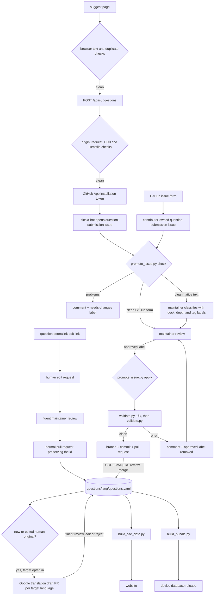

# Contribution pipeline

How a question gets from someone's head into the database, the website and a
device. Human-facing instructions are in
[CONTRIBUTING.md](https://github.com/giacomomellone/cicala/blob/main/CONTRIBUTING.md).
Runtime setup is in [native submission setup](native_submission_setup.md).

## Entry points

The native path asks for a question, language, optional public credit and CC0
consent. It does not require an account. The box starts empty and offers no
example of its own; above it, one of the five question-writing tips from the
README appears with a weak and a stronger version of the same question, and two
arrows move through the rest. The browser validates the text and checks the
active language's corpus for duplicates, then posts to the same-origin
`/api/suggestions` Pages Function. That function verifies
Turnstile and opens a public issue through the repository-scoped `cicala-bot`
GitHub App.

The direct GitHub issue form remains available. It asks the contributor for
decks, depth and optional tags because a GitHub contributor owns and can edit
that issue. Developers editing `questions/{lang}/questions.yaml` directly
skip to the pull-request half.

Contextual links all open the same native sheet:

- an empty browse search carries its query in `?text=`;
- the bottom of Browse uses `source=browse`;
- Play uses `source=play`, outside the panel and device controls;
- the site navigation uses `source=suggest` implicitly.

`source` is operational context, not analytics. It is written into the issue's
machine-readable marker and no visitor profile is created.

## Editorial hints

Once the text passes the mechanical rules, the form may add one advisory hint:
a superlative frame, two questions in one entry, or length past the 95-character
target. Hints name the pattern and stop. They never propose wording, because
questions here are written by people, and they never gate the submit button,
because the same wordlists also match questions maintainers have accepted.
`website/src/lib/style-hints.ts` holds them, separate from the validator mirror
in `rules.ts`.

Tip rules are translated like any other interface string. The example questions
are not: they are quoted from [theory](theory.md) and the language's style
guide, and a language carries a pair only once a fluent maintainer has written
one.

## The path



The App token only creates the issue. The `promote-question` workflow uses its
normal short-lived `GITHUB_TOKEN` to comment, apply labels, create the branch
and open the pull request.

Existing-question edits take a deliberately smaller path. The permalink opens
the `edit-question.yml` issue form with the question ID in the title. The
request is not handled by `promote-question.yml`: a fluent maintainer discusses
it, applies accepted changes in a normal pull request, and preserves the ID and
added date. Once merged, a wording or editorial change can refresh linked
Google Cloud translation drafts through the post-merge path above.

## Native issue contract

The Pages Function creates the same stable headings that
`tools/promote_issue.py` parses:

```markdown
### Language

English (en)

### Question

> Which ordinary day would you happily live again?

### Name for credit (optional)

_No response_

### Public domain dedication

- [x] I dedicate this question to the public domain (CC0-1.0). …

### Submission channel

Submitted through cicala.dev at 2026-08-31T12:00:00.000Z.

<!-- cicala-native:v1 submission:<uuid> source:suggest consent:cc0-1.0-2026-08-31 -->
```

The endpoint HTML-escapes text that GitHub could interpret as markup or a
mention. The parser restores those entities before writing YAML. The marker
selects the native parsing path and records the consent-copy version without
putting a secret in the issue.

## Editorial classification

A native suggestion carries no contributor-selected decks, depth or tags. A
language maintainer adds:

- one or more `deck:<name>` labels;
- exactly one of `depth:1`, `depth:2`, or `depth:3`;
- zero or more `tag:<name>` labels.

The `approved` label comes last. `promote_issue.py apply` refuses an
unclassified native issue, more than one depth, unknown values, or a dark or
spicy question outside Wild. Direct GitHub form issues continue to read this
metadata from their body, so existing submissions do not need label migration.

## Where each rule is enforced

| Rule                                             | Browser | Pages Function | Open issue  | Approval / merge |
| ------------------------------------------------ | ------- | -------------- | ----------- | ---------------- |
| 10–140 characters, ends with `?`, one line       | yes     | yes            | yes         | yes              |
| Already in this language's corpus                | yes     | no             | yes         | yes              |
| Shipped language                                 | yes     | yes            | yes         | yes              |
| Explicit, current CC0 consent                    | yes     | yes            | yes         | yes              |
| Same-origin request and Turnstile                | —       | yes            | —           | —                |
| At least one deck and exactly one depth          | —       | —              | direct form | yes              |
| Dark/spicy only in Wild                          | —       | —              | direct form | yes              |
| Per-language denylist                            | no      | no             | yes         | yes              |
| Style guide, tone, whether it is a good question | no      | no             | no          | maintainer       |

The denylist stays server-side. Publishing it in the website payload would
publish the list it is meant to flag for human review.

An unclassified native issue is checked with temporary neutral metadata so
the validator can run its text, duplicate and denylist rules without writing
anything. Real editorial metadata is mandatory before approval.

## Text normalization

One definition of "the same question" is applied at each boundary:

- `tools/validate.py` `normalize_text`: NFC, lowercased, whitespace collapsed;
- `tools/promote_issue.py`: restores escaped native text, then collapses whitespace;
- `website/src/lib/rules.ts`: the same collapse and comparison in the browser and Pages Function.

A question that differs only in case, padding, internal spacing or Unicode
composition is a duplicate.

## Ids

`validate.py --fix` assigns `q-` plus the first eight hex characters of
SHA-256 over `lang|normalized text`. Contributors and the submission endpoint
never write one. An id remains stable through later text, deck or depth edits.

## Testing this pipeline

- `tools/tests/test_tools.py`: direct-form parsing, native issue parsing,
  editorial labels, CC0, validator checks and promotion.
- `website/tests/submission.test.ts`: the untrusted request contract.
- `website/tests/suggestions-api.test.ts`: origin checks, Turnstile, GitHub App
  authentication boundary and rendered issue body.
- `website/tests/rules.test.ts`: browser/server text normalization and duplicates.
- `website/tests/style-hints.test.ts`: which patterns earn a hint, and the
  two-part shape that is exempt.
- `website/tests/tips.test.ts`: rotation in both directions, and a translated
  rule for every tip in every shipped language.
- `website/e2e/suggest.spec.ts`: the built native sheet, the empty box, tip
  rotation, an advisory hint that leaves submission enabled, contextual
  prefill, submission receipt, retry state and legacy redirect.
