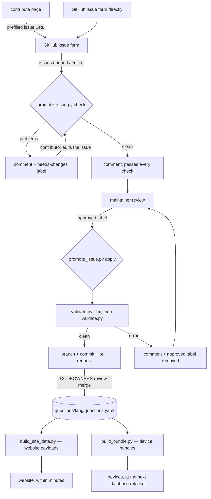

# Contribution pipeline

How a question gets from someone's head into the database, the website and a
device. Human-facing instructions are in
[CONTRIBUTING.md](https://github.com/giacomomellone/cicala/blob/main/CONTRIBUTING.md);
this page describes the machinery behind them.

There are two entry points and they converge immediately. Most people use the
website form, which is a styled thin client of the GitHub issue form: it
validates locally, then opens the issue prefilled. Developers editing
`questions/{lang}/questions.yaml` directly skip to the pull-request half.

## The path

Every gate on that path runs the same rules, because every gate runs
`validate.py`. The check job appends the parsed entry to a temp copy of the
database and validates that; the promotion job appends it for real and
validates that. Neither reimplements a rule.

## Where each rule is enforced

A contributor can hit the same rule at three distances, and the cost of being
told rises with each one. The design goal is to move every rejection as far
left as it will go.

| Rule                                               | Website form | Issue check | Merge      |
| -------------------------------------------------- | ------------ | ----------- | ---------- |
| 10–140 characters, ends with `?`, one line         | yes          | yes         | yes        |
| At least one deck; dark/spicy only in `wild`       | yes          | yes         | yes        |
| Already in this language's corpus                  | yes          | yes         | yes        |
| Per-language denylist                              | no           | yes         | yes        |
| Shipped language (not the incubator)               | yes          | yes         | yes        |
| CC0 box ticked                                     | yes          | yes         | —          |
| Style guide, tone, whether it is a _good_ question | no           | no          | maintainer |

The website form cannot check the denylist: shipping the list to the browser
would publish exactly the list of words the project would rather not
advertise, and the list is the reason a human looks at those submissions.

## The vocabulary, and why it is single-sourced

Decks, tags and the depth labels live in `questions/schema.json` under
`x-cicala`. Three consumers restate them:

- `.github/ISSUE_TEMPLATE/new-question.yml` — the dropdown options.
- `website/src/config.ts` — so no page parses the schema at runtime.
- `tools/validate.py` — reads the schema directly.

The website prefills the issue form's dropdowns **by option string**, and
GitHub silently drops a value that is not one of the declared options, leaving
a required field blank. So the strings have to agree character for character,
and two tests hold them together: `TestIssueFormVocabulary` in
`tools/tests/test_tools.py` for the issue template, and `config.test.ts` for
the website constants.

## Text normalization

One definition of "the same question", applied in three languages:

- `tools/validate.py` `normalize_text` — NFC, lowercased, whitespace collapsed.
- `tools/promote_issue.py` — collapses whitespace before writing the entry.
- `website/src/lib/rules.ts` `collapse` / `normalizeQuestion` — the same, so
  the form measures and compares what the database would store rather than the
  raw textarea contents.

A question that differs only in case, padding, internal spacing, or Unicode
composition is a duplicate.

## Ids

`validate.py --fix` assigns `q-` plus the first 8 hex characters of
SHA-256 over `lang|normalized text`. Contributors never write one, and an id
never changes after assignment — later edits to text, decks or depth keep it,
which is what makes a permalink and a saved deck durable.

## Testing this pipeline

- `tools/tests/test_tools.py` — `TestIssueFormVocabulary` (the forms agree with
  the schema), `TestPromoteIssue` (what an approved issue becomes, and what is
  refused), `TestCheckSubmission` (what the open-issue check catches, and that
  it writes nothing).
- `website/tests/rules.test.ts` — the form's mirror of the validator's text and
  duplicate rules.
- `website/e2e/contribute.spec.ts` — the built form in a browser, including
  that every value it prefills is one the issue template declares.
