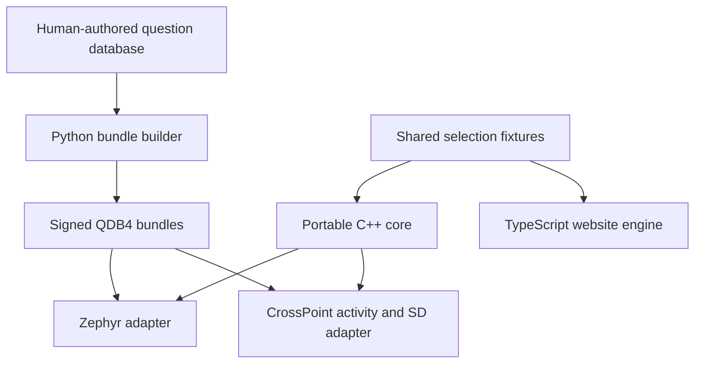

# Cicala on Xteink X4 Pro

[cicala-crosspoint](https://github.com/giacomomellone/cicala-crosspoint) adds
Cicala to CrossPoint's Home menu. It targets the Xteink X4 Pro. CrossPoint keeps its
book reader, settings, networking, and device drivers. Cicala owns the question
session and its signed bundle store.

The implementation has host tests and builds for X4 Pro. Touch and physical button mapping,
panel refreshes, sleep current, peak heap, and installation through firmware
OTA still need checks on a device. The public English corpus is currently empty;
the embedded fallback therefore shows the empty-deck state. Existing firmware
test questions are packaged only as test fixtures.

## Shared code

`core/` contains QDB4 parsing, permission eligibility, selection and recency,
transactional Filters/Next behavior, bundle verification, and an explicit SD
snapshot codec. It has no Arduino, Zephyr, network, filesystem, or display
dependency. It uses C++17, fixed capacity state, and no dynamic allocation.

The Zephyr application compiles these sources through its existing CMake
library adapters. Its RTC layout and three language bag slots remain intact.
The website retains its TypeScript implementation. Both languages run
`core/tests/fixtures/selection.json` to check eligibility and seen-history rules;
they need not produce the same random ordering among equally ranked candidates.

The fork consumes a versioned archive with a SHA-256 pin. That archive contains
the core, the public verification key, and an English offline bundle. It has no
dependency on another local repository or a private repository. A local archive
override supports development before publication.

## Session and display contract

Preparing an action creates a token and a bounded copy of the proposed view.
Permissions, draft state, displayed question, and bag history change only after
the matching render completes. Failed, timed-out, cancelled, and stale renders
cannot consume a question. Input pressed during a refresh remains suppressed
through its later release.

Filters opens the draft menu and moves the cursor. Touch can activate a filter
row directly; each tap follows the same display-commit contract. Next toggles a permission;
on Done it applies the draft. The current question remains if it is still
eligible. Otherwise the core selects another question. New session resets
permissions and history after the new view renders successfully.

CrossPoint's activity uses its logical buttons and touch coordinates, wraps the
whole question, and falls back to a smaller font when necessary. Layout failure
does not commit the question. It uses one framebuffer, starts with a full
refresh, and requests another full refresh after ten partial refreshes.

A small FreeInk SDK patch adds an opt-in checked refresh result. The Pro adapter
checks BUSY completion using the detected panel controller's protocol.
SSD1677 requires a BUSY assertion and completion. UC8179/UC8279 retain the SDK's
one-tick wait followed by idle-HIGH completion; a stuck LOW times out, but this
level-based protocol cannot diagnose a disconnected line that reads HIGH.
The build applies the patch to an ignored copy of the pinned SDK display
library. The SDK submodule remains unchanged. The fork includes host tests of
the patched bus implementation with simulated GPIO and semaphore behavior.

## Persistence and updates

Normal power-off loses RAM. Its SD card is authoritative for
sessions. Two alternating, checksummed session records retain the question,
permissions, draft cursor, and bag history. The codec writes fields explicitly
in little-endian order and rejects incompatible capacities. Records are 265
bytes with the default configuration. A new record is reopened and checked
before it becomes the active generation.

Sessions save on leaving Cicala, preparing for sleep, and completing New session.
An unexpected power cut can lose changes since the last save. Normal sleep
preserves the committed question or filter view. A consumed-on-boot SD marker
requests Cicala resume; panic recovery and holding the Pro's right page button (Down) take precedence. Opening
books and returning to Cicala restores the saved session.

Question updates are manual. Cicala reuses CrossPoint's Wi-Fi selection and HTTP
transport. Its worker releases the active corpus allocation during networking,
then checks the downloaded file's size, SHA-256 digest, Ed25519 signature, QDB4
structure, language, version, count, UTF-8, and question length. The payload's
signed header must match the manifest. A bundle is limited to 32 KiB and 512
questions, each at most 128 UTF-8 bytes. Two payload/manifest slots keep the old
verified bundle available if a write is interrupted. Every reopen verifies the
signature again; two invalid slots fall back to the compiled English bundle.

An updated corpus clears incompatible selection indices while keeping the
copied current question and explicit filter state. The update task stops before
the activity is destroyed. A Wi-Fi connection opened by Cicala is shut down
after updating or cancelling; play itself performs no networking.

Firmware OTA replaces the combined CrossPoint/Cicala application. Its version
starts at `0.1.0`, independently of CrossPoint's version. It follows the fork's
GitHub releases and selects `cicala-crosspoint-<version>-x4pro.bin`. Core packages,
firmware versions, upstream revisions, and question bundle versions are separate
identities. Bundle `min_fw` is compared with the shared sync contract version,
currently `0.2.0`, rather than either project's release number.

## Development and rollout

Run `just test-core` and `just core-package` here. Build the fork with
`CICALA_CORE_ARCHIVE=/absolute/path/to/cicala-core-0.1.0.tar.gz pio run -e cicala`.
The fork's [development guide](https://github.com/giacomomellone/cicala-crosspoint/blob/cicala/docs/cicala.md)
contains setup, native HTTP tests, release staging, and the hardware checklist.

Publish a core package from a clean, reviewed Cicala revision before releasing
firmware. Then replace the fork's development archive checksum with the checksum
of that published package. The intended `core-0.1.0` URL is not populated by a
local build. During review, the fork can reproduce the same archive from its
pinned public source commit if that release asset is absent; release builds
require the published asset. Release provenance records both source revisions and artifact
hashes; a development archive's dirty provenance cannot pass the release gate.

The production bundle feed also needs verification before release. During this
implementation, `device.cicala.dev` did not resolve from the development host.
Local HTTP tests cover signed updates independently of that service.

Keep `develop` aligned with upstream and maintain the product on `cicala`.
Merge upstream into the shared product branch; rebase unpublished feature
branches as useful. The fork's daily workflow tries an upstream merge in a
disposable checkout, builds X4 Pro, and runs the native suites. It does not update
branches. Set `cicala` as the fork's default branch when it is published so the
scheduled workflow runs there. SDK changes require reviewing the checked-refresh
patch and its pin before adoption.
