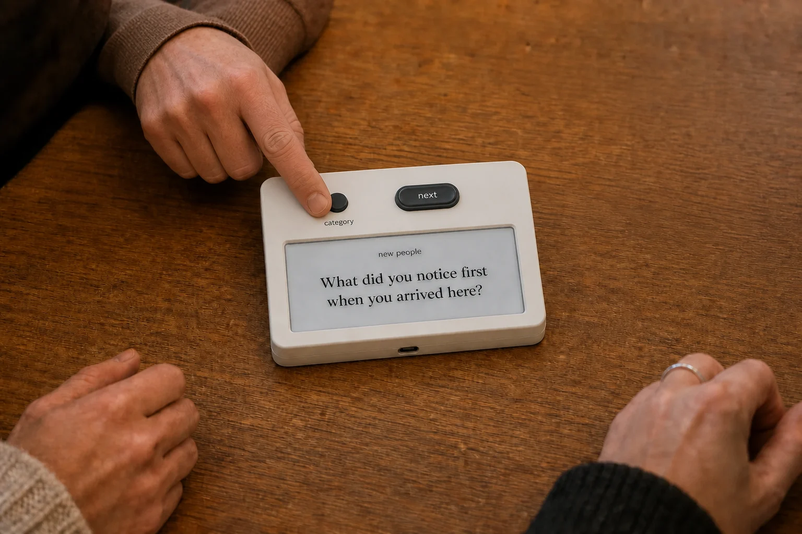
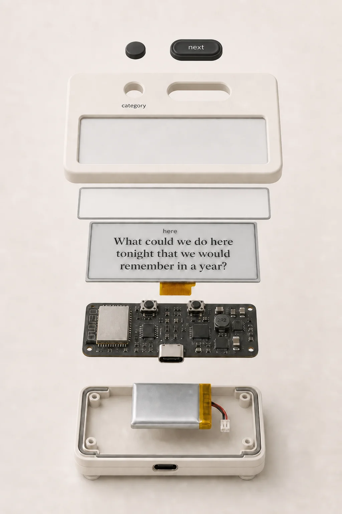

# Device prototype direction

This is the description for the next physical study. It is not a finished
industrial design and does not authorize firmware work.

!!! warning "Concept renders, not manufacturing data"

    The renders communicate layout and use. They do not replace CAD, component
    drawings, tolerance analysis, antenna work, or a verified PCB.

## Evaluation of the proposal

The OLED should go. Its category preview is redundant once a fixed selector
points at a printed label. A generic follow-up belongs in the question text or
in the people listening. Wi-Fi, language, and maintenance are easier on a phone
than on a narrow status display. Removing the OLED also removes a competing
surface, its driver, rail, load switch, window, and layout work.

Three parts of the earlier proposal should not be built yet:

1. **A public depth slider is ambiguous.** Its proposed benefit is giving
   someone a low-cost way to set a boundary. On a date or at work, moving a
   control toward “light” may itself feel like a public rejection. The device
   should initially mix editorial depths 1 and 2 and let Next reject a prompt
   without explanation. Depth 3 stays out of normal playback.
2. **Six deck labels are not a validated taxonomy.** `new people`, `close`,
   `family`, `work`, `here`, and `wild` make sense as contexts, but a physical
   selector freezes the count. Use a replaceable printed bezel and do not order
   custom hardware until people can distinguish New People from Close and
   understand Wild without an explanation.
3. **The compact selector is not sealed.** Alps Alpine SRBV160803 is a useful
   model part, not a final ingress solution. A sealed C&K MA06L1NCGF exists, but
   it costs roughly 27.55 EUR in single quantity and has worse availability.
   An enclosure shaft seal may preserve the compact part, but its torque and
   spill behavior need physical testing.

Two controls may also look more complicated than one push encoder. The added
Next button is still the clearer choice because the selector remains absolute:
pressing cannot disturb the selected deck, and every press duration means the
same thing.

## Proposed form

The face has three elements: e-paper, an absolute selector, and Next. The
display shows only the question.

| Property | Study target | Reason |
|---|---:|---|
| Envelope | about 84 × 56 × 16 mm | Allows a real six-position switch, readable labels, button, and the 59.2 × 29.2 mm panel |
| Mass | 80–100 g | Resists one-handed rotation and button presses |
| Orientation | landscape, 3° face incline | Keeps the device readable without becoming a wedge |
| Display | 2.13″ e-paper behind a matte protective lens | Persistent question surface |
| Selector | six-position absolute rotary switch with fixed stops | Position remains visible without power and cannot wrap |
| Next | separate low-profile round button | One action with no press-duration vocabulary |
| Legend | replaceable English bezel: `new people · close · family · work · here · wild` | Initial study needs readable words, not untested icons |
| Port | centered USB-C on the lower edge | Absent from the main tabletop view |
| Finish | warm-ivory matte shell; charcoal knob and button | Matches the paper-like website |

The size is a planning envelope. Component drawings and a label legibility test
may change it.

## How the selector aligns with the labels

This is a stepped rotary switch, not a free-spinning potentiometer or a
software encoder. The switch supplies six electrical positions, tactile index
points, and end stops. SRBV160803 indexes every 30 degrees, so its six centers
occupy a 150-degree arc. It does not wrap from Wild to New People.

Alignment is mechanical:

- the PCB footprint fixes the switch body;
- the D-flat shaft fixes the knob angle;
- a keyed knob or pointer marks the selected center;
- the bezel artwork is dimensioned from the manufacturer's index angle;
- the enclosure prevents the switch body from rotating under torque.

The first paper bezel should include center ticks as well as words. A jig sets
the shaft to its first hard stop before the knob is pressed on. The model study
must test tolerance at both end labels. A label ring that only looks aligned in
the middle is a failed design.

The switch has one common and six contacts. The simple electrical contract is
one GPIO per position with pull resistors. Six GPIOs cost more pins than an
encoder, but avoid ADC thresholds, calibration, and remembered software state.
A coded sealed switch could reduce pin use later; it is not needed for the
model.

## Candidate controls

### Compact study selector

**Alps Alpine SRBV160803**: SP6T, six positions, 30 ± 3 degree indexing,
30 ± 15 mN·m torque, 15 mm D-flat shaft, 16.2 × 18.5 × 7.5 mm body, and
10,000-cycle life. Mouser listed 213 in stock at 9.07 USD each in July 2026,
with a 16-week factory lead time beyond stock. It is an active standard part,
but it is uncommon and materially more expensive than an EC11 encoder.

Use it for both weighted models. Check:

- whether the detent feels deliberate at table scale;
- whether the two hard stops are clear;
- whether the 15 mm shaft can be shortened or buried without weakening the
  pointer;
- whether the body and antenna can coexist;
- whether a shaft lip seal adds unacceptable torque.

### Sealed comparison

**C&K MA06L1NCGF**: SP6T, fixed index stops, 36-degree indexing, flatted
10.16 mm shaft, 10.42 mm depth behind panel, and IP67 shaft/panel sealing.
Mouser France listed 69 at 27.55 EUR each in July 2026; current factory lead
time was 17–19 weeks. It is too costly to assume for production, but one sample
can establish the size and feel of a genuinely sealed control.

### Next input

**C&K KSC321GLFS**: IP67 SPST-NO tact switch, 6.2 × 6.2 mm footprint,
3.5 mm actuator height, 2 N force, and 300,000-cycle rating. It needs an
external button cap with a mechanical stop so enclosure loads do not crush the
switch. Mouser listed 5,732 at 0.413 EUR each in July 2026.

IP67 at the component does not make the assembled enclosure IP67. The lens,
USB opening, shell seam, selector shaft, and button-cap interface need their
own paths and tests.

## Mechanical stack

The previous 14 mm target assumed a low encoder and OLED rail. Six fixed
contacts and a separate button change the stack. Start at 16 mm and earn any
reduction through CAD.

| Layer | Planning allowance |
|---|---:|
| Top shell, lens, display support | 1.8–2.2 mm |
| E-paper plus compliant perimeter support | 1.0–1.5 mm |
| PCB | 1.0–1.2 mm |
| Local electronics | 2.5–3.2 mm |
| Protected 503035 cell | 5.0–5.5 mm |
| Bottom shell and clearance | 1.8–2.2 mm |

The switch and cell cannot stack. Put the selector beside the display/cell
stack and carry rotational loads into a chassis boss, not through solder
joints. Support the e-paper glass continuously around its perimeter. Use four
elastomer feet positioned to resist selector torque and the Next press.

The legend should be a replaceable laser-printed or UV-printed insert for the
study. This accepts the first prototype's English-only cost without pretending
that six tiny icons are language-neutral. A future language variant can change
the bezel, but long labels, right-to-left scripts, and character coverage remain
open.

## Electrical description for a later rev A

No schematic or firmware is part of this iteration. The later board description
must account for:

- ESP32-S3-WROOM-1-N16 and the GDEY0213B74 e-paper circuit;
- six one-hot selector contacts and one independent Next wake input;
- an integrated charging power path or a validated load-sharing circuit;
- USB-C input and ESD protection, VBUS detection, and switched battery sensing;
- a protected 503035 cell with charge current set from its data sheet;
- e-paper power gating and a measured whole-device sleep budget below 30 µA;
- antenna keep-out clear of the display, battery, selector metal, and copper;
- hidden development pads, with no extra user-facing controls.

The selector is read after every wake. A contact transition must settle for
about 600 ms before it draws, which ignores make/break chatter and avoids
flashing through intermediate questions. There is no stored category, session
counter, escalation state, or Favorite event.

The question bundle stores each question once with a six-bit deck mask and
depth metadata. Normal playback excludes depth 3. See
[sync_protocol.md](sync_protocol.md).

## Validation sequence

### 1. Website

The website is the first test rig. It ships all six deck choices, overlapping
membership, Wild tone, the New People default, and the depth 1–2 playback cap.
Watch whether people can choose a useful deck without reading documentation.

### 2. Non-functional model — two days

Build two weighted shells with real SRBV160803 switches, real button caps, and
paper question inserts. One shell may use a flat face and one a 3-degree
incline. Run at least five small table sessions without explaining the controls
first.

Gate:

- people can map every detent to the intended label;
- they understand that turning draws from another deck;
- they distinguish New People from Close;
- Wild is chosen deliberately rather than mistaken for Random;
- the extra Next button does not make the face look like a control panel;
- the device does not slide, tip, or need to be picked up;
- question type is readable from ordinary seats.

If deck choice takes more attention than rejecting a poor question with Next,
reduce or remove the selector before custom electronics.

### 3. Display and type rig

Only after the model gate, drive the exact e-paper panel and render the released
English and German corpora. Test every question at a fixed minimum type size.
Do not include a status display.

Gate: every released question fits; partial updates remain readable through a
representative run; a full refresh is scheduled by observed ghosting rather
than by idle time.

### 4. Power path, rev A, and EVT

Prove charging with system load, Wi-Fi peaks, cutoff behavior, and sleep current
before laying out the complete board. Import manufacturer STEP models into the
case before board order. EVT covers drop, selector life, button overload,
pocket lint, radio performance, and small spills.

## Acceptance targets

| Area | Target |
|---|---|
| First question | already visible |
| Next question | readable in under 1 s on a partial refresh |
| State at zero power | active deck and current question are readable |
| Sleep current | below 30 µA measured at the cell |
| Stability | no slide or tip during one-handed selection or Next |
| Text | all released questions fit at the fixed minimum size |
| Ingress | no path from a small tabletop spill to PCB or cell |
| Service | cell, display, and PCB replaceable without destructive adhesive |

## Primary references

- [Alps Alpine SRBV series](https://tech.alpsalpine.com/e/products/category/switches/sub/04/series/srbv/)
- [C&K MA06L1NCGF](https://www.ckswitches.com/products/switches/product-details/Rotary/M/MA06L1NCGF/)
- [C&K KSC321GLFS](https://www.ckswitches.com/products/switches/product-details/Tactile/KSC3/KSC321GLFS/)
- [Good Display GDEY0213B74](https://www.good-display.com/product/391.html)
- [Espressif ESP32-S3-WROOM-1/1U data sheet](https://documentation.espressif.com/esp32-s3-wroom-1_wroom-1u_datasheet_en.pdf)
- [Espressif module current measurement](https://docs.espressif.com/projects/esp-idf/en/latest/esp32s3/api-guides/current-consumption-measurement-modules.html)

Render prompts and provenance are in
[`assets/device-prototype/prompts.txt`](assets/device-prototype/prompts.txt).
