# Firmware architecture

Structure of the ESP32-S3 application: threads, the messages between them, and
which modules depend on Zephyr. Interaction rules are in [design.md](design.md),
the data contract in [sync_protocol.md](sync_protocol.md), the pins and the
board in [hardware wiring](hardware_wiring.md), rationale in
[decisions.md](decisions.md).

**Status: the tabletop loop is built, its state survives a reboot, and the
device can be put on a network.** `input`, `app_fsm`, `qdb` with its bag,
`layout`, `retained`, the panel and the setup `portal` all exist and are
tested. Still design: `sync`, `power`, and deep sleep itself — `CONFIG_PM` is
off, so nothing sleeps, but the state that has to outlive a wake is already in
RTC memory rather than waiting on it. `CONFIG_TK_NET` is off in the everyday
image for the same reason, and `just fw-net` is the one with a radio in it. Items marked *verify* have not been run on
hardware. The [firmware primer](firmware_primer.md) is the hands-on tour.

## The one constraint

Below 30 µA means deep sleep, and on the ESP32-S3 deep sleep is a reboot: SRAM
and every thread stack are gone, and waking runs `main()` from the top.

- The steady state is **off**, not idle. Threads live for the milliseconds
  between wake and sleep.
- "Next question under 1 s" is a **boot-time** budget, not a scheduling one.
- Persisted state lives in **RTC slow memory**, never in `.bss`.
- Sleep is never called. It is what happens when no thread is runnable.

## Threads and data flow

Every arrow is a zbus message. `app` is the only thread that decides anything;
everything else reports or renders. Solid boxes and arrows are built; dashed
ones are design.

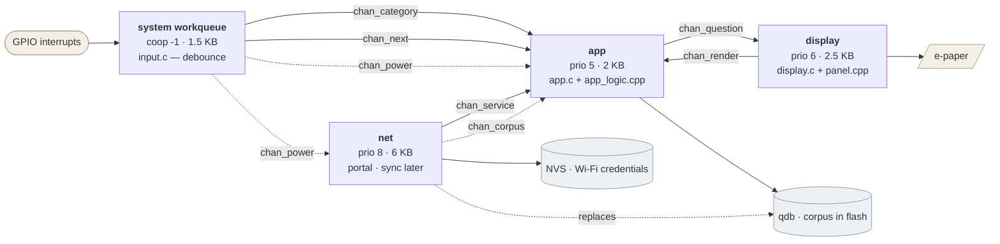

A thread exists only where something must block independently.

| Context | Blocks on | Why not merged |
|---|---|---|
| system workqueue | nothing (delayed work) | An input thread would buy nothing; the `gpio-keys` driver already owns the debounce |
| `app` | its zbus queue | — |
| `display` | the panel, 0.3–2 s | So `app` stays awake during a refresh and can drop the Next press |
| `net` | its semaphore | Portal and sync never overlap, so one thread serves both |

`net` is a coordinator rather than the thread that does the networking. The
HTTP server has its own thread, the DHCP server runs on the socket-service
thread, the DNS responder has one of its own, and the Wi-Fi driver spawns
several. What is left on `net` is the portal's state machine, the translation
of management events into it, and the tick its deadlines need — which is why
6 KB is enough where the design once said 12.

There is no power thread. With `CONFIG_PM` the idle thread picks the sleep
state once nothing is runnable, so the design's job is to make every thread
block with **no timeout** when the table is quiet. `net` inhibits sleep while
the portal is on air — `sleep_now()` asks `tk_net_is_active()` and reschedules
rather than calling `sys_poweroff()`, which is what a PM lock would mean on a
device that stops the SoC explicitly. Nothing else inhibits sleep.

`CONFIG_PM` is off today, so nothing sleeps yet — but `app` already blocks with
`K_FOREVER` except in `REFRESHING`, which is the property enabling it later.

## What each module owns

Every module has one job, one input and one output. The rule that decides which
language a file is in is mechanical: `ZBUS_CHAN_DEFINE`, `ZBUS_MSG_SUBSCRIBER_DEFINE`
and `ZBUS_CHAN_ADD_OBS` expand to out-of-order designated initializers, which C
allows and C++17 rejects, so files using them are `.c` and everything else is
free to be C++.

| Module | File | In | Out |
|---|---|---|---|
| `input` | `app/src/input.c` | key events via the `gpio-keys` driver | `chan_category`, `chan_next` |
| `app` | `app/src/app.c` | those two channels, plus `chan_render` | calls into `app_logic` |
| `retained` | `lib/retained/` | the block RTC memory handed back | whether it survived, or a zeroed one |
| `app_logic` | `app/src/app_logic.cpp` | posts from `app.c` | `chan_question` |
| `app_fsm` | `lib/app_fsm/` | the active deck, a press, a render result | which deck to draw, and when |
| `qdb` | `lib/qdb/` | a TKB2 byte range, a deck, a depth cap | one question, no repeats |
| `layout` | `lib/layout/` | UTF-8 text, a column count | lines of base glyph + mark |
| `panel` | `app/src/panel.cpp` | a question | pixels, and a full/partial choice |
| `display` | `app/src/display.c` | `chan_question` | `chan_render` |
| `net` | `app/src/net.c` | the boot gesture, Wi-Fi events | drives the portal machine |
| `portal_fsm` | `lib/portal/` | a scan, an AP result, a form, a join result | when to scan, serve, join, stop |
| `net_logic` | `app/src/net_logic.cpp` | the machine's decisions | `chan_service`, and calls into `portal` |
| `portal` | `app/src/portal.c` | those calls | SoftAP, DHCP, DNS, HTTP, credentials |
| `channels` | `app/src/channels.c` | — | the channel definitions themselves |

`lib/` is everything that compiles without a Zephyr header, which is what lets
the suites run it on a host. `app/src/` is the glue that gives it threads,
channels and a display.

## Where the questions come from

The corpus is not fetched at runtime yet. It is compiled into the image, which
is the factory-preloaded set [design.md](design.md) promises: a device whose
Wi-Fi is never configured still works.

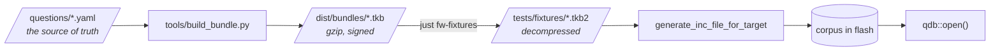

The same decompressed bundle feeds the `qdb`, `layout` and `panel` suites, so
the corpus the tests check is the corpus the device ships. When `sync` lands,
`open()` points at a LittleFS file instead and the embedded copy becomes the
fallback.

## qdb — the question store

`qdb` is the only thing that knows what a question is. It answers exactly one
question itself: *given this deck, what should the device show next?* It is
plain C++17 with no Zephyr headers, about 370 lines, and it is two pieces that
share a header.

### The reader

`Qdb` is a decoder for the TKB2 format in [sync_protocol.md](sync_protocol.md).
It does not own or copy the bundle — `open()` takes a pointer and a length, and
every `Question` it hands back points into that buffer. The bundle outlives the
questions drawn from it.

Two decisions worth knowing:

- **Everything is validated at `open()`.** It walks all records once, checking
  every declared length against the buffer, and refuses the bundle on bad
  magic, a truncated record, trailing bytes, or a corpus larger than the bag can
  track. A file that would run off the end is rejected once, at the start,
  rather than on whichever draw first reaches the bad offset.
- **There is no offset table.** `at(index)` walks the records from the start.
  With 240 questions that is microseconds, and it costs no RAM on a device whose
  memory budget is the reason the corpus lives in flash at all.

A question is **eligible** for a deck when its deck-mask bit is set and its
depth is within `CONFIG_TK_PLAYBACK_DEPTH_MAX`. That is the whole filter, and it
is where the two editorial rules land: depth 3 is never drawn automatically, and
the tone-flagged questions carry only the Wild bit, so no other deck can reach
them.

### The bag

`Bag` is the draw-without-repeats policy. Its state is a plain struct, sized to
live in RTC memory so it can survive the reboot that deep sleep really is:

```
fingerprint   4 B     which bundle this state describes
recent[20]   40 B     question indices last seen, shared across decks
drawn[6][16] 384 B    one bit per question, per deck
```

Under 450 bytes of the 8 KB available. Keeping it out of NVS means a Next press
costs no flash write, so button life rather than flash endurance bounds the
device.

A draw applies exclusions in order of how much each one matters, and gives up
on them in the same order:

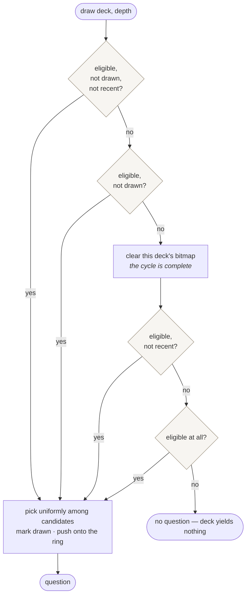

The order encodes what is negotiable. **The bag is the guarantee**: every
eligible question in a deck is shown once before any is shown twice, and the
bitmap is only cleared when the cycle is genuinely complete. **The ring is a
courtesy** and is dropped first, because the smallest shipped deck is no bigger
than the ring — Here has 20 eligible questions in English and 12 in German
against a 20-entry ring — and honouring it there would leave nothing to draw.
Refusing to answer a press is worse than repeating a question sooner than
ideal.

The ring is shared across decks rather than kept per deck. Close and New People
overlap heavily, so a per-deck ring would let a Category press hand back a
question just read under the other name.

`fingerprint` is a cheap hash of the bundle's version, language and count.
`bind()` compares it and wipes the state when it differs — without that, a
synced bundle would leave bitmaps indexing questions that no longer exist. It
is already in place even though sync is not, because it is the part that would
be painful to add afterwards.

Randomness is injected as a function pointer rather than called directly, which
is what lets the suite run a deterministic sequence and the device use its
hardware RNG.

## Channels

One channel is **state** (it holds its last value, so anyone can read "what is
true now") and the rest are **events**. That distinction is the domain model:
the question on the glass *is* something, a press *happened*.

| Channel | Kind | Carries | Published by | Read by | Status |
|---|---|---|---|---|---|
| `chan_category` | event | timestamp, press duration | workqueue | `app` | built |
| `chan_next` | event | timestamp, press duration | workqueue | `app` | built |
| `chan_question` | state | seq, deck, text | `app` | `display` | built |
| `chan_render` | event | seq, result, was-full | `display` | `app` | built |
| `chan_service` | event | the portal's current card | `net` | `app` | built |
| `chan_power` | state | USB, charging, mV | workqueue | `app`, `net` | design |
| `chan_corpus` | event | version, language, count | `net` | `app` | design |

All observers are message subscribers, so a publish never blocks a publisher.

`chan_question` carries the text by value — `CONFIG_TK_MAX_QUESTION_BYTES` of
it — rather than a pointer into the corpus. A sync can replace the bundle
between the publish and the render, and a 128-byte copy is cheaper than the
rule that would otherwise be needed about who may free what.

Two contract rules that are easy to violate:

- **Press duration travels but is never read by policy.** It exists so a table
  study can answer "did anyone try to long-press?". Long press is Next.
- **`chan_corpus` must not trigger a redraw.** A new bundle applies on the next
  *requested* draw, silently.
- **`app` is the only publisher of `chan_question`.** `net` has something to
  put on the panel and still does not publish it: `app_logic` owns the sequence
  number every card is stamped with, and the guard that drops a late render
  matches against it. A second publisher would break that guard rather than
  merely race it, so the portal's card travels on `chan_service` and `app`
  turns it into a card.

## Modules

The split that matters is not epaper-versus-input, it is **what needs
hardware**. Everything in the upper box runs under qemu and is tested without a
board. `fsm` touches Zephyr only for its default clock, which tests override,
so every timeout is exercised without sleeping.

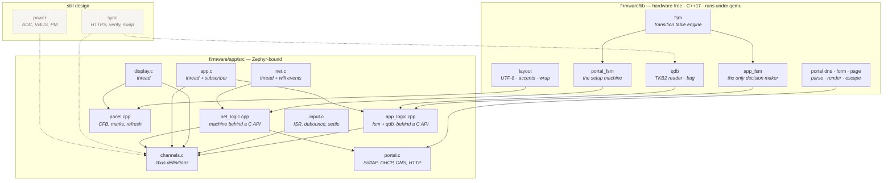

`panel.cpp` is C++ although it sits in the Zephyr-bound box: it calls `layout`
directly, and the display and CFB APIs are ordinary functions with none of the
macro trouble that keeps the others in C.

C++ stops at the Zephyr boundary for one mechanical reason: `ZBUS_CHAN_DEFINE`
and several HAL macros expand to out-of-order designated initializers, legal in
C and rejected by C++17. Keeping those files `.c` means upstream samples paste
in unmodified.

## The tabletop state machine

`app_fsm` uses the `Fsm` base class: the transition table is the
specification, `handle_current_state()` only picks which transition to return,
and each state gets its own `on_*()` handler so the table stays readable.

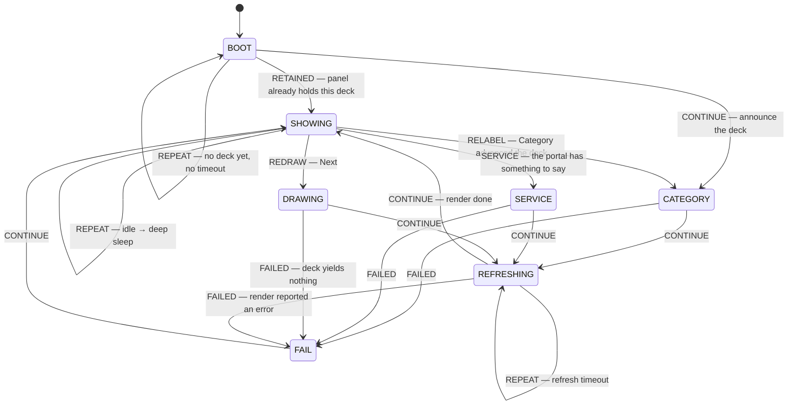

Transitions are named for what happened, not for where they lead — the table
owns the destinations. `REDRAW`, `RELABEL` and `RETAINED` exist because
`SHOWING` and `BOOT` have more than one way out and `CONTINUE` cannot mean all
of them.

**Category announces the deck; Next asks a question.** The deck's
name goes on the panel and stays there until someone presses. That is what
makes the deck legible without printing the six names on the case, which is
what lets one button reach all six: a deck you can read on the glass does not
need a labelled detent.

`SHOWING` checks Next before a deck change, so a press made while the name is
up gets a question rather than the name again.

The table above is `firmware/lib/app_fsm/app_fsm.cpp` line for line, and
`firmware/tests/app_fsm` drives every edge in it with a fake display and an
injected clock.

| State | Handler | Leaves when |
|---|---|---|
| `BOOT` | `on_boot()` | a deck is known, which is immediate — it comes from RTC memory |
| `CATEGORY` | `on_category()` | immediately — the deck's name is sent in `on_enter_state()` |
| `SHOWING` | `on_showing()` | Next arrives, or the deck differs from the one on screen |
| `DRAWING` | `on_drawing()` | immediately — the draw itself happens in `on_enter_state()` |
| `SERVICE` | `on_service()` | immediately — the card is sent in `on_enter_state()` |
| `REFRESHING` | `on_refreshing()` | the display reports back, or `CONFIG_TK_REFRESH_TIMEOUT_MS` passes |
| `FAIL` | `on_fail()` | immediately |

`BOOT` has no timeout. The deck comes from RTC memory and is known immediately,
so it is never waited on in practice; the state stays because a corpus that
fails to open is still a reason not to draw. `REFRESHING` has one, so a dead
panel cannot wedge the device.

Two rules are in the handlers rather than the table, because they are about
what the machine remembers rather than where it goes:

- **A press that lands during `REFRESHING` is dropped, not queued.** A panel
  takes up to two seconds; honouring presses made during it would spend that
  time drawing questions nobody has read.
- **Entering `FAIL` adopts the active deck as the one on screen.** Without
  that, a deck yielding nothing would leave `SHOWING` looking at a deck it has
  not drawn, ask again, fail again, and spin. Adopting it means the device sits
  on the previous question until the user presses or turns something.
- **Entering `DRAWING` discards any render result still pending.** It can only
  belong to an earlier question, one whose refresh timed out and then finished
  anyway. Left in place it satisfies the next refresh the instant that refresh
  begins, so the panel is told to draw and the machine calls it done in the same
  breath. This was a real bug on hardware: one press appeared to do nothing, and
  the next showed two questions in quick succession. `app_logic` adds a second
  guard by matching the `seq` on `chan_render` against the last question
  published, so a late result is dropped before it reaches the machine at all.

**A press that lands during `REFRESHING` is dropped; a service card is not.**
The two are opposites on purpose. A press made while the panel is busy is
asking for time nobody has read yet, so honouring it spends two seconds badly.
A service card is somebody standing at the device waiting to be told which
network to join, and the panel is free within a couple of seconds.

Service entry was specified here as *not* a state, on the grounds that the
tabletop face stays a question display. It stays a question display, and it is
a state anyway. The reason is mechanical rather than aesthetic: `app_logic`
owns the sequence number every card carries and drops any render whose `seq` is
not the one last published, so a card published from the `net` thread would
allocate a sequence number behind its back and break that guard. Routing it
through `SHOWING → SERVICE → REFRESHING → SHOWING` gives the card the same
refresh accounting as everything else, and `app` stays the only publisher of
`chan_question`. A press during setup still draws a question.

## Sync

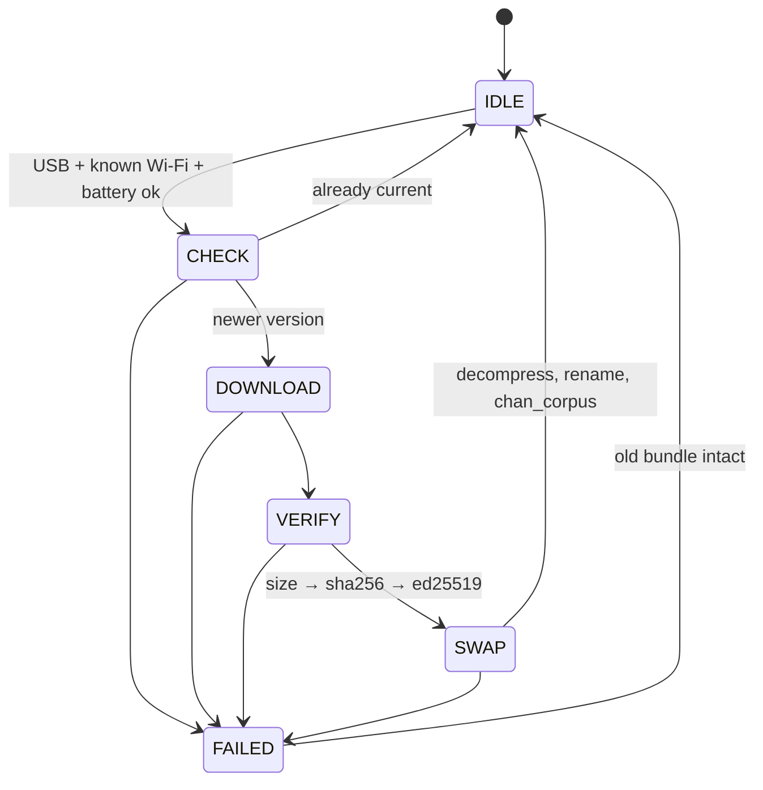

Checks run cheapest-first so a truncated download costs no signature work. Any
failure leaves the previous bundle in place. The gzip in a `.tkb` is transport
only — `SWAP` decompresses, because a device that reboots on every press must
not re-inflate the bundle each time.

## The setup portal

Built, behind `CONFIG_TK_NET` and `just fw-net`. It exists because a device
with no way to be told an SSID can never sync, so it comes before sync rather
than after it.

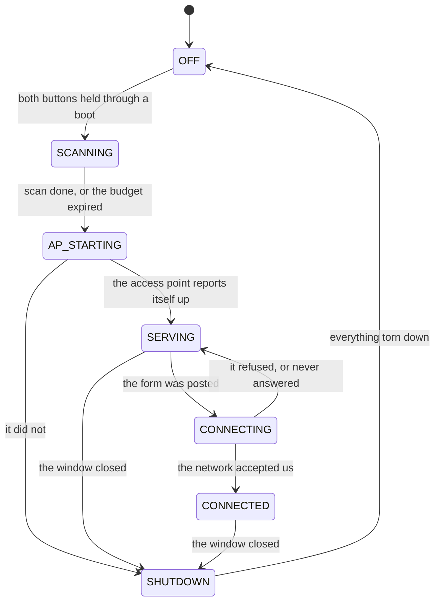

Three orderings in that diagram are forced by the hardware rather than chosen,
and all three come from the ESP32-S3 having one radio for two jobs.

**The scan runs before the access point.** A scan hops every channel in the
band for several seconds while a SoftAP sits on one, so scanning with a phone
already associated stalls it and can drop the association. The list is a few
seconds stale by the time anyone reads it, which is not a property of networks
that move. A scan that never reports back still raises the access point: the
page takes a typed network name, which a hidden network needs anyway.

**Joining happens last, and the panel reports it.** In AP+STA mode the SoftAP
is forced onto whatever channel the station lands on, so joining knocks the
phone off the setup network. The browser that submitted the form is gone before
the result exists. The form is therefore answered first and the join started
afterwards, and the answer arrives on the e-paper.

**Serving waits for the access point to report itself up.** A socket bound to
192.168.4.1 fails with `-EADDRNOTAVAIL` until the interface actually carries
that address.

The captive sheet needs two things to be wrong at once, which is why both are
arranged deliberately. DHCP hands out the device as the DNS server — an empty
`CONFIG_NET_DHCPV4_SERVER_OPTION_DNS_ADDRESS` omits option 6 entirely and the
whole flow silently fails there — and the DNS responder answers every A query
with 192.168.4.1. The phone's probe then reaches the HTTP server's fallback
resource, which redirects.

The access point is **open**. A WPA2 setup network needs a passphrase the user
has to be told, and the only places to tell them are the panel and the case.
Open, plus a physical gesture to start it, plus a window that closes on its own,
is the same posture most consumer setup flows take. The status page names the
saved network and never its password.

Entry is **both buttons held through a boot**, confirmed for
`CONFIG_TK_PORTAL_ENTRY_HOLD_MS` rather than sampled once.
[design.md](design.md) documents USB-plus-Next, which needs VBUS detect on
GPIO21 — reserved, unwired, and absent from the devicetree. The buttons are
read from the pins directly, because `input.c` publishes a press on release and
ignores a release with no press behind it: a button already down at boot
produces no event at all.

## A press, as the firmware runs today

Every participant below is a real thread or driver, and the whole path is
covered by `firmware/tests/integration`.

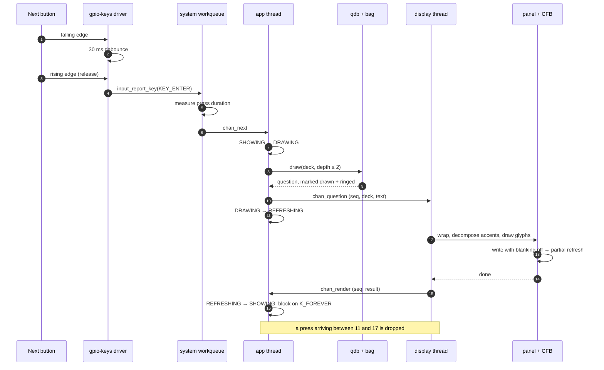

A Category press is the same path, ending in the deck's name rather than a
question.

## The wake path

Once deep sleep exists, the same work happens from a cold boot instead. This is
the design, not the current build — `CONFIG_PM` is off and nothing sleeps yet:

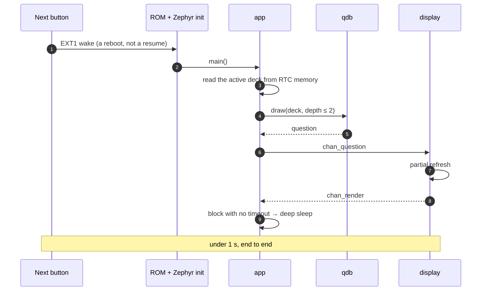

A Category press follows the same path, advancing the retained deck and drawing
its name rather than a question.

## Where state lives

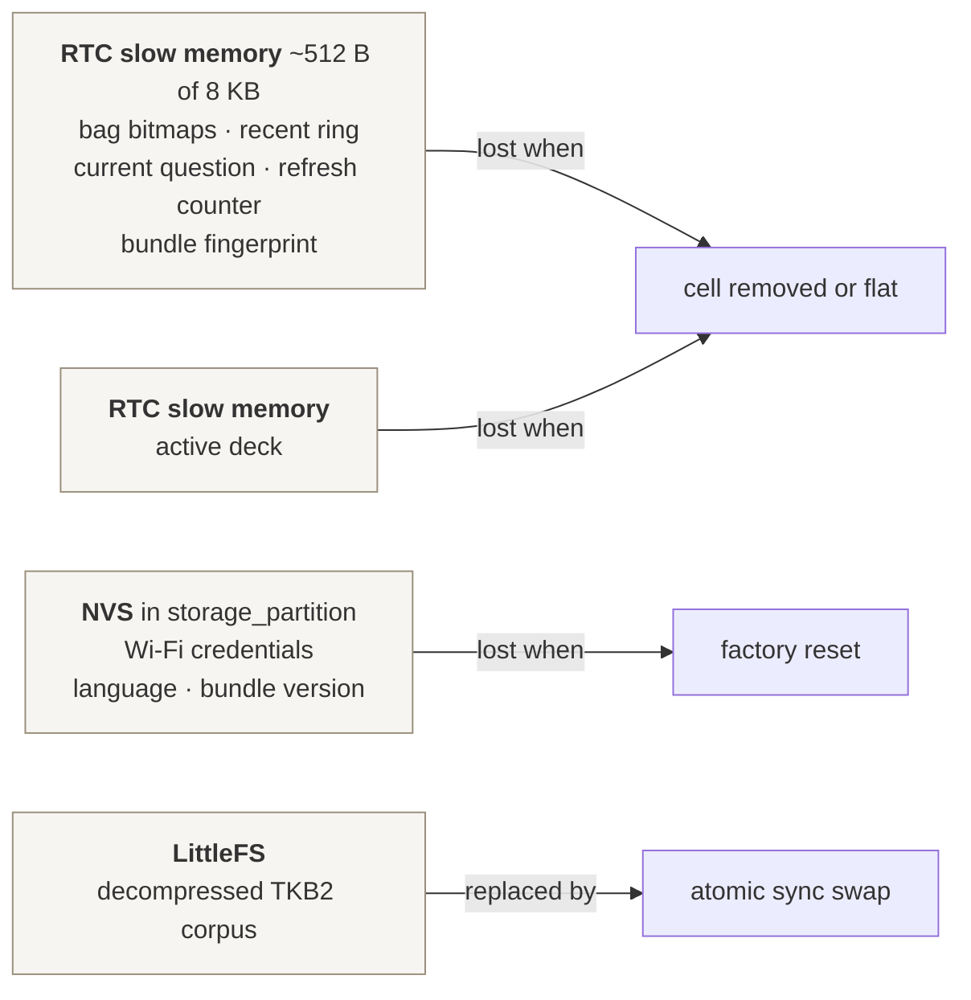

Keeping the bag out of NVS means a Next press costs no flash write, so button
life rather than flash endurance bounds the device.

The Wi-Fi credentials are Zephyr's `wifi_credentials` on the settings backend,
which puts them in the `storage_partition` the ESP32-S3 flash map already
defines — 192 KB at 0x3b0000, of which settings takes 32 KB. No devicetree
change was needed. They are written when the form is posted and before the
station is asked to join, deliberately: a flash write on this SoC disables the
instruction cache, and the Wi-Fi task runs out of it.

The active deck is in RTC memory rather than nowhere. A rotary selector would
have held its own state — the knob position *is* the deck, readable at zero
power — and a button does not, so the deck it advances to has to be remembered.
A cold block makes that New People.

**The retained block is built.** `lib/retained` owns one struct — the bag's
state, the partial-refresh counter, and what the panel is currently showing —
and `app/src/retained_block.cpp` places it in `.rtc_noinit`, a NOLOAD section
inside `rtc_slow_seg` that nothing zeroes at startup. `.rtc.bss` would survive
the sleep and then be cleared on the way back up, which retains the memory and
discards the point of it.

RTC memory holds whatever it held, and a cold power-on is not distinguishable
from a wake by content alone, so the block carries a magic number, a layout
version, its own size and a hash of the payload. Anything failing that check is
zeroed. The check is not decoration: `Bag::State` carries `recent_len` and
`recent_next`, which index fixed arrays without bounds checks of their own, so
a block of garbage accepted as state is an out-of-bounds write.

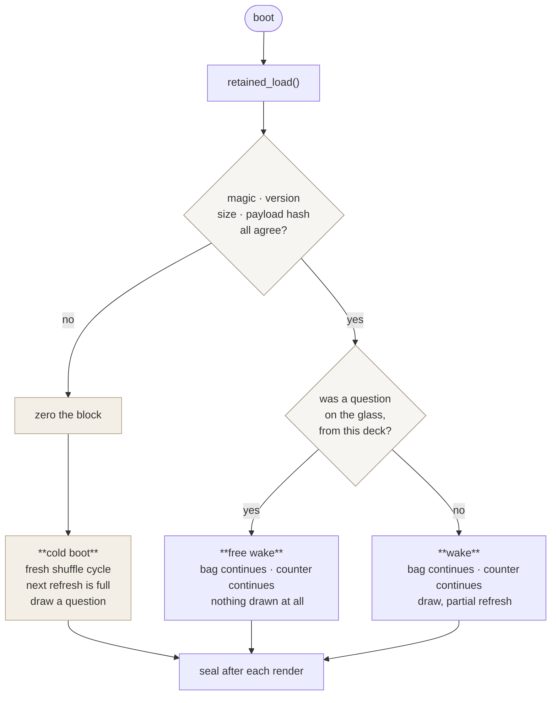

The right-hand path is the one that pays for the whole mechanism. A cold boot
costs a 2315 ms full refresh; a free wake costs nothing at all.

`retained_matches()` therefore answers truthfully, and a wake to a question the
panel already holds costs no refresh. A deck name does not count — waking to
one means Category was pressed and Next never was, so the name stays up
rather than being read as an answer.

*Verified at link time:* the block lands at `0x50000000`, which is
`rtc_slow_ram`, and takes `rtc_slow_seg` from 36 to 488 bytes of the 8 KB
available. The `esp32s3_devkitc/esp32s3/procpu` board also lists `retained_mem`
as supported, so Zephyr's driver API is available; the section attribute is
used instead because it hands out a struct rather than a read/write interface,
and the bag mutates in place.

*Verified on hardware*, with `just fw-retain` — the soak image rebooting itself
every three presses, since a warm reboot is what a deep-sleep wake will be.
Across three consecutive reboots:

```
rst:0xc (RTC_SW_CPU_RST)
<inf> tk_main: reset: software
<inf> tk_app: retained state: kept across the reboot
<inf> tk_soak: partial #6 of seq 7      <- before
rst:0xc (RTC_SW_CPU_RST)
<inf> tk_soak: partial #7 of seq 8      <- after
```

The bag continued its cycle, `seq` continued, the refresh counter continued so
no full refresh followed a reboot, and nothing was drawn at boot — the first
question arrives one soak interval later, which is `retained_matches()` sending
`BOOT` straight to `SHOWING`.

Only a warm reset keeps RTC memory. A reset through the DevKitC's EN pin
reports as `rst:0x1 (POWERON)` and clears it, so the check needs an image that
reboots itself.

*Still unconfirmed:* `PM_STATE_SOFT_OFF` mapping to real deep sleep rather than
light sleep, and whether a genuine wake behaves like the warm reboot tested
here.

### The EXT1 wake mask

The mask is computed at sleep time from a live reading: every pin currently
high, armed for ANY_LOW. Both buttons are open at rest, so both are normally in
it. A button held down at the moment of sleep is already low and is left out,
because arming it would satisfy the wake condition before sleep is entered —
and leaving it out means the other button still wakes the device.

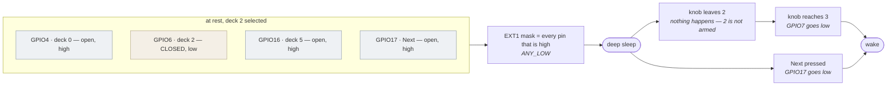

VBUS detect joins the mask with the opposite polarity, since plugging in drives
it high.

The consequence worth stating: the mask is state recomputed on every sleep
rather than configured once.

## Testing boundary

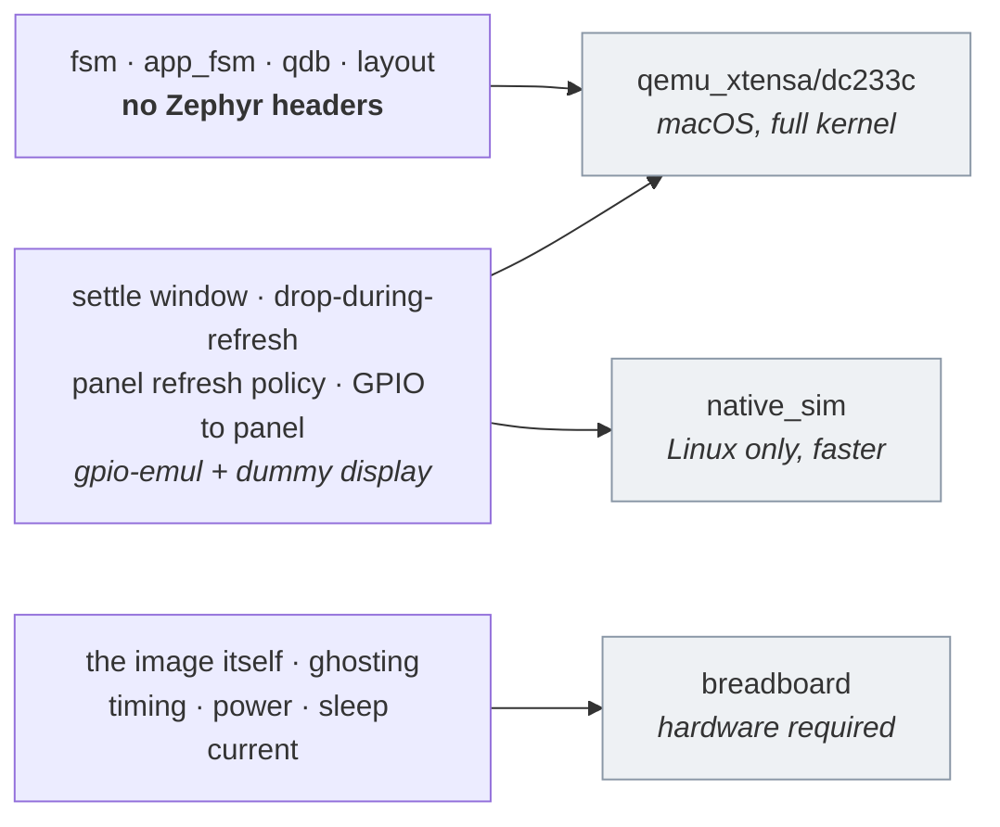

The dummy display accepts writes and discards them, so everything about
rendering *except the picture* is testable off-target: that each shipped
question lays out inside 25 × 7 cells, that accented text draws without
falling back, and that full refreshes come round on the interval. Whether it
looks right is a bench question.

Emulated GPIO is not a `native_sim` feature: `CONFIG_GPIO_EMUL` follows a
`zephyr,gpio-emul` devicetree node and works on either host platform, so the
suites that drive the two buttons run in the default macOS loop.

`qdb` suites run against real bundles built from the question database by
`just fw-fixtures`, not hand-written bytes.

## Open items

- What a phone actually does with the portal. The access point, the DHCP
  server, the DNS responder and the HTTP server all come up on the bench and
  the card reaches the panel, but no phone has joined one: the captive sheet on
  iOS and on Android, the scan list against a real band, the form, and the join
  are all *verify*.
- Whether the SoftAP surviving a station join is as disruptive as the datasheet
  implies. The design assumes the phone is dropped and reports on the panel
  instead; that assumption has not been watched happening.
- A partial refresh measured 2769 ms during a portal session against the 622 ms
  the panel work recorded. Either the service card's longer text or contention
  with the radio explains it, and which one matters for the refresh budget.
- The refresh counter has to reach RTC memory before the full-refresh interval
  means anything. `tk_panel_init()` seeds it with the interval, so a cold boot
  always refreshes fully — correct today, and wrong the moment deep sleep makes
  every press a cold boot, because every question would then cost a 2.3 s full
  refresh instead of 622 ms. It is already listed under "Where state lives"; the
  measured numbers are what make it load-bearing rather than tidy.
- The bundled font. Zephyr's CFB fonts are 10x16 monospace and cover ASCII
  only, so `lib/layout` decomposes accented letters into a base glyph plus a
  mark that `app/src/panel.cpp` draws itself — enough for German, French,
  Spanish and Italian without licensing a font file. Two gaps remain: `¿` and
  `¡` fall back to `?` and `!`, and a monospace terminal font is not what this
  object should look like. Latin-1 coverage is a requirement to put on the
  eventual product font rather than a separate task.
- Whether `build_bundle.py` should assert the device's text buffer size so an
  over-long question fails in CI rather than on the device. Partly covered
  already: the `layout` and `qdb` suites fold every shipped question at the
  real panel geometry, so an over-long one fails a test — but only once
  someone runs the firmware suites.
- The recent ring is specified here as shared across decks; the website keeps a
  per-deck window. They should agree before either is called done.
