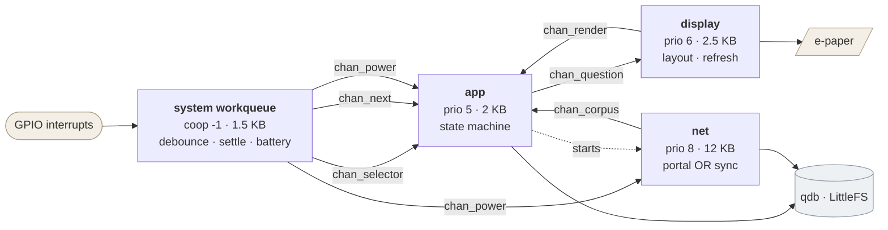
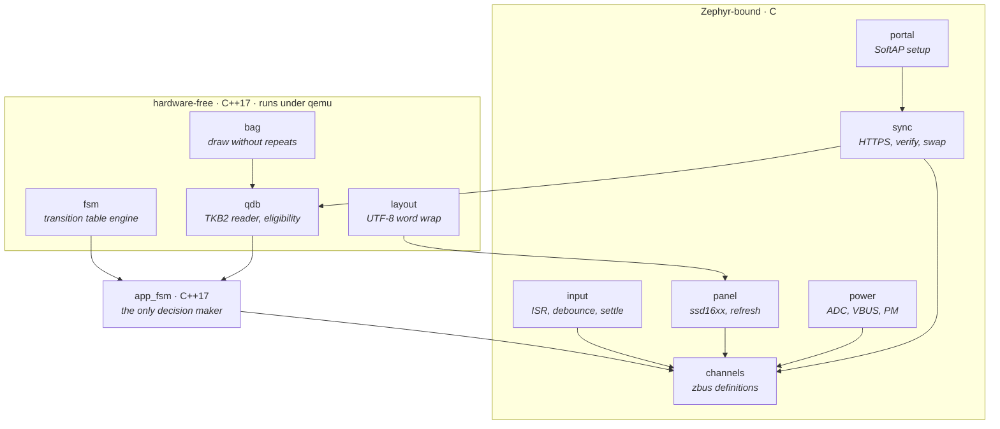
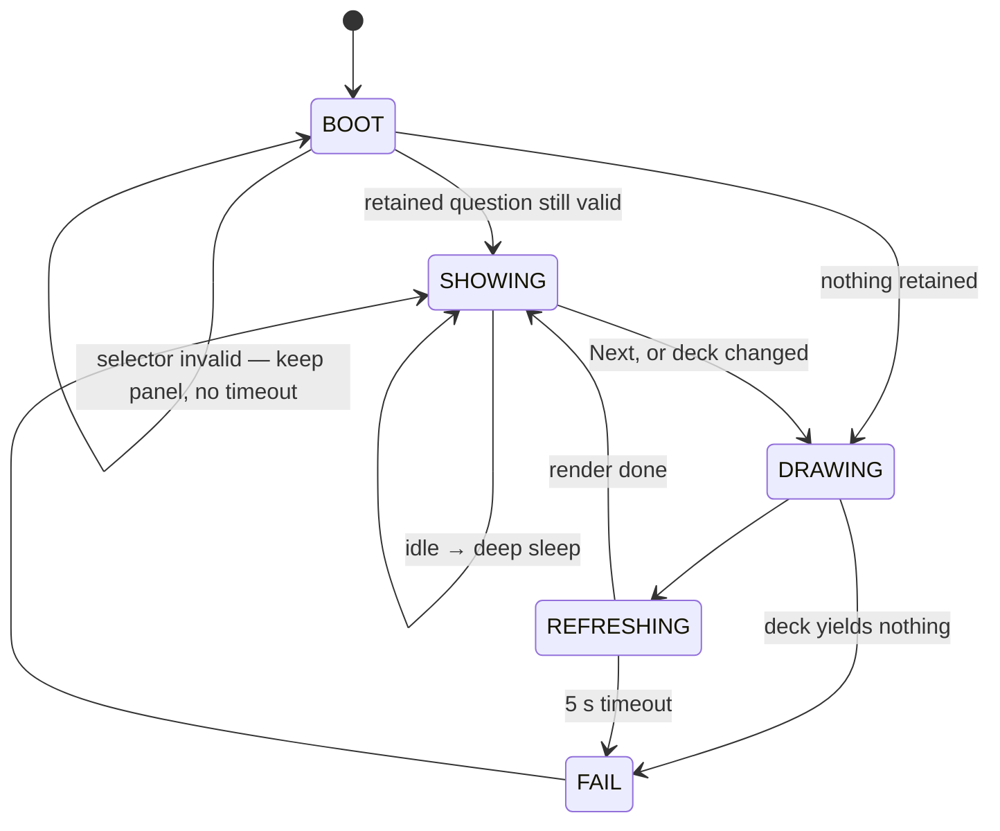
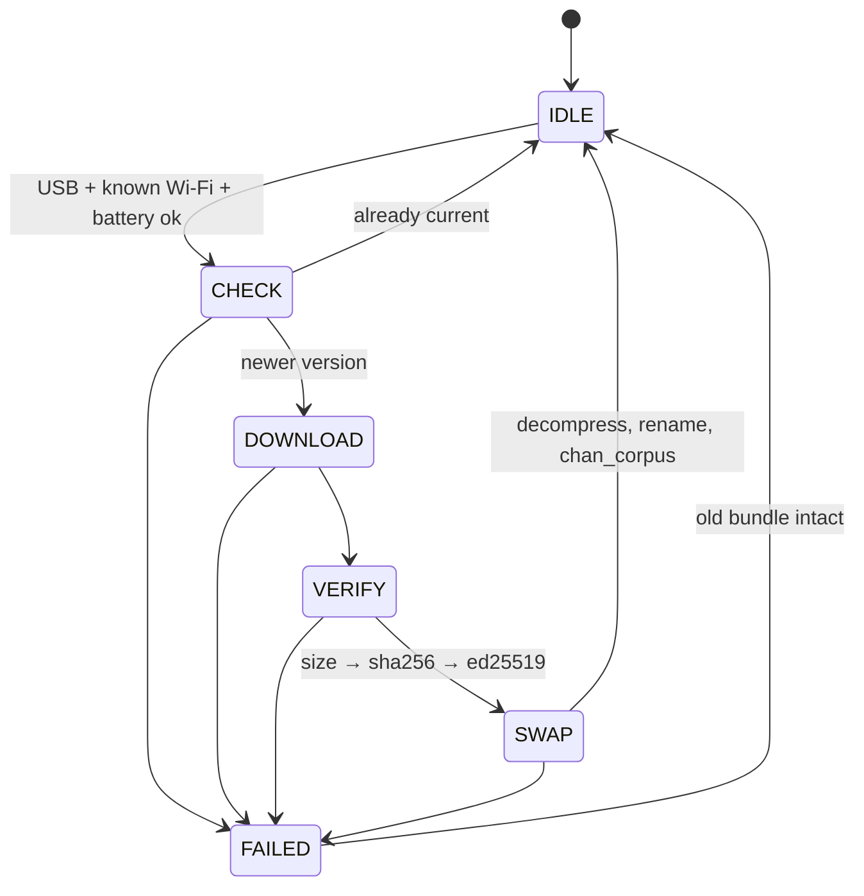
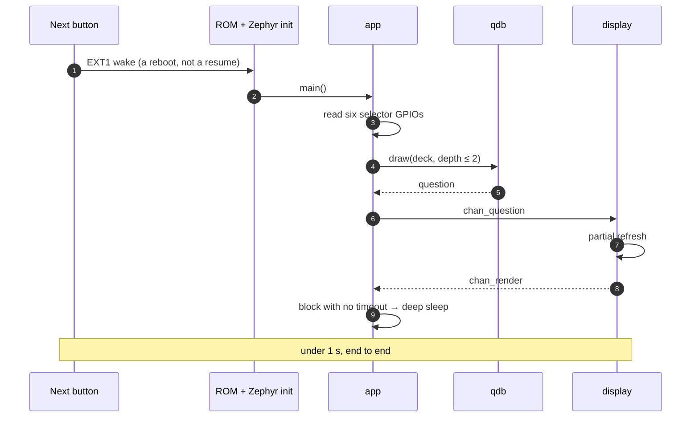
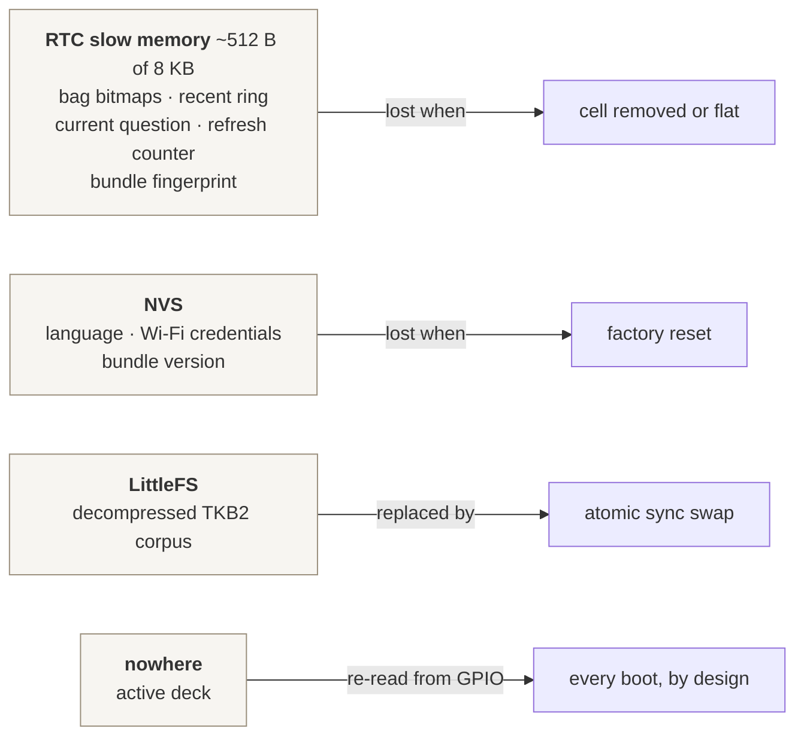
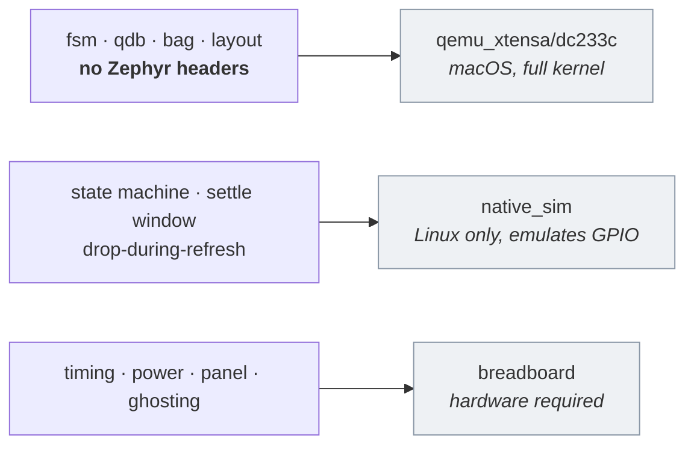

# Firmware architecture

Structure of the ESP32-S3 application: threads, the messages between them, and
which modules depend on Zephyr. Interaction rules are in [design.md](design.md),
the data contract in [sync_protocol.md](sync_protocol.md), rationale in
[decisions.md](decisions.md).

**Status: partly built.** `fsm` and a bring-up blinky exist and are tested;
everything else is design. Items marked *verify* have not been run on hardware.
The [firmware primer](firmware_primer.md) is the hands-on tour of what is
there.

## The one constraint

Below 30 µA means deep sleep, and on the ESP32-S3 deep sleep is a reboot: SRAM
and every thread stack are gone, and waking runs `main()` from the top.

- The steady state is **off**, not idle. Threads live for the milliseconds
  between wake and sleep.
- "Next question under 1 s" is a **boot-time** budget, not a scheduling one.
- Persisted state lives in **RTC slow memory**, never in `.bss`.
- Sleep is never called. It is what happens when no thread is runnable.

## Threads and data flow

Every arrow is a zbus message. `app` is the only thread that decides anything;
everything else reports or renders.

A thread exists only where something must block independently.

| Context | Blocks on | Why not merged |
|---|---|---|
| system workqueue | nothing (delayed work) | An input thread would buy nothing; `k_work_reschedule` *is* the 600 ms settle |
| `app` | its zbus queue | — |
| `display` | the panel, 0.3–2 s | So `app` stays awake during a refresh and can drop the Next press |
| `net` | sockets, TLS | Portal and sync never overlap; one thread saves ~12 KB |

There is no power thread. With `CONFIG_PM` the idle thread picks the sleep
state once nothing is runnable, so the design's job is to make every thread
block with **no timeout** when the table is quiet. `net` holds a PM lock while
active; nothing else inhibits sleep.

## Channels

Two channels are **state** (they hold their last value, so anyone can read
"what is true now") and three are **events**. That distinction is the domain
model: the selector *is* the deck, a press *happened*.

| Channel | Kind | Carries | Published by | Read by |
|---|---|---|---|---|
| `chan_selector` | state | deck 0–5, valid flag | workqueue | `app` |
| `chan_next` | event | timestamp, press duration | workqueue | `app` |
| `chan_question` | state | seq, deck, text | `app` | `display` |
| `chan_render` | event | seq, result, was-full | `display` | `app` |
| `chan_power` | state | USB, charging, mV | workqueue | `app`, `net` |
| `chan_corpus` | event | version, language, count | `net` | `app` |

All observers are message subscribers, so a publish never blocks a publisher.

Two contract rules that are easy to violate:

- **Press duration travels but is never read by policy.** It exists so a table
  study can answer "did anyone try to long-press?". Long press is Next.
- **`chan_corpus` must not trigger a redraw.** A new bundle applies on the next
  *requested* draw, silently.

## Modules

The split that matters is not epaper-versus-input, it is **what needs
hardware**. Everything in the upper box runs under qemu and is tested without a
board. `fsm` touches Zephyr only for its default clock, which tests override,
so every timeout is exercised without sleeping.

C++ stops at the Zephyr boundary for one mechanical reason: `ZBUS_CHAN_DEFINE`
and several HAL macros expand to out-of-order designated initializers, legal in
C and rejected by C++17. Keeping those files `.c` means upstream samples paste
in unmodified.

## The tabletop state machine

`app_fsm` uses the `Fsm` base class: the transition table is the specification,
and `handle_current_state()` only picks which transition to return.

`BOOT` has no timeout, so a device with a broken or mid-travel selector waits
indefinitely while keeping the panel readable. `REFRESHING` has one, so a dead
panel cannot wedge the device.

Service entry is not a state. USB-plus-Next starts `net` in portal mode and the
FSM continues in `SHOWING`, because the tabletop face stays a question display.

## Sync

Checks run cheapest-first so a truncated download costs no signature work. Any
failure leaves the previous bundle in place. The gzip in a `.tkb` is transport
only — `SWAP` decompresses, because a device that reboots on every press must
not re-inflate the bundle each time.

## The wake path

The whole latency budget, from press to readable:

Turning the selector follows the same path with the 600 ms settle inserted
before the draw, so crossing three detents produces one question rather than
three.

## Where state lives

Keeping the bag out of NVS means a Next press costs no flash write, so button
life rather than flash endurance bounds the device. The active deck has no
storage at all, which is how "the selector is the deck state" is enforced
structurally rather than by discipline.

*Verify:* the `esp32s3_devkitc/esp32s3/procpu` board lists `retained_mem` as
supported, so Zephyr's retained-memory API is the likely mechanism rather than
raw section attributes. Still unconfirmed: `PM_STATE_SOFT_OFF` mapping to deep
sleep, and EXT1 wake on seven pins. Only the structures above depend on this,
so the fallback is a write-coalesced NVS record, not a redesign.

## Testing boundary

`qdb` suites run against real bundles built from the question database by
`just fw-fixtures`, not hand-written bytes.

## Open items

- Pin assignments. Constraint: all six selector contacts, Next and VBUS must be
  RTC-capable GPIOs, or EXT1 wake is impossible.
- Full-refresh interval, from observed ghosting rather than a chosen number.
- Bundled font and its German coverage.
- Whether `build_bundle.py` should assert the device's text buffer size so an
  over-long question fails in CI rather than on the device.
- The recent ring is specified here as shared across decks; the website keeps a
  per-deck window. They should agree before either is called done.
