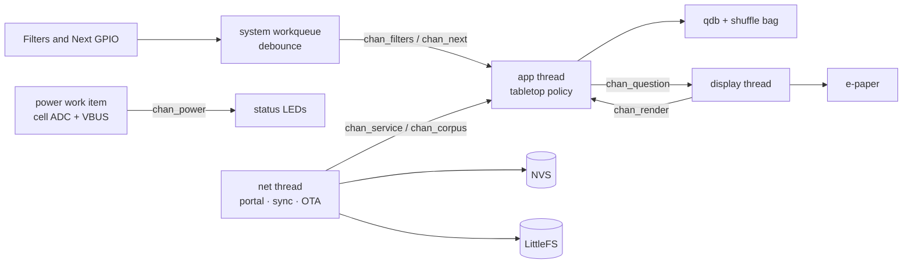
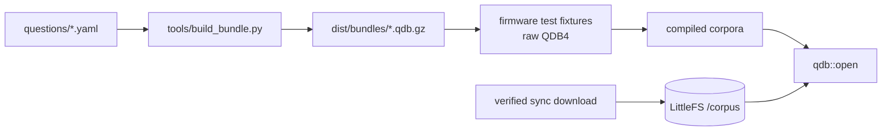
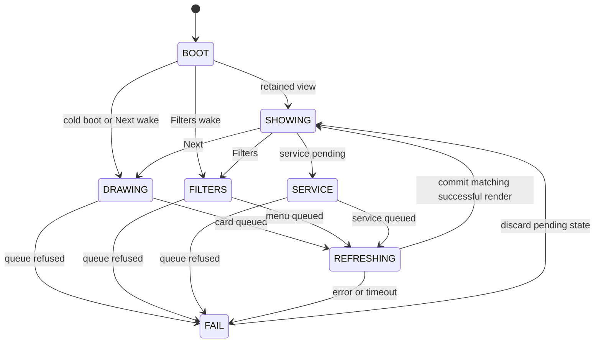
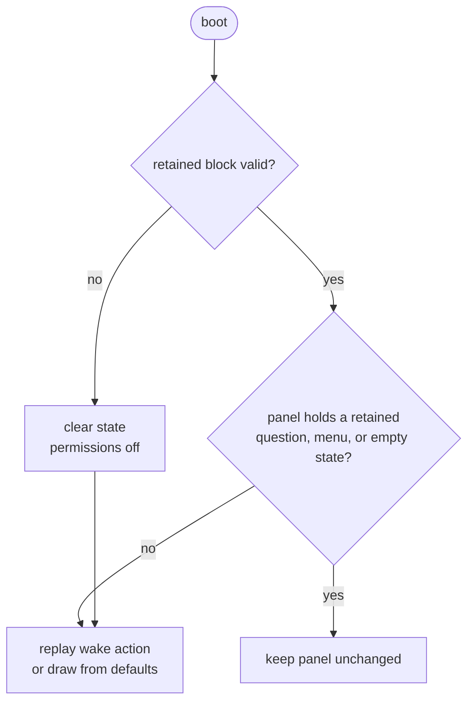
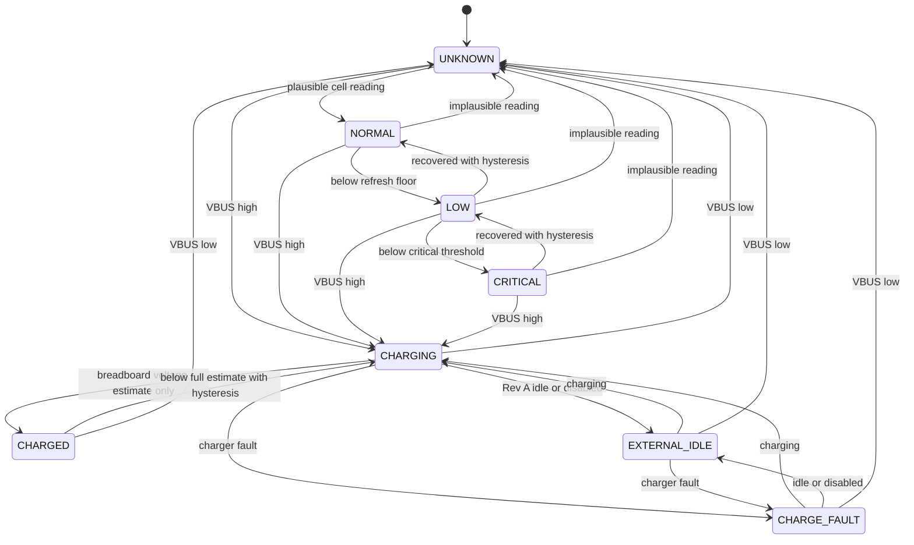
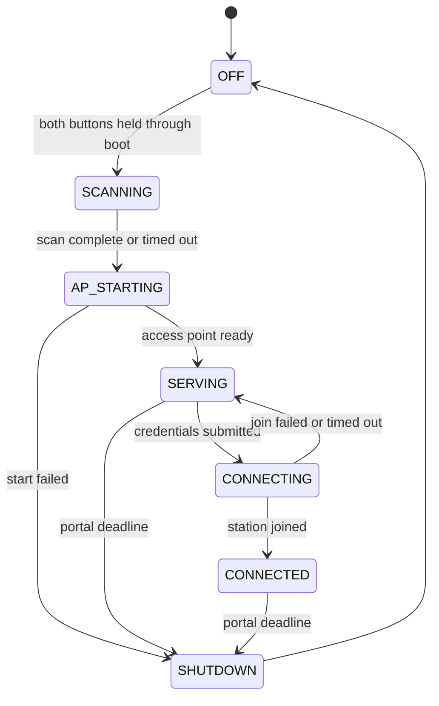
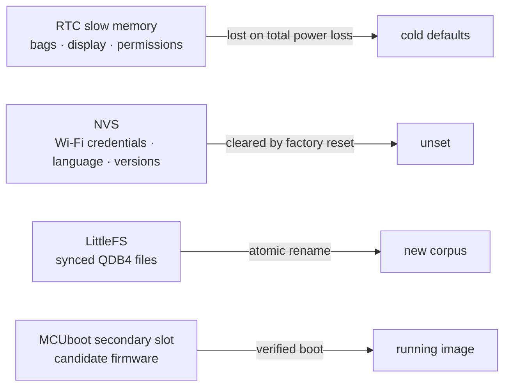
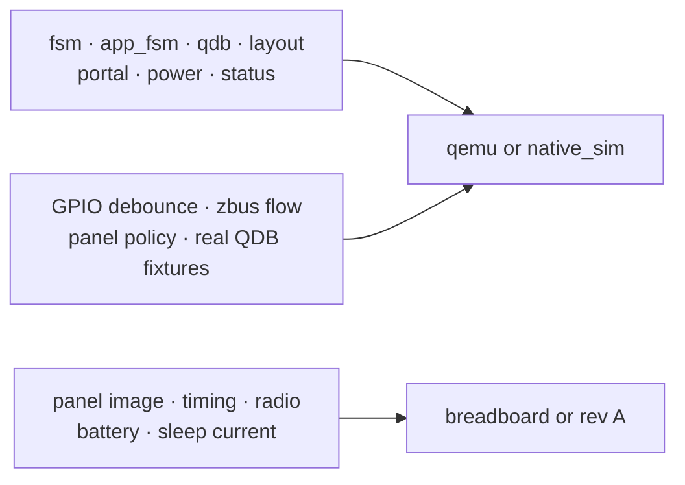

# Firmware architecture

The ESP32-S3 firmware runs the tabletop interaction, preserves state through
deep sleep, manages the setup portal, and installs signed question and firmware
updates. See [design.md](design.md) for interaction rules,
[sync_protocol.md](sync_protocol.md) for bundle formats, and
[hardware_wiring.md](hardware_wiring.md) for the breadboard pins.

Every module builds and runs on the breadboard. Whole-device sleep current is
still unmeasured because the DevKitC indicators exceed the 30 µA target. The
[firmware primer](firmware_primer.md) covers setup and common development
tasks.

## Runtime model

ESP32-S3 deep sleep restarts the application. SRAM and thread stacks are lost;
`main()` runs again after a button wake. State needed across wakes lives in RTC
slow memory or flash.

The device enters deep sleep after the idle timeout when all three conditions
hold:

1. the tabletop state machine has settled;
2. the portal, sync, and update paths are idle;
3. external power is absent.

External power keeps the application awake. It also opens a bounded window for
sync and update checks.

The display has its own thread because an e-paper refresh can block for up to
two seconds. The app thread remains responsive and can apply the rule that
presses during a refresh are discarded. Network coordination also has a thread;
short ADC and VBUS reads run as delayed work.

## Code boundaries

Shared question and session policy lives in `core/`, also consumed by the
[Xteink X4 fork](crosspoint.md). Zephyr-specific policy remains in
`firmware/lib/`; threads, drivers, channels, and storage adapters live in
`firmware/app/src/`.

| Area                                         | Owns                                                                |
| -------------------------------------------- | ------------------------------------------------------------------- |
| `lib/fsm`                                    | table-driven state machine engine with an injectable clock          |
| `lib/app_fsm`                                | Filters, Next, render, and service-card policy                      |
| `../core`, through `lib/qdb`                 | QDB4 validation, selection, and transactional session state         |
| `lib/layout`                                 | UTF-8 decoding, accent composition, and line wrapping               |
| `lib/portal`                                 | portal state machine, form parsing, DNS replies, and HTML rendering |
| `lib/power`                                  | battery and external-power states                                   |
| `lib/status`                                 | LED priority and blink patterns                                     |
| `lib/sync`                                   | CMake adapter for shared manifest parsing and version comparison    |
| `lib/retained`                               | validation of the RTC-retained block                                |
| `lib/ed25519`                                | CMake adapter for shared detached-signature verification            |
| `app/src/input.c`                            | Filters and Next events from `gpio-keys`                            |
| `app/src/app.c`, `app_logic.cpp`             | app thread, state machine effects, and corpus binding               |
| `app/src/display.c`, `panel.cpp`             | display thread, layout, and refresh policy                          |
| `app/src/net.c`, `net_logic.cpp`, `portal.c` | Wi-Fi, setup, and network events                                    |
| `app/src/fetch.c`, `sync.cpp`, `ota.cpp`     | HTTP transport and signed updates                                   |
| `app/src/power.c`, `power_logic.cpp`         | ADC/VBUS sampling and power state publication                       |
| `app/src/status.c`, `status_logic.cpp`       | serialized LED output                                               |
| `app/src/sleep.c`                            | idle timer, wake sources, and pin state for deep sleep              |

Files that define zbus objects stay in C because Zephyr's macros use
initializers that C++17 rejects. C++ policy is exposed to those files through
small C APIs.

## Channels

`chan_question` and `chan_power` hold current state. The other channels carry
events.

| Channel         | Carries                                   | Publisher       | Consumer |
| --------------- | ----------------------------------------- | --------------- | -------- |
| `chan_filters`  | timestamp and press duration              | input work item | app      |
| `chan_next`     | timestamp and press duration              | input work item | app      |
| `chan_question` | sequence, permissions, cursor, kind, text | app             | display  |
| `chan_render`   | sequence, result, and refresh type        | display         | app      |
| `chan_service`  | setup or sync result card                 | net             | app      |
| `chan_corpus`   | active language change                    | net             | app      |
| `chan_power`    | power state, millivolts, and VBUS         | power work item | status   |

Messages use subscribers, so publishers do not wait for consumers.
`chan_question` copies the text into the message. This keeps it valid if sync
replaces the underlying corpus before the display thread reads it.

The app is the only publisher of `chan_question` and owns its sequence number.
Render results with an older sequence are ignored. Corpus changes take effect
on the next requested draw and do not refresh the panel by themselves.

## Question data

Every shipped language is compiled into the firmware. A valid synced corpus in
LittleFS takes precedence; the compiled copy remains the fallback.

The selected language is stored in NVS. Changing it reopens the corpus and
publishes `chan_corpus`. Binding the shuffle bag to a different bundle
fingerprint clears indices that belong to the previous corpus.

### QDB reader

`Qdb::open()` validates the whole QDB4 buffer: magic, record lengths, question
count, and trailing bytes. Questions point into that buffer, so the buffer must
outlive every returned view.

`Qdb::at()` walks records from the start. The shipped corpora are small enough
that an offset table would cost more RAM than the scan saves.

A question is eligible only when Dark permits its dark flag, Sexual permits its
sexual flag, and Heavy permits depth 3. All applicable permissions are required.

### Shuffle bag

Each installed language has one drawn bitmap and recent ring of 20 indices.
Selection happens at draw time: eligible, unseen, non-recent if possible, then
not current if possible. Only exhaustion reopens the eligible cycle. Excluded
questions keep their seen bits. A depth-3 predecessor adds a cost of three to
another depth-3 candidate; repeated depth band and overlapping form each add
one. Random choice among the cheapest candidates therefore prefers a breather
before texture, without forcing an early repeat. Restrictions never relax.

The fingerprint covers the full bundle bytes, so metadata or order changes
invalidate old indices even if a development version string is unchanged.

## Tabletop state machine

Filters opens or advances the four-row menu. Next draws during play, toggles a
menu row, or applies Done. A cold boot draws from default permissions; a valid
retained menu, question, or empty state needs no redraw. A button wake replays
its action once. The two-button service gesture remains unchanged.

`AppIo` stages a copy of the bag and play state before publishing a card.
`complete(true)` commits after the display succeeds. A low-power refusal,
failed publication, display error, or timeout discards that copy. Both tabletop
inputs are dropped while refreshing. Late render results cannot commit. Service
cards wait until the current refresh finishes. If sync changes the corpus during
a refresh, completion cannot revive indices into the old corpus.

## Display

`panel.cpp` lays out UTF-8 text through `lib/layout`, draws through Zephyr CFB,
and selects full or partial refresh. A full refresh is forced at boot and after
`CONFIG_CICALA_FULL_REFRESH_INTERVAL` partial updates.

The SSD16xx driver performs a full update when blanking changes from on to off.
`panel.cpp` therefore uses `display_blanking_on()`, `display_write()`, then
`display_blanking_off()` for a full refresh. A partial refresh writes while
blanking is already off.

The local Zephyr patch controlled by `firmware/patches.yml` preserves the image
during driver initialization. Without it, every deep-sleep wake would clear the
bistable panel before the app could decide that no refresh was needed.

Before system power-off, `sleep.c` sends the panel controller to deep sleep,
stops pending ADC sampling and LED work, then parks the display signals.
Rev A holds reset, D/C, chip-select, MOSI and clock physically low and disables
the panel rail. Its first refresh after restoring power is full because the
controller RAM was lost. The retained question and shuffle state survive.

## Retained state and wake

`app/src/retained_block.cpp` places one validated block in `.rtc_noinit` inside
RTC slow memory. It contains:

- shuffle-bag state and the shared recent ring;
- the partial-refresh counter;
- committed permissions, menu draft and cursor;
- a copied question and its restrictions, plus the displayed card kind;
- the last question sequence number.

The block carries a magic value, layout version, size, and payload hash. A
failed check clears the whole block and excludes Dark, Sexual, and Heavy. The block is sealed
after each completed render.

Filters and Next are active-low RTC-capable inputs. At sleep time, firmware
arms every input that currently reads high with EXT1 `ANY_LOW`. A held or stuck
button is omitted from the mask, avoiding an immediate wake loop while leaving
the other button usable. The EXT1 wake status is latched at `PRE_KERNEL_1` so
later driver initialization cannot erase it. Next wins if both bits are set.

VBUS uses a separate active-high EXT0 trigger when
`CONFIG_CICALA_POWER_WAKE_ON_USB` is enabled. It is disabled by default because it
keeps the RTC peripheral domain powered. With the default setting, plugging in
does not wake the device; the next button press wakes it, VBUS is sampled during
boot, and the network window opens.

## Power and status

`power.c` samples the battery divider and VBUS on a dedicated workqueue. Rev A
switches its 1 MΩ/470 kΩ divider, waits 200 ms, samples, then switches it off
even after a conversion failure. VBUS remains usable when the ADC fails.
Rev A also reads both BQ25185 status inputs atomically. A mutex protects the
power state machine and queries from app, networking and system workqueue threads.

LOW and CRITICAL refuse panel refreshes. UNKNOWN permits them, so a missing or
failed divider does not disable the tabletop interaction. Downward transitions
are immediate. Recovery uses hysteresis. A reading below
`CONFIG_CICALA_POWER_PLAUSIBLE_MV` is treated as an invalid divider reading.

CHARGED is retained for the breadboard's voltage estimate. Rev A selects
CHARGING, EXTERNAL_IDLE or CHARGE_FAULT directly on USB insertion, depending
on its two status pins. High/high can mean charge completion, CE-disabled or
sleep; it does not prove a full battery. A failed status read uses EXTERNAL_IDLE
and logs unavailable status. The message preserves recoverable/latched fault
detail, even if voltage and the outer state do not change. External power
keeps the device awake in all four external states and opens one network window
per insertion; charger state changes do not reopen that window.

The red and green LEDs share one priority arbiter:

| Condition                          | Output           |
| ---------------------------------- | ---------------- |
| critical refresh refused           | three red blinks |
| low refresh refused                | one amber blink  |
| Rev A charger fault                | slow red pulse   |
| sync or update active              | slow green pulse |
| setup portal active                | steady amber     |
| breadboard charged estimate        | steady green     |
| charging                           | steady red       |
| Rev A idle/disabled/unavailable    | slow amber pulse |
| healthy battery or unknown reading | off              |

Calls from app, network and power threads set atomic flags. The zbus power
listener also posts to those flags; it runs on the ADC publisher's thread.
The status work item owns the arbiter and GPIO writes. Sleep synchronously
cancels pending work, prevents rescheduling, then makes the final LED-off write.

## Setup, sync, and updates

Holding Filters and Next for `CONFIG_CICALA_PORTAL_ENTRY_HOLD_MS` during boot opens
the setup portal. The device scans first, starts a WPA2 access point with a
fresh session password, serves DHCP/DNS/HTTP, stores submitted credentials, then
joins the selected network. The password is generated from the device random
source, shown on the e-paper service card, and cleared when the portal closes.
The setup page can rescan nearby networks and save the question language
separately from Wi-Fi. Its status page shows the access-point name, remaining
portal window, board and firmware versions, corpus information, connection
diagnostics, and the last requested sync result. It can request a question or
firmware update, or forget all saved Wi-Fi credentials after confirmation. The
stored password is never shown. The portal closes at its configured deadline.

A cold boot with stored credentials checks for new data. A button wake also
checks while the external-power window is open. Battery-only wakes skip Wi-Fi
so the requested question is not delayed by network association.

Question sync performs these checks before storing a bundle:

1. manifest schema and minimum firmware version;
2. version newer than the installed corpus;
3. declared download size;
4. SHA-256 digest;
5. Ed25519 signature against the compiled public key.

The verified bytes are written beside the installed corpus and renamed over it.
A failure leaves the previous file intact. An automatic sync keeps the current
panel content. A sync requested from the portal publishes a result card.

OTA uses the same fetch, manifest, hash, and signature code. The image streams
into `slot1_partition`; it is marked for upgrade only after verification.
MCUboot validates and installs it on the next boot. `update_notice.c` displays
the installed version after a successful update. See
[firmware_update.md](firmware_update.md).

## Persistent storage and security

The current breadboard build does not enable flash encryption. Physical access
to its flash exposes Wi-Fi credentials and stored corpora. Product provisioning
needs ESP32-S3 eFuse-backed flash encryption before the device is used on a
sensitive network.

## Testing boundary

`just fw-test` runs the firmware suites under qemu. Linux can use
`just fw-test-linux` for `native_sim`. Both platforms use `gpio-emul` for the
button suites. Generated QDB fixtures keep the writer and firmware reader on
the same data contract.

The dummy display checks bounds, refresh selection, and channel behavior. Image
quality, ghosting, radio behavior, power thresholds, and current require
hardware.

## Open measurements

- Measure whole-device deep-sleep current on rev A without DevKitC indicator
  loads.
- Measure the lowest reliable e-paper refresh voltage and set
  `CICALA_REFRESH_MIN_MV` from that result.
- Measure the current cost of enabling VBUS wake through EXT0.
- Verify font coverage and layout for every released language.
- Run multi-phone setup-portal and long-transfer stress tests.
