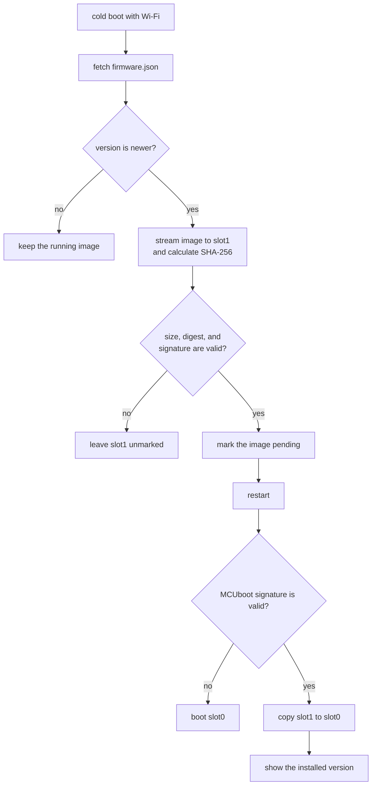

# Firmware updates

The device checks for firmware after Wi-Fi connects on a cold boot. It downloads
a newer signed image into the spare slot, verifies it, and asks MCUboot to
install it on the next boot.

Question bundles use the related process described in
[sync protocol](sync_protocol.md).

## Flash layout

```text
0x000000  mcuboot            64 KB    bootloader
0x010000  sys                64 KB
0x020000  image-0 (slot0)  1344 KB    running firmware
0x170000  image-1 (slot1)  1344 KB    downloaded update
0x3b0000  storage           192 KB    NVS settings and versions
0x400000  corpus            512 KB    LittleFS question bundles
```

MCUboot runs in overwrite-only mode. A valid pending image is copied from slot1
to slot0. There is no automatic rollback; recover a bad release with a wired
flash.

## Update flow



The application rejects manifests at or below `APP_VERSION_STRING`. It checks
the slot capacity before downloading, then checks the received byte count,
SHA-256 digest, and Ed25519 signature. Slot1 remains inactive until all checks
pass and `boot_request_upgrade()` succeeds.

## Signing keys

Each update has two signatures:

| Signature                       | Secret                 | Checked by  | Purpose                          |
| ------------------------------- | ---------------------- | ----------- | -------------------------------- |
| MCUboot image                   | `FIRMWARE_SIGNING_KEY` | MCUboot     | Authorizes code to run           |
| Image digest in `firmware.json` | `BUNDLE_SIGNING_KEY`   | Application | Authorizes the published release |

The MCUboot public key is compiled into the bootloader. Changing it requires a
wired reflash. The manifest public key is compiled into the application and can
change in a firmware release. See `firmware/keys/README.md` for key handling.

## Release process

1. Update `firmware/app/VERSION`.
2. Commit the change and tag it `fw-<version>`, for example `fw-0.2.0`.
3. Push the tag.

`.github/workflows/ota.yml` checks that the tag and version file agree. It
builds the application and matching bootloader, applies both signatures, and
publishes these release assets:

- `tischkarte-<version>.bin`
- `firmware.json`
- `mcuboot-<version>.bin`

Devices fetch `/device/firmware.json` and the image URL in that manifest. The
host must serve plain HTTP without redirects because the firmware HTTP client
does not follow redirects. [Hosting](hosting.md) describes the deployment.

## Local OTA test

Use a laptop and device on the same network. Guest networks often isolate
clients, so first confirm that the device can reach the laptop address.

Generate a temporary manifest key, build an OTA profile that points to the
laptop, and serve the output:

```sh
just keygen
just fw-flash ota 192.168.1.23
just fw-ota-publish
just fw-ota-serve
```

`just keygen` replaces `firmware/components/sync/trusted_key.h`. Restore that
tracked file after the test:

```sh
git restore firmware/components/sync/trusted_key.h
```

Increase `firmware/app/VERSION`, run `just fw-ota-publish` again, and reset the
device. The device should verify the new image, restart, and show the installed
version.

## Test with release keys

The private release keys live in GitHub Actions. Dispatch the OTA workflow with
the laptop address:

```sh
gh workflow run ota.yml -f sync_host=192.168.1.23 -f sync_port=8000
gh run watch
gh run download --name firmware-0.1.0-bench -D /tmp/bench
```

Flash the bootloader and application from the same artifact. A bootloader only
accepts images signed by its configured firmware key.

```sh
.venv/bin/python -m esptool --port /dev/cu.usbserial-140 --chip esp32s3 \
    write-flash 0x0 /tmp/bench/mcuboot-0.1.0.bin \
    0x20000 /tmp/bench/tischkarte-0.1.0.bin
```

Build a second artifact with a higher version and the same host, serve its
manifest and image on port 8000, and reset the device.

Use `just fw-flash` to return a bench board to the development bootloader and
release image.

## Test the install path without a network

Sign an application into a slot1 image and write it directly:

```sh
.venv/bin/python deps/bootloader/mcuboot/scripts/imgtool.py sign \
    --version 0.2.0+0 --header-size 0x20 --slot-size 1376256 \
    --overwrite-only --align 1 --pad --confirm \
    --key firmware/keys/firmware-signing-dev.pem \
    build/esp32s3/app/zephyr/zephyr.bin /tmp/slot1.bin

.venv/bin/python -m esptool --port /dev/cu.usbserial-1120 --chip esp32s3 \
    write-flash 0x170000 /tmp/slot1.bin
```

`--pad --confirm` writes the trailer that marks the image pending.

## Update notice

The first boot after an update shows `Updated to <version>. Press for a
question.` The card remains until the next button press. `src/update_notice.c`
compares `APP_VERSION_STRING` with the version stored in NVS. A device with no
stored version records its first version without showing the card.

## First flash and recovery

```sh
just fw-flash
```

The release profile writes the matching MCUboot and application images. It
preserves the NVS and corpus partitions, including Wi-Fi credentials, language,
and synced questions.
