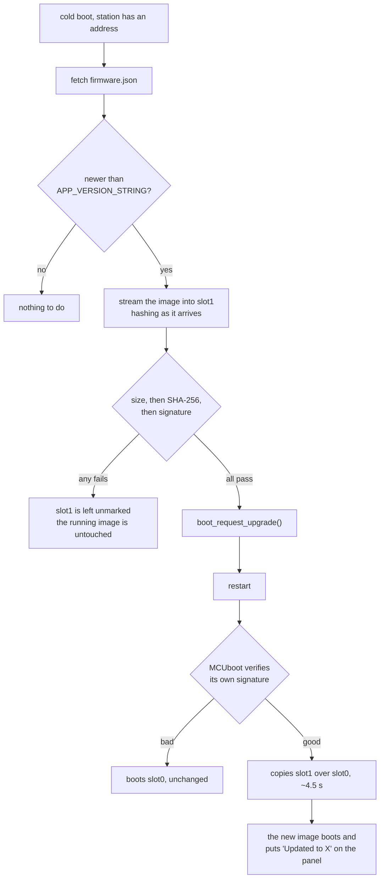

# Firmware updates

The device installs new firmware over the network, from a manifest it checks on
a cold boot. This describes what is built, how to release a version, and how to
try the whole loop on a bench with no website involved.

The question-bundle equivalent is [sync_protocol.md](sync_protocol.md), and the
two are deliberately alike: same manifest shape, same check order, same key for
the manifest signature. What is different is written down below.

## What is on the flash

```text
0x000000  mcuboot            64 KB    the bootloader, and the only thing that decides what runs
0x010000  sys                64 KB
0x020000  image-0 (slot0)  1344 KB    the running firmware
0x170000  image-1 (slot1)  1344 KB    where a download goes
0x3b0000  storage           192 KB    NVS: Wi-Fi credentials, language, versions
0x400000  corpus            512 KB    LittleFS: synced question bundles
```

Only the bootloader is new; every partition above comes from Zephyr's
`partitions_0x0_amp_4M.dtsi` and existed before any of this was built, which is
why enabling MCUboot moved nothing and orphaned no device state.

## The flow



### Two signatures, two keys

An update is signed twice, and the signatures say different things.

| | Key | Made by | Checked by | Answers |
|---|---|---|---|---|
| Image | `FIRMWARE_SIGNING_KEY` | `imgtool`, during the build | MCUboot, at boot | may this run? |
| Manifest | `BUNDLE_SIGNING_KEY` | `tools/build_firmware_manifest.py` | the application, before rebooting | is this the current release? |

MCUboot's is the security boundary: it gates execution, and it is checked
before a single byte of slot1 is copied over the running firmware. The
manifest's exists so the device can refuse a bad image *before* spending a
download and a restart on it, and it is the same statement a question bundle's
signature makes — which is why it uses the same key.

They are separate keys because they rotate differently. The bundle key is
compiled into the application, so replacing it is an ordinary firmware release.
The firmware key is compiled into the bootloader, which nothing but a wired
reflash can replace: a device that will not accept your images is a device you
must physically reach. `firmware/keys/README.md` covers what that means for
manufacturing.

### The checks, in order

`src/ota.cpp` checks size, then SHA-256, then signature — cheapest first, the
same order `src/sync.cpp` uses. A bundle is checked before it touches storage
and an image cannot be: 780 KB does not fit in RAM, so it is written to slot1 as
it arrives and judged afterwards.

That is safe because **slot1 is scratch**. Nothing boots from it, and the only
thing that makes it live is `boot_request_upgrade()`, which runs after all three
checks pass. An image that fails any of them sits in slot1 unreferenced until
the next download overwrites it.

### Rollback, and what happens if a release is bad

The manifest is refused unless its version is strictly newer than
`APP_VERSION_STRING`. An attacker who can replay an old, validly signed manifest
therefore cannot walk a device backwards — the same rule, for the same reason,
that the corpus sync applies.

MCUboot runs in **overwrite-only** mode: there is no automatic revert. A signed
image of ours that boots into a crash is recovered by a wired reflash, not by
the bootloader. Swap-with-revert would change that, and the argument against it
is in the decision log — briefly, every wake from deep sleep is a fresh boot on
this device, so "did the new image boot successfully" is a question it would
answer dozens of times a day rather than once.

## Releasing a version

1. Bump `firmware/app/VERSION`. That one file feeds both
   `APP_VERSION_STRING`, which the device compares, and the version in the
   MCUboot image header.
2. Commit it, and tag the commit `fw-<version>` — `fw-0.2.0` for `0.2.0`.
   `.github/workflows/ota.yml` refuses a tag that disagrees with the file.
3. Push the tag. CI builds, signs with both keys, and attaches
   `tischkarte-<version>.bin`, `firmware.json` and the matching bootloader to a
   GitHub Release.

Devices do not fetch from GitHub Releases: every asset URL there redirects to
another host and Zephyr's HTTP client does not follow redirects. Serving
`/device/firmware.json` from the website is the step that closes this loop, and
it is the same step the question bundles are waiting on.

## Trying it on a bench

No website, no release, one laptop and one device on the same network. The
device must be able to reach the laptop — a guest network that isolates its
clients will not work, which is worth checking first.

```sh
# A throwaway manifest key, because the real private half is a GitHub secret.
# This rewrites the committed trusted_key.h, so put it back afterwards.
just keygen

just fw-ota 192.168.1.23          # build + flash, fetching from this laptop
just fw-ota-publish               # sign the built image into dist/firmware
just fw-ota-serve                 # serve it on :8000

git checkout firmware/components/sync/trusted_key.h
```

Then bump `firmware/app/VERSION`, run `just fw-ota-publish` again, and reset the
device. It fetches, verifies, restarts, and comes back saying what it installed.

To exercise the install path alone — no network needed — sign an image into the
spare slot by hand and reboot:

```sh
.venv/bin/python deps/bootloader/mcuboot/scripts/imgtool.py sign \
    --version 0.2.0+0 --header-size 0x20 --slot-size 1376256 \
    --overwrite-only --align 1 --pad --confirm \
    --key firmware/keys/firmware-signing-dev.pem \
    build/esp32s3/app/zephyr/zephyr.bin /tmp/slot1.bin

.venv/bin/python -m esptool --port /dev/cu.usbserial-1120 --chip esp32s3 \
    write-flash 0x170000 /tmp/slot1.bin
```

`--pad --confirm` is what writes the trailer that marks the image pending;
without it MCUboot sees an image and no instruction to install it.

## Saying so afterwards

An update installs during a boot, which is the one moment nobody is looking:
MCUboot copies the image before any of this firmware runs, and the device comes
up looking exactly as it did before.

So the first boot of a new version puts a service card on the panel —
`Updated to 0.2.0. Press for a question.` — which holds until the next press,
like every other service card. `src/update_notice.c` decides that by comparing
`APP_VERSION_STRING` against a version in NVS, which is the only source that
answers "is this different firmware than last time?" rather than "what will
happen next boot", and the only one that survives a device that reboots on every
wake. A device that has never recorded a version records it silently: nobody
unboxing a device should be told it has just been updated.

## First flash, and recovery

A device is flashed over the wire once, with both images:

```sh
just fw-flash
```

Both come from the same build, so the bootloader and the image it will accept
always match. A device flashed with a development-key bootloader cannot be
upgraded into trusting the release key — the bootloader is what verifies, and
replacing the bootloader is exactly what an update cannot do. That is the one
mistake here with no over-the-air fix.

Recovery from a bad image is the same command. It rewrites slot0 directly and
does not touch `storage` or `corpus`, so Wi-Fi credentials, the chosen language
and the synced questions survive.
