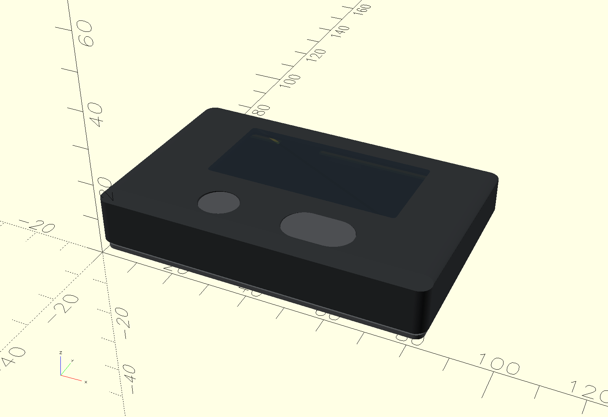
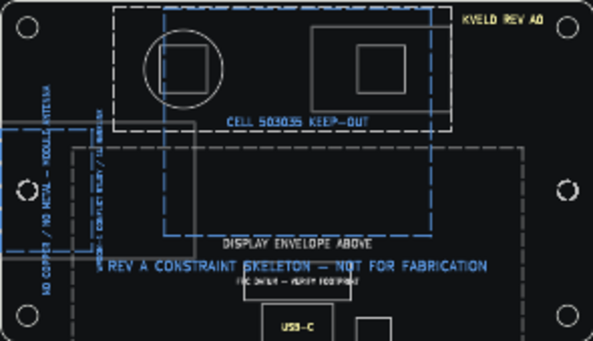
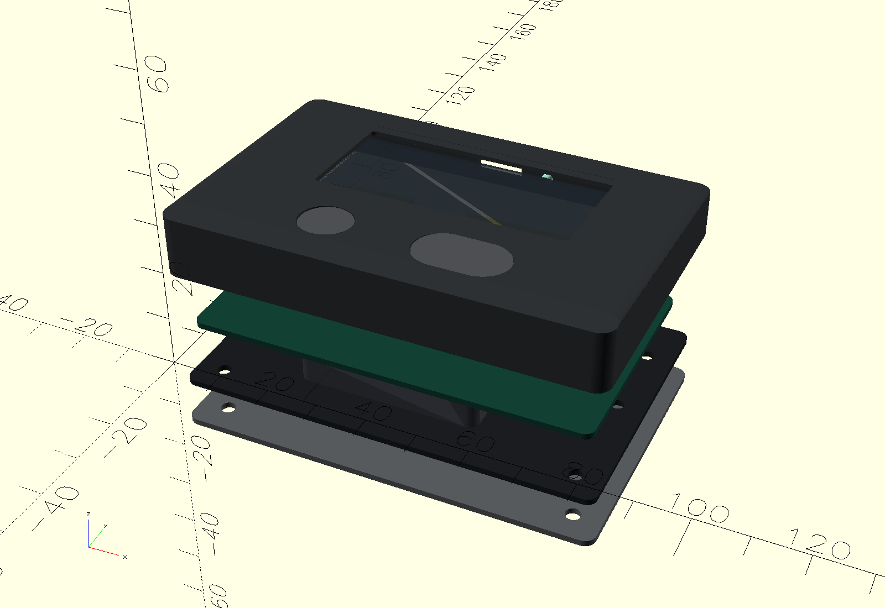

# Rev A hardware

Rev A is the first integrated enclosure and PCB study. The files establish a
shared coordinate system, component envelopes, recovery access, and validation
gates. They are suitable for fit studies and schematic capture. They are not
released for PCB fabrication or production tooling.

_Parametric CAD render, 16 August 2026. This is a model, not a photograph of
built hardware._

## Source files

The mechanical source is `hardware/case/kveld_enclosure.scad`. Printable Rev A
exports live beside it under `hardware/case/exports/rev_a/`. The KiCad 10
project is `hardware/pcb/kveld_rev_a/kveld_rev_a.kicad_pro`.

OpenSCAD is the source of truth for the enclosure. KiCad owns the board outline,
stack-up, copper and component placement. Dimensions shared by both files use
the case coordinate system below and must be changed together.

## Coordinate contract

All values are millimetres. The origin is the rear-left corner of the case when
viewed from above. X runs right, Y runs toward the front USB edge, and Z runs up
from the table.

| Item                | Contract                                                    |
| ------------------- | ----------------------------------------------------------- |
| Case                | 84 × 56 mm, 3 mm corner radius, about 3° face incline       |
| Maximum height      | 15.85 mm at the rear, including 1.5 mm feet                 |
| PCB                 | rear-left at (3, 3), 78 × 45 × 1.2 mm, 2 mm corner radius   |
| PCB holes           | (6.5, 6.5), (77.5, 6.5), (6.5, 44.5), (77.5, 44.5), Ø2.7 mm |
| Category            | centre (27, 12), Ø10.30 mm cap bore                         |
| Next                | centre (53, 12), 18.30 × 11.30 mm cap bore                  |
| Display panel       | centre (42, 37), 59.2 × 29.2 × 1.0 mm                       |
| Visible window      | centre (42, 37), 50.6 × 25.7 mm                             |
| Lens                | centre (42, 37), 55.0 × 30.1 × 0.8 mm                       |
| USB-C               | centred at X=42 on the front board and case edge            |
| FPC connector datum | centre (42, 40); preliminary until footprint review         |
| Status light        | X=52 on the front edge, beside USB-C                        |
| Cell volume         | X=24.5–59.5, Y=4–34, 5.4 mm nominal height                  |
| Module antenna zone | X=0–15, Y=20–36; no copper or metal                         |

The e-paper panel dimensions use the GDEY0213B74 vendor envelope. Its active
area is 48.55 × 23.7046 mm. The PCB project draws the larger panel, battery,
antenna, button, gasket, USB, FPC and light-pipe datums on mechanical user
layers.

The OpenSCAD face plane is 3.37° between the rounded-corner centres so the
specified 15.85 mm rear and 12.91 mm front surface heights both survive the
3 mm corner construction. OpenSCAD's geometry summary reports an exact
84 × 56 × 15.85 mm overall bounding box including feet and the flush light
pipe.

_KiCad constraint map. Grey marks enclosure datums; blue marks keep-outs and
warnings. It contains no routed circuit._

## Mechanical stack

The enclosure uses a deep top shell, a removable base, an optional 1.2 mm steel
weight, and four 8 × 1.5 mm elastomer feet. The steel has a cut-out below the
module antenna. The PCB sits above a protected 503035 cell. A separate retainer
supports the e-paper around its perimeter and leaves the FPC exit clear.

The modeled 0.35 mm base recess leaves 0.25 mm nominal clearance between a
5.4 mm cell keep-out and the PCB. That is a feasibility warning, not a release
clearance: the selected cell drawing, protection tab, wire exit, adhesive,
swelling allowance and base process tolerance must either validate the stack or
force a height change.

The display retainer starts 0.05 mm above the nominal PCB top and overlaps only
the panel's perimeter support region. That clearance also requires a tolerance
study and a component keep-out below the frame; it is not suitable for release
as drawn.

The default cap presentation is:

- Category: 0.2 mm sub-flush;
- Next: flush;
- 0.25 mm nominal XY print clearance at both bores.

Those are starting values. `coupon_buttons`, `coupon_lens`, `coupon_usb`, and
`coupon_boss` in the OpenSCAD model must be printed before the complete shell.
Record the printer, material, layer orientation and measured correction. Button
caps require overload stops that transfer a hard press to the shell instead of
the KSC321G actuator.

The lens uses a 55.4 × 30.5 mm rebate around a 50.6 × 25.7 mm through-window.
The switch region has a gasket loop with a low-point drain break. The front
edge has separate USB and 2.4 mm light-pipe openings. A sealed switch does not
seal those other paths, so no enclosure ingress rating is claimed.

_Exploded CAD render showing the shell, lens/display/retainer stack, PCB, base,
steel weight and feet._

## PCB foundation

The KiCad project starts with a four-layer 1.2 mm FR-4 stack:

| Layer  | Initial role                                          |
| ------ | ----------------------------------------------------- |
| F.Cu   | components and short signals                          |
| In1.Cu | uninterrupted ground reference                        |
| In2.Cu | 3V3 and switched power, with return-path review       |
| B.Cu   | low-speed signals, test access and limited components |

Four layers are the Rev A default for the ESP32-S3 RF return path, native USB,
and the dense display/power layout. The final stack and controlled-impedance
geometry must come from the selected PCB fabricator before routing USB.

The root schematic contains seven empty hierarchy sheets: USB and protection,
battery charger, 3V3 regulation, ESP32-S3 core, e-paper interface, controls and
status, and programming and test. Empty sheets make subsystem ownership and
net contracts explicit without implying that an unreviewed circuit is ready.

### Firmware pin contract

Existing firmware pins stay fixed unless a hardware review changes both sides
in one revision.

| Function                |         GPIO | Hardware rule                                      |
| ----------------------- | -----------: | -------------------------------------------------- |
| Battery ADC             |            1 | 1 MΩ / 470 kΩ divider; switch the complete divider |
| Battery-divider enable  |            2 | off during sleep                                   |
| Category                |            4 | active-low RTC wake input                          |
| Panel power enable      |            5 | panel and boost off between refreshes              |
| Charger STAT1 / STAT2   |        6 / 7 | inputs; truth table belongs in the charger sheet   |
| Display reset / busy    |        8 / 9 | preserve current firmware mapping                  |
| Display CS / MOSI / CLK | 10 / 11 / 12 | preserve current firmware mapping                  |
| Charger enable          |           14 | polarity documented at the sheet boundary          |
| Status red / green      |      15 / 16 | both low means no LED sleep load                   |
| Next                    |           17 | active-low RTC wake input                          |
| Display D/C             |           18 | preserve current firmware mapping                  |
| Native USB D− / D+      |      19 / 20 | route as a matched pair over solid ground          |
| VBUS sense              |           21 | boot/poll input; optional EXT0 measurement path    |
| Factory reset control   |           38 | open-drain compatible; final use remains gated     |

IO0 and EN both need concealed service pads. IO0 alone does not recover a
battery-powered board unless reset can also be asserted. Expose ground, 3V3,
VBUS, battery, UART0, USB, the display bus, charger status and removable current
links on the underside.

## Parts requiring schematic decisions

The GDEY0213B74, KSC321G LFS and XC6220B331 are retained. WROOM-1U-N16 is the
Rev A baseline candidate, with a qualified external antenna and a defined cable
route. The current case does not yet demonstrate the 15 mm clearance Espressif
requires around a WROOM-1 PCB antenna: its study envelope conflicts with the
display region. WROOM-1-N16 remains a gated alternative only if a revised
placement, full-height metal exclusion and assembled radio test close that
conflict. The two modules are assembly alternatives, not parts to fit at once.

The preliminary FPC connector and USB datums have 0.5 mm between their drawn
envelopes after moving the FPC centre rearward to Y=40. This only proves that
the placeholders no longer overlap. The reviewed connector footprints, FPC
insertion motion, cable fold and USB shell courtyard must establish the final
clearance.

BQ25185 is the current charger candidate because it provides a power path and
STAT1/STAT2 charge-state outputs. Charge current, input current, NTC behavior,
ship/factory mode, thermal margin and the chosen protected cell still require a
sheet-level review. Firmware voltage inference remains valid for the existing
bench board; Rev A should use the status outputs when fitted.

KSC321G LFS is specified at 2 ±0.4 N, at least 15% tactile ratio, and electrical
travel of 0.2 mm with +0.3/−0 mm tolerance. Cap geometry must accommodate that
range. A fixed 0.25 mm travel or a 50% snap ratio is not a design input.

## Validation gates

Run `just hw-check` for file-level checks. Before ordering a PCB or complete
shell, close every applicable physical gate:

1. Print and measure all four enclosure coupons in the intended materials.
2. Import manufacturer 3D models and clear the display glass, FPC fold, cell,
   antenna, switches, USB shell and service tool access.
3. Complete schematic review, ERC, footprint verification and netlist-to-board
   parity. Replace every mechanical datum with a reviewed footprint.
4. Route and review USB return current, RF keep-out, e-paper boost loops,
   battery protection and high-current charge paths. Run DRC against the
   fabricator stack.
5. Build an unweighted fit prototype before fitting the steel. Verify stable
   button presses, cap stops, lens support, FPC bend radius of at least 2.5 mm,
   antenna clearance, drainage and serviceability.
6. Measure whole-device sleep current at the cell, e-paper refresh brownout
   margin, radio performance, charging temperature and LED leakage.
7. Run drop, cap-overload, button-life, lint and small-spill tests. Keep ingress
   claims out of product material until a complete assembly passes a defined
   test method.

The current ERC, PCB DRC, schematic parity and STEP export pass in KiCad 10.0.5.
These checks validate the skeleton file structure and mechanical outline; they
do not validate a circuit that has not been captured.

## Primary references

- [Good Display GDEY0213B74](https://www.good-display.com/product/391.html)
- [C&K KSC3 series data sheet](https://www.ckswitches.com/media/1969/ksc3.pdf)
- [Espressif PCB layout guidance](https://docs.espressif.com/projects/esp-hardware-design-guidelines/en/latest/esp32s3/pcb-layout-design.html)
- [TI BQ25185 data sheet](https://www.ti.com/document-viewer/BQ25185/datasheet/GUID-038472CB-EA03-4FB2-B894-ED0D9E1E6481)
