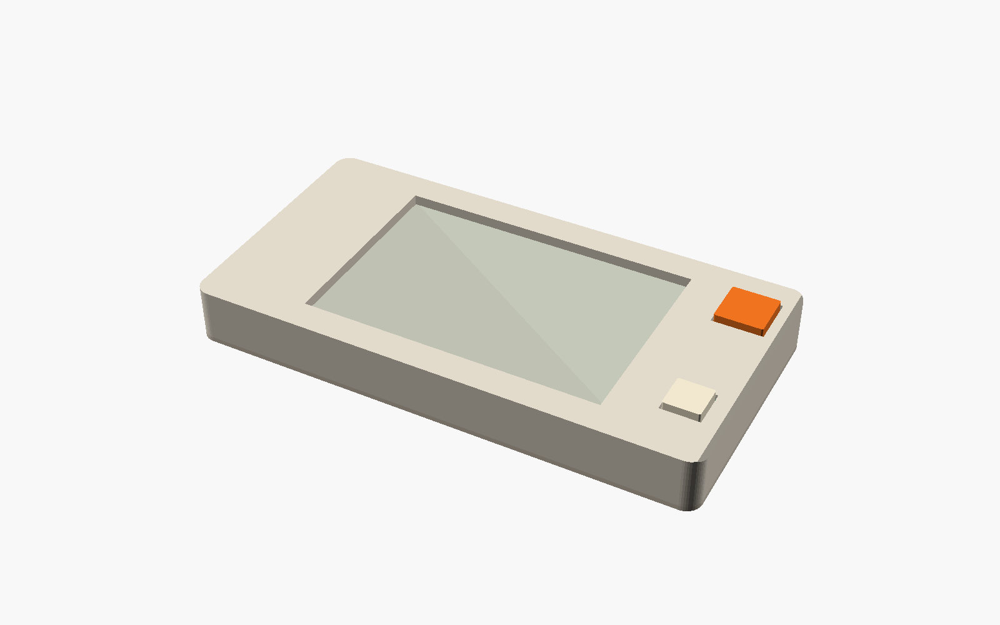

# Rev B landscape hardware

Rev B is an **engineering prototype**, with a centered screen, two large flat controls beside a 30° outer-edge bevel and a thin battery beside an L-shaped PCB. The housing is **128 × 66 × 14.2 mm**; the purchased cap tops extend to **15.8 mm** overall. The breadboard firmware works; the integrated Rev B hardware has not been built or powered. Read [component selection evidence](hardware_rev_b_selection.md) for the manufacturer drawings and the remaining first-article measurements.



## Files and revisions

Both hardware generations use the same structure. `hardware/rev_a/` preserves the earlier design; `hardware/rev_b/` owns this design. Shared and revision-specific tools live under `hardware/tools/`. A clean public clone contains all required engineering sources.

| File or directory                               | Purpose                                           |
| ----------------------------------------------- | ------------------------------------------------- |
| `hardware/rev_b/contract.json`                  | Packaging dimensions and manufacturing limits     |
| `hardware/rev_b/pcb/cicala_rev_b.kicad_pro`     | Editable KiCad 10 project, schematic and board    |
| `hardware/rev_b/case/cicala_enclosure.scad`     | Editable enclosure, buttons, supports and carrier |
| `hardware/rev_b/case/contract.scad`             | Generated numeric include                         |
| `hardware/rev_b/case/pcb_component_bounds.scad` | Fitted STEP envelopes and placement fingerprint   |
| `hardware/rev_b/case/exports/`                  | STL, 3MF, lens outline and source/output manifest |
| `hardware/rev_b/pcb/exports/`                   | Generated fabrication, assembly and review files  |
| `hardware/rev_b/validation.md`                  | Recorded validation status                        |

Native KiCad files are authoritative. Routing helpers produce candidates; replaying a historical routing script is not required to open or edit the board. Do not hand-edit the generated SCAD dimensions.

## Packaging

| Item              | Implemented arrangement                                                                          |
| ----------------- | ------------------------------------------------------------------------------------------------ |
| Enclosure         | 128 × 66 × 14.2 mm; 1.4 mm wall, 1.2 mm base, 4 mm outer corner radius                           |
| PCB               | Four layers, 1.2 mm nominal; lower arm and right arm, R1 reentrant corner; lower face z=4.6 mm |
| Assembly          | Electronic components on the top face                                                            |
| Controller        | ESP32-S3-WROOM-1-N16, antenna toward the left edge                                               |
| Display           | Waveshare 22609 V1.1, UC8253; 84.70 × 54.41 mm glass, 1.18 mm reserved thickness                 |
| Active screen     | 74.51 × 49.67 mm, 360 × 240; centered at x=54, y=33 mm                                           |
| Battery           | Protected Renata ICP303450PA-02, 500 mAh minimum; 54 × 36 × 4.8 mm assembly reservation          |
| Display connector | Molex 503480-2400, 24 positions, 0.5 mm pitch, dual contacts                                     |
| Battery header    | JST SH, BAT+/NTC/GND; AWG28 adapter harness                                                      |
| Controls          | 2 × Omron B3F-4050; B32-1200 ivory 9 × 9 mm / B32-1320 orange 12 × 12 mm                                 |
| USB / recovery    | HRO TYPE-C-31-M-12 and six-contact Tag-Connect recovery interface                                |
| Optional carrier  | 3.2 mm behind the core; 1.4 mm around its perimeter                                              |
| Table stand       | Separate passive wedge, approximately 12°                                                        |

The glass is offset because its inactive border is asymmetric. The **visible screen** is centered. A separate frame and lower support bar carry the glass through a nominal 0.2 mm foam interface; the battery does not support it. The lens is 0.8 mm thick. Adhesive and foam interfaces need prototype compression checks.

The lower arm holds the module and recovery contacts. The right arm holds power, display electronics, the connector and switches. No U arm is needed for this placement. Keep the battery bay free of electronics and copper.

The antenna exclusion is x=3–9.5 mm, y=29–64 mm on all layers. It excludes the battery, display, other components and carrier metal. Follow [Espressif's placement guidance](https://docs.espressif.com/projects/esp-hardware-design-guidelines/en/latest/esp32s3/pcb-layout-design.html). This reserve does not predict radio performance against a phone; measure standalone and attached operation.

## Display, power and recovery

The circuit implements the V1.1 pin table, with pins 1/4 NC and pin 5 VDHR, and the reference HAT's 68 µH / BSS138 / 3 Ω boost arrangement. The selected reservoir capacitors are rated 50 V. [Selection evidence](hardware_rev_b_selection.md) explains the conflicting vendor documents and the exact BOM.

The display fold has a nominal R1.55 mm inside radius and straight reinforced tip. The minimum-tail / maximum-stiffener length calculation leaves **0.276 mm**. The connector entry z=6.115 mm is an assembly assumption; its contact-plane height, latch access and actual bend must be checked on a sample. The printed former is an assembly jig and is removed after forming. Hold the glass independently, avoid tension at the bond and never bend the reinforced tip to force insertion.

The battery retains factory protection. Bond the insulated **103JT-025** NTC against the pouch following its lead and insulation instructions. Splice the stock AWG26 pack wires to short AWG28 JST SH pigtails, with separate insulation and strain relief. Pin 1 is protected BAT+, pin 2 NTC, pin 3 protected ground. Test polarity and NTC resistance before connecting J3.

BQ25185 charging is nominal **100 mA at 4.2 V**, with the existing independent temperature veto. The Renata pack permits 510 mA continuous discharge; its higher noncontinuous rating is not a qualified operating budget. Measure Wi-Fi/OTA and display startup loads, charge-temperature thresholds, low-voltage behavior and sleep current. Runtime is unmeasured.

USB supplies charging and native USB recovery. The optional C1/C2 capacitor lands and TP12/TP13 branches were removed to shorten the data paths. USB measurements use the actual filled board; the factory still needs to confirm impedance. The Tag-Connect interface becomes accessible after removing the display stack; its 3.3 V contact is a reference, not a second power input. Rev B requires a UC8253 firmware port before display bring-up; this hardware change does not add a Rev B firmware target.

## Buttons and print preparation

Both controls use **Omron B3F-4050**, a through-hole switch with a 12 × 12 mm body, projected square plunger, 7.3 ±0.2 mm free height, 1.27 ±0.49 N operating force and 0.3 +0.2/−0.1 mm pretravel. **Filters is B32-1200, ivory, 9 × 9 mm. Next is B32-1320, orange, 12 × 12 mm**: 78% more face area. Both purchased caps fit directly onto the projected plunger. Their assembled height is 10.0 ±0.4 mm above the PCB. See the [switch drawing](https://omronfs.omron.com/en_US/ecb/products/pdf/en-b3f.pdf) and [cap drawing](https://omronfs.omron.com/en_US/ecb/products/pdf/en-b32.pdf).

The controls remain flat; only the outer case edge is beveled. The board right edge is x=116 mm and both switch centers are x=108 mm. The case extends from x=−10 to 118 mm, preserving the centered active screen. The PCB and display stack move upward together by 1.965 mm; the flex bend and relative connector geometry remain unchanged. The lens is recessed below the taller housing roof.

### Clearances

The openings are 9.8 × 9.8 mm and 12.8 × 12.8 mm, with 0.4 mm nominal clearance per side. These print allowances are larger than Omron's precision-panel cutouts. The geometric screen includes ±0.15 mm cap width, ±0.20 mm printed opening size and ±0.15 mm lateral alignment assumptions: minimum radial clearance is 0.075 mm. Measure the actual openings; adjust the print compensation if needed.

The cap tops are nominally z=15.8 mm, 1.6 mm above the control panel. At maximum specified 0.5 mm pretravel, including cap/PCB height tolerances and a independent ±0.20 mm printed panel-height and PCB-seat assumptions, at least 0.17 mm remains above the panel. The switch supplies its own tactile mechanism and cap retention. The housing does not preload the cap or act as a travel stop. Pretravel is not an allowable overtravel rating; test edge presses and return on the real parts.

The PCB underside is z=4.6 mm. Untrimmed 3.5 mm leads clear the 1.2 mm base by 1.10 mm nominally and 0.17 mm in the declared worst-case stack. Inspect solder fillets and lead ends; keep their full envelope inside this allowance. The datasheet's reference drilling example uses a 1.6 mm PCB; this design retains 1.2 mm and explicitly reserves the greater underside protrusion. Verify body seating on the first article.

### Print and assembly preparation

| Folder | Contents |
| --- | --- |
| `case/exports/assembly/` | Assembly-coordinate printed parts |
| `case/exports/print/core/` | Base, top shell, display frame and support bar |
| `case/exports/print/accessories/` | Carrier, cover and wedge |
| `case/exports/print/jigs/` | Temporary flex former |
| `case/exports/reference/` | Purchased caps, switch, battery, panel and PCB envelopes; do not print |
| `case/exports/patterns/` | Clear-sheet lens cutting outline |

`print-layout.json` records print orientations and bed translations. Start home trials with PETG, a 0.4 mm nozzle and 0.15 mm layers. The top shell prints face-down; inspect the recessed display ledge and use local supports if required by the slicer. The base and display supports have flat print orientations. Purchased caps eliminate printed sliding fits, elastomer inserts and cap-retaining screws. [JLC3DP guidelines](https://jlc3dp.com/help/article/3d-printing-design-guideline) and [PCBWay printing capabilities](https://www.pcbway.com/rapid-prototyping/3d-printing/) describe the service limits, not acceptance of these parts.

Four **M2.5 × 10 mm countersunk screws** close the core; use **M2.5 × 12 mm** with the optional 3.2 mm carrier. Verify head seating, pilot engagement and screw-tip clearance before installing electronics.

1. Complete the 87-part SMT assembly. Seat and solder the two B3F-4050 switches from above, inspecting the underside joints and lead protrusion. B3F is unsealed and not washable; follow the manufacturer's soldering restrictions.
2. Verify unpressed/open and pressed/closed continuity for both controls. Support the PCB beneath each switch and press on the matching cap **after soldering**: ivory on SW1/Filters, orange on SW2/Next. Do not load the display while seating a cap.
3. Install the board, prepared protected-cell/NTC harness, display supports, formed and latched flex, glass, perimeter foam and lens. Verify battery polarity before connection.
4. Lower the top shell over the fitted caps through its clearance openings. Close with the four core screws. Check full return and center/edge actuation again before powering the device.

The assembly checks cover cap insertion through the roof, 0–0.5 mm travel, lateral alignment corners, switch bodies/leads, electronics, glass, flex, supports and carrier fasteners. They do not simulate friction, spring force or cap extraction force. Recovery access still requires opening the display stack.

### What is printed, fabricated or purchased

| Part or operation                                                | Practical route                                                                                       |
| ---------------------------------------------------------------- | ----------------------------------------------------------------------------------------------------- |
| L-shaped PCB: 87 SMT parts and two through-hole switches                        | PCB fabrication and assembly from Gerbers/BOM/CPL; confirm exact parts and the supported routed panel |
| Shell, base, supports, wedge and carrier plastics | Separate prints; qualify material, surface finish, fits and pilot threads                             |
| E-paper panel, protected battery, switches, caps, controller and NTC   | Purchase the selected components                                                                      |
| Clear lens, foam and insulation                 | Cut purchased sheet materials using the patterns; reference meshes are not substitutes                |
| Battery/NTC harness                                              | Crimp or source pigtails, splice and insulate, bond the sensor and verify polarity                    |
| Fasteners, magnetic array and steel shield                       | Source separately; printing supplies their housing, not the functional materials                      |
| Completed device                                                 | Install the controls, flex, glass and cell, close, program and test                                   |

PCBWay advertises complete product and cable-harness assembly, which needs a separately defined scope, instructions and test procedure. JLCPCB states that enclosure integration and box-build assembly are not included in its current workflow. These are advertised services, not acceptance of this design. [PCBWay assembly services](https://www.pcbway.com/pcb-assembly.html), [JLCPCB service scope](https://jlcpcb.com/blog/turnkey-pcb-assembly).

## PCBWay / JLCPCB construction

Use nominal **1.2 mm four-layer FR-4, 1 oz copper, ENIG**, top-side SMT assembly plus separate through-hole switch soldering, through vias and tab routing. Check the current [PCBWay capabilities](https://www.pcbway.com/capabilities.html) and [JLCPCB capabilities](https://jlcpcb.com/capabilities/Capab) at order. No factory has reviewed or accepted an order for this revision.

| Constraint                           | Design limit                                                                                                                |
| ------------------------------------ | --------------------------------------------------------------------------------------------------------------------------- |
| General trace / clearance            | 0.20 / 0.20 mm                                                                                                              |
| Fine-pitch escape traces             | 0.15 mm minimum, local to dense pads                                                                                        |
| TI DGK adjacent lands                | 0.15 mm pad-to-pad exception from the manufacturer pattern                                                                  |
| Through via                          | 0.30 mm drill / 0.60 mm diameter; no soldered via-in-pad, blind or buried vias; bare probe contacts can share a through-via |
| Copper / drilled hole to routed edge | 0.50 mm minimum                                                                                                             |
| Inside corner                        | True R1 routed arc                                                                                                          |
| Assembly panel basis                 | 5 mm handling rails, 2 mm routed channels, supported lower/right arms                                                       |
| USB                                  | 90 Ω differential target; 0.28 mm main tracks / 0.24 mm gap on B.Cu, local In2.Cu ground reference                          |

L1 carries components and signals; L2 is mostly ground with local signal crossings outside reserved reference regions; L3 carries power and signals with a dedicated ground corridor under the lower-face USB pair; L4 carries signals and ground fill. Keep that corridor free of foreign traces and inspect the filled copper, including around vias.

The calculation basis is [PCBWay's four-layer stack table](https://www.pcbway.com/multi-layer-laminated-structure.html), entry 17: outer pressed dielectric 0.1855 mm, Dk 4.74, 1 oz inner/outer copper. The published reference lists a 0.630 mm core and 1.21 mm finished board, ±10%. Those simplified listed layers do not sum exactly to the finished thickness. **KiCad uses a 0.689 mm normalized core solely to make the CAD substrate total 1.2 mm**; it does not prescribe that value to the factory. The USB estimate uses the published outer dielectric, not the normalized core. Confirm the actual pressed stack, solder mask and impedance at order; JLCPCB may require a different track width for its offered stack.

Account for approximately 1.33 mm maximum board thickness in assembly checks. The component/case intersection checks operate at the nominal CAD stack; printed seats, foam and flex positioning require first-article tolerance checks. Do not treat nominal collision-free CAD as a production tolerance analysis.

The L outline needs tab routing. Keep tabs clear of the antenna, USB opening and stressed reentrant corner. Factory rails carry fiducials and tooling; the bare board does not carry a duplicate set inside the case. Factory CAM review must confirm supports, tab placement and depanelization. [JLCPCB panel guidance](https://jlcpcb.com/help/article/pcb-panelization), [PCBWay assembly panels](https://www.pcbway.com/pcb_prototype/Panel_Requirements_for_Assembly.html).

The assembly BOM identifies exact MPNs. Blank LCSC fields require exact-part sourcing/consignment, not an inferred substitute. Check supplier stock, pin 1, rotations, stencil apertures and exposed-pad wetting in the order preview. No filled/capped thermal via process is assumed.

## Removable phone carrier

The core rotates for carrying, radio end downward. With the carrier it occupies **68.8 × 114.8 mm**, adding **13.4 mm** depth behind the phone before case/adhesive gaps. Its covered accessory-style magnetic array is a separate, made-to-drawing part, not a generic ring magnet.

The wider core makes the portrait carrier 114.8 mm long. Its ring is repositioned to leave **1.185 mm** both below the iPhone 16 Plus camera keepout and above the phone bottom. These small nominal margins leave little allowance for cases or alignment error. [Selection evidence](hardware_rev_b_selection.md) gives the dimensions and source. This is a 2D fit screen, not a compatibility claim. Test actual cases, optical/flash cones, retention, slipping, removal and radio behavior. Detach for wireless charging. The carrier remains optional and does not alter the standalone electronics.

## Reproduce validation

Use KiCad 10 with footprint/STEP libraries, OpenSCAD, and the repository Python environment with Shapely and Gerbonara. Install the hardware helper dependencies with `.venv/bin/python -m pip install -r hardware/tools/pcb/requirements.txt`. Regenerating fitted envelopes requires CadQuery, tested with 2.8.0. Optional tool variables are `KICAD_CLI`, `KICAD_PYTHON`, `KICAD10_3DMODEL_DIR`, `OPENSCAD_BIN` and `CAD_PYTHON`. Linux needs a Python that imports `pcbnew`; renders need a display or `xvfb-run`.

```sh
just hw-rev-b-check
CAD_PYTHON=/path/to/python-with-cadquery just hw-rev-b-export --renders
just hw-rev-b-fab-export
```

Reports are written under `build/hardware-rev-b/`. The checks cover the actual concave outline, component courts/models, one fitted assembly face and underside bare diagnostic contacts, mounting and pad-to-edge clearance, centered active screen, RF exclusion, source fingerprints, schematic/PCB netlist parity, ERC and DRC. The electrical check requires zero unconnected items.

Mesh checks require closed, oriented single solids for each printable part. Intersection checks cover components, battery, PCB, display, supports, harness, flex, carrier and caps across their stroke. Purchased cap and lead clearance calculations include the declared print and component tolerances. `--mechanical-only` explicitly skips electrical checks and labels its report accordingly.

Physical acceptance remains: first power and recovery; exact panel waveforms and fold; charge/NTC and pulse loads; purchased-cap fit, actuation and retention; enclosure assembly and optical support; optional phone retention and loaded RF. These measurements follow fabrication of the engineering prototype.
