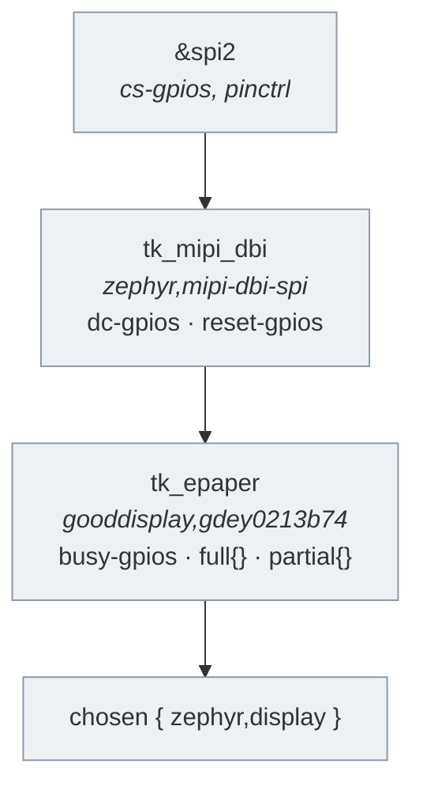

# Hardware and wiring

The breadboard rig: what is connected to what, and why each pin is the pin it
is. The shopping list is [prototype bom](prototype_bom.md), the object this
becomes is [device prototype](device_prototype.md), and the firmware that
drives it is [firmware architecture](firmware_architecture.md).

**Status:** the buttons and the panel are wired and drawing questions, and the
refresh policy, timings and RTC retention have been measured on the rig — see
"Bench measurements" at the end of this page, which is also the procedure for
repeating any of them.

The power path is **wired in firmware and not yet built in copper.** The
charger, the cell, the two dividers and the two status LEDs below describe what
the firmware expects; nothing on this page marked *verify* has been measured.
"Bringing the rig up" is the procedure for building it, in the order that keeps
a mistake cheap.

## Parts

| Part | Role |
|---|---|
| ESP32-S3-DevKitC-1-N8R8 | The firmware target. 8 MB flash, 8 MB PSRAM, native USB and a CP2102 UART bridge |
| Waveshare 2.13-inch e-Paper HAT | 250 × 122 display, SSD1680 controller, 3.3 V logic |
| Two tactile push-buttons | Category and Next; stand in for the KSC321G |
| Adafruit 6092 | bq25185 USB/DC/solar charger with a TPS62569 3.3 V/1 A buck. Powers the rig and charges the cell |
| EEMB 524261, 3.7 V 1500 mAh LiPo | Bench cell, JST-PH. Three times the capacity of the 503035 the product is designed around, so it discharges slowly enough to measure |
| Red and green LED, one resistor each | Status. Two packages here, one bi-colour package on the target board |
| Resistors: 2 × 470 kΩ, 100 kΩ, 150 kΩ, 100 nF | The battery and VBUS dividers |
| Breadboard and jumpers | — |

Everything runs at 3.3 V, so no level shifting anywhere.

The bring-up LED that used to sit on GPIO2 is gone. It toggled on every question
that reached the panel, which mattered before the panel was wired; the status
LEDs say the things the glass cannot, and GPIO2 goes back to the ADC1 pool.

## The whole rig

```mermaid
flowchart LR
    subgraph esp["ESP32-S3-DevKitC-1"]
        direction TB
        CAT["GPIO 4<br/><i>Category</i>"]
        NXT["GPIO 17<br/><i>Next</i>"]
        LEDS["GPIO 15 · 16<br/><i>status red · green</i>"]
        BAT["GPIO 1<br/><i>battery sense</i>"]
        VB["GPIO 21<br/><i>VBUS detect</i>"]
        SPI["GPIO 10 11 12 13<br/><i>SPI2</i>"]
        CTL["GPIO 18 8 9<br/><i>D/C · RST · BUSY</i>"]
        PWR["3V3 pin"]
        USB["USB jacks<br/><i>UART · native</i>"]
    end

    CB["Category button"] --> CAT
    BTN["Next button"] --> NXT
    LEDS --> L(["red + green LED,<br/>one resistor each"])
    SPI --> EPD["Waveshare 2.13in<br/>e-Paper HAT"]
    CTL --> EPD

    subgraph chg["Adafruit 6092 · bq25185"]
        direction TB
        C3V["3V out"]
        CBAT["BAT pad"]
        CVU["VU pad"]
        CJST["JST-PH"]
    end

    CELL["EEMB 1500 mAh"] --- CJST
    UC["USB-C<br/><i>charge</i>"] --> chg
    C3V --> PWR
    CBAT --> D1["470k / 470k<br/>+ 100 nF"] --> BAT
    CVU --> D2["100k / 150k"] --> VB

    GND[("− rail")] --- CB
    GND --- BTN
    GND --- L
    GND --- EPD
    GND --- chg
    USB --- HOST["host: flash · console · JTAG"]

    classDef x fill:#f7f5f1,stroke:#9a8f7d
    class CB,BTN,L,EPD,HOST,CELL,UC,D1,D2 x
```



## Pin assignment

Every pin below is chosen, not arbitrary. Two constraints drive the whole map:

1. **Every wake input must be RTC-capable.** On the ESP32-S3 that is GPIO0–21.
   Outside that range, EXT1 deep-sleep wake is impossible, and the device's
   entire power budget depends on it.
2. **GPIO19 and GPIO20 are the native USB pair.** They carry the debug console
   and the JTAG interface OpenOCD uses. Anything else on them breaks both.

| GPIO | Function | Direction | Notes |
|---:|---|---|---|
| 4 | Category | in, pull-up | active low |
| 17 | Next | in, pull-up | active low |
| 10 | e-paper CS | out | fixed by the board's `spim2_default` |
| 11 | e-paper MOSI (DIN) | out | as above |
| 12 | e-paper SCK (CLK) | out | as above |
| 13 | SPI MISO | in | unused by the panel; claimed by the bus |
| 18 | e-paper D/C | out | active high |
| 8 | e-paper RST | out | active low; **not 19** |
| 9 | e-paper BUSY | in | active high; **not 20** |
| 1 | battery sense | in, ADC1_CH0 | through a 470k/470k divider — see below |
| 21 | VBUS detect | in | through a 100k/150k divider — see below |
| 15 | status LED, red | out | active high |
| 16 | status LED, green | out | active high |

Deliberately avoided: GPIO0 and GPIO3 are strapping pins, GPIO26–32 are the SPI
flash, GPIO33–37 are the octal PSRAM on the N8R8, GPIO43/44 are the UART0
console, and GPIO48 is the onboard WS2812.

Dropping the rotary selector for a Category button freed GPIO 5, 6, 7, 15 and
16, and removing the bring-up LED has since freed GPIO2. Power takes GPIO1 and
GPIO21 and the status LEDs take GPIO15 and GPIO16, which leaves **GPIO2, 5, 6,
7 and 14** spare and RTC-capable. Four of those five are ADC1 channels, which is
the state the pin map was being kept in: the one measurement that cannot go
anywhere else has somewhere to go, and so does the next one.

The LEDs are on 15 and 16 rather than on any of 5, 6 or 7 for that reason. An
LED needs neither an ADC channel nor RTC capability, so spending a channel on
one would be spending the scarce thing on the plentiful requirement.

### Why those two, and not the other way round

The ESP32-S3 has two ADCs and only one of them is usable here: **ADC2 shares
its hardware with Wi-Fi**, so a reading taken while the radio is up can fail.
Battery voltage has to be sampled during a sync, which is precisely when the
radio is up, so it needs ADC1 — GPIO1 to GPIO10.

Of those ten, GPIO4 is Category, GPIO8 to GPIO10 are the panel, GPIO2 is the
bring-up LED and GPIO3 is a strapping pin. That leaves GPIO1, GPIO5, GPIO6 and
GPIO7 — and GPIO1 is taken here so the run of three stays contiguous for
whatever the rev A board needs.

VBUS detect is a digital input with no such constraint, so it takes GPIO21 and
leaves the last ADC1 channel to the measurement that cannot go anywhere else.

### The two dividers

**VBUS, 100k/150k.** VBUS is 5 V and the pin is 3.3 V tolerant only. Not
100k/100k: 2.5 V sits under the ESP32-S3's V_IH of 0.75 × VDD ≈ 2.48 V by too
little to trust across tolerance and supply droop. 100k/150k puts it at 3.0 V
with margin at both ends. It draws 20 µA, but only while something is plugged
in, which is when the current is somebody else's.

Tap the charger's **VU** pad, not VIN. VU is the USB rail; VIN accepts 5–18 V
from a DC or solar source, and 18 V through this divider is 10.8 V on a 3.3 V
pin. The consequence is worth stating plainly: **charging from DC or solar is
invisible to the firmware.** The device would run, and would believe it was on
battery.

**Battery, 470k/470k with 100 nF.** Half the pack voltage, so a 4.2 V cell
arrives as 2.1 V — inside what 12 dB attenuation reads, with room above. The
capacitor is not optional: the SAR ADC wants a low source impedance and this is
235 kΩ, so without a reservoir next to the pin the reading wanders.

470 kΩ rather than the 100 kΩ that would settle faster, because unlike the VBUS
divider this one is across the cell and draws current forever: 4.5 µA at 4.2 V,
which fits under a 30 µA budget on its own. That is what lets the bench run it
unswitched. `hardware/pcb/README.md` still requires rev A to switch it, and that
requirement stands — a product should not spend any of its budget here.

Tap the charger's **BAT** pad, which is the cell. Not the 3.3 V rail: the buck
holds that flat while the cell is above roughly 3.45 V and then passes the cell
through at full duty, so the rail says nothing about state of charge over most
of a discharge.

Neither pin is a wake source. `esp_sleep_enable_ext1_wakeup()` takes one trigger
polarity for the whole mask, the buttons have claimed active-low, and VBUS is
interesting when high — and the ESP32-S3 does not define
`SOC_PM_SUPPORT_EXT1_WAKEUP_MODE_PER_PIN`. EXT0 would do it and costs a powered
RTC domain on every sleep; see `CONFIG_TK_POWER_WAKE_ON_USB` and the decision
log. So plugging in does not wake the device. The next press does, and that boot
finds VBUS high and opens the sync window.

The order Category advances through is the deck order in
`questions/schema.json` → `x-tischkarte.decks`, duplicated in `tk_deck_name()`.
Both have to agree.

## Wiring the inputs

All inputs are active low with internal pull-ups enabled in the devicetree, so
every switch simply shorts its pin to ground. **No external pull-up or
pull-down resistors** — adding them does nothing useful.

Run one jumper from a board **GND** pin to the breadboard's **−** rail, and
return everything to that rail.

**Both buttons.** A 6 mm tactile switch has four legs in two internally shorted
pairs — the two legs in each row are permanently connected to each other. Use
two **diagonally opposite** legs, one to the GPIO and one to the − rail, and
leave the other two unconnected. Category goes to GPIO4, Next to GPIO17.

If both chosen legs come from the same pair, the pin sits at ground forever.
The symptom is silence rather than a stuck reading: the driver reports only
edges, so a permanently shorted pin produces no event at all. Check with a
multimeter on continuity — open when unpressed, closed when held.

## Wiring the status LEDs

GPIO15 → resistor → red LED anode (long leg); cathode (flat side, short leg) →
− rail. GPIO16 → resistor → green, the same way. Both are active high, so a
reversed LED gives no light and no error message — check them by hand before
flashing, or a dark LED reads as a firmware bug.

Size the resistors for something you can look at across a table rather than for
maximum brightness. This is an object that sits in a room with people in it.

Lighting both is amber, and that is the whole palette:

| What is happening | Red | Green | Looks like |
|---|---|---|---|
| Nothing, healthy cell | off | off | dark |
| Charging | on | off | red |
| Charged | off | on | green |
| Portal on air | on | on | amber |
| Sync or update running | off | pulsing | slow green pulse |
| Press refused, cell low | blink ×1 | blink ×1 | one amber blink |
| Press refused, cell flat | blink ×3 | off | three red blinks |

Two separate packages will not blend into amber the way the bi-colour part on
the target board does — they read as a red LED and a green LED both lit. Every
transition and every priority rule is still exercised; only the appearance waits
for rev A.

The pairs that share a colour are separated by rhythm rather than hue, because
with two dice there is no third colour to separate them with: a low-battery
blink against a steady portal amber, and a sync pulse against a steady charged
green.

## Wiring the panel

The HAT is a Raspberry Pi form factor, so the connections come off its 40-pin
header.

| HAT signal | RPi header pin | BCM | ESP32-S3 |
|---|---:|---|---|
| VCC | 1 | 3V3 | 3V3 |
| GND | 6 | — | − rail |
| DIN | 19 | BCM10 | GPIO11 |
| CLK | 23 | BCM11 | GPIO12 |
| CS | 24 | BCM8 | GPIO10 |
| DC | 22 | BCM25 | GPIO18 |
| RST | 11 | BCM17 | GPIO8 |
| BUSY | 18 | BCM24 | GPIO9 |

### Which revision

Waveshare has shipped three electrically different 2.13-inch panels under the
same name, and they need different controller profiles. Check the marking on
the board and set the devicetree compatible to match:

| Revision | Compatible | Controller | Size |
|---|---|---|---|
| V3 / V4 | `gooddisplay,gdey0213b74` | SSD1680 | 250 × 122 |
| V2 | `gooddisplay,gdeh0213b72` | SSD1675A | 250 × 120 |
| V1 | `gooddisplay,gdeh0213b1` | SSD1673 | 250 × 120 |

`firmware/app/boards/esp32s3_devkitc_esp32s3_procpu.overlay` currently targets
V3/V4, which is what is sold now. The older two are 120 rows rather than 122,
so the `height` property changes with the compatible.

### How the driver is bound

In Zephyr 4.4 the SSD16xx driver sits behind MIPI-DBI rather than on SPI
directly. The display node is a child of a `zephyr,mipi-dbi-spi` node that owns
the bus and the D/C and reset pins; putting those properties on the display node
itself is the older binding and does not bind at all.



The `full` and `partial` child nodes are not decoration. The driver offers
partial refresh only when a partial profile exists, and chooses between the two
by the blanking state — which is why `panel.cpp` toggles blanking rather than
looking for a driver flag it does not have.

Blanking is not a flag you set and forget, though. The two calls bracket the
write:

| Call | What ssd16xx does |
|---|---|
| `display_blanking_on()` | selects the `full` profile, suppresses updates |
| `display_write()` | loads the controller's RAM; updates the panel **only while blanking is off** |
| `display_blanking_off()` | performs the update that was suppressed |

So a full refresh is a sandwich — blanking on, write, blanking off — and a
partial refresh is a plain write with blanking already off. Doing only the
first half loads the image and never shows it: the refresh returns in about
20 ms with nothing changed on the glass, and the update is deferred onto
whichever later call turns blanking off, which then runs long and shows the
previous image. That was a real bug, found on the bench and not by any test —
the dummy display accepts blanking calls in any order.

## Powering the rig from the cell

The charger's **3V** terminal goes to the DevKitC's **3V3** pin and its **−** to
GND. That bypasses the board's own regulator: the buck is already making 3.3 V
at up to 1 A, and running it through an LDO afterwards would only add a drop.

It also leaves the DevKitC's 5 V rail dead, which is worth having — the CP2102
bridge lives on that rail, so on battery it is simply unpowered.

**Two supplies, one node.** With the charger on 3V3 and a USB cable in the
DevKitC, two regulators drive the same net and the higher one wins. Unplug the
JST before flashing, or fit a slide switch in the battery lead. The switch is
worth the ten minutes: the flash-and-monitor loop runs many times a day.

One useful accident of tapping VU rather than the DevKitC's own VBUS: plugging
the devkit in to flash leaves the firmware's VBUS reading low. The sync window
does not fire on every flash and the LED does not go red every time you work on
the board.

## Cables

Keep both USB cables connected while developing.

| Jack | Shows up as | Carries |
|---|---|---|
| UART | `/dev/cu.usbserial-*` | Flashing, and the normal console |
| USB | `/dev/cu.usbmodem*` | JTAG for OpenOCD, and the debug build's console |

The UART jack's CP2102 drives EN and IO0 through the auto-reset circuit, so
anything opening that port resets the chip — which is why the debug build moves
its console to the native USB side, where no such circuit exists.

A third cable now matters: the **charger's** USB-C. That is the one the firmware
sees. Plugging the DevKitC in is not plugging the device in.

### One connector, on rev A

The ESP32-S3 has a USB Serial/JTAG controller in silicon on GPIO19 and GPIO20.
It presents a vendor JTAG interface and a CDC-ACM at the same time — which is
what `app/debug.overlay` already uses — and esptool can drive the ROM download
mode through that same CDC interface. So the target board needs no CP2102, no
auto-reset transistor pair and no second connector: one USB-C, VBUS to the
charger input, D+ and D− to GPIO19 and GPIO20.

Two things go with that, and both are easier to build in than to add later.
Rev A wants a test point or an internal button on **IO0**: download mode over
USB Serial/JTAG is normally entered by command, but an image that reconfigures
those two pins, or crashes before USB enumerates, can only be recovered by
strapping IO0 low at reset, and the product's own buttons are on GPIO4 and
GPIO17. And a sleeping device is not on the bus at all — deep sleep stops USB
enumerating, so the port disappears between presses.

*verify:* nothing here has yet flashed over `/dev/cu.usbmodem*`. `just fw-flash`
targets the CP2102, and `debug.overlay`'s own header still asserts that flashing
wants the UART jack. Point `ESPTOOL_PORT` at the usbmodem device and run
`just fw-flash` — it is one check, and rev A's connector rests on it.

The 6092 breaks D+ and D− out on its bottom edge, so the same arrangement can be
tried on the bench: that connector's VBUS feeds the charger while its data pair
runs to GPIO19/20. It would also delete the two-supply problem above, since the
DevKitC's own jacks would stay unplugged. Two things can fail independently, so
try them in order — esptool over USB Serial/JTAG first, on the devkit's own jack
where the wiring is known good, and only then over jumper wires, which are out
of spec for a 90 Ω differential pair. Keep that pair under about 10 cm and twist
it. **Never plug both connectors at once:** they land on the same two pins.

## Bringing the rig up

Six stages, each ending in a number from the meter. Nothing moves to the next
stage until the current one reads what it should.

The ordering principle: every new connection is measured before anything is
asked to survive it. The two irreversible mistakes available here are a reversed
cell and 5 V on a 3.3 V pin, and both are caught before they can happen.

### 0. The parts, nothing connected

- Continuity across the 6092's charge-rate jumper pads: **open**. If it reads
  closed the cut did not take and charging runs at 1 A instead of 500 mA.
- Cell leads on DC volts: **3.6–4.0 V**, and note which lead is positive.
  Compare against the polarity printed at the 6092's JST footprint.

**If the polarity disagrees, stop.** Do not re-crimp and do not try it briefly.
A reversed cell damages the charger and can vent the cell.

### 1. Charger and cell, no MCU

- Plug the cell in. Nothing gets warm, and the fault LED marked `F` stays off.
- `3V` to `−`: **3.30 V ±0.05**. This is the rail the DevKitC will run on and it
  is the most important reading on the page.
- `4.5V` to `−`: **≈ the cell voltage**, not 4.5 V. On battery the bq25185 power
  path passes the cell through; 4.5 V is a ceiling, not an output.
- Plug the charger's USB-C: the charge LED marked `C` lights, `VU` reads
  **≈5 V**, and the cell climbs over a few minutes. Unplug again.

### 2. The dividers, still no MCU

Both taps get measured before either touches a pin. This is the stage where a
slip puts 5 V on a 3.3 V input.

- Battery tap to `−`: **half the cell**, so 1.85–2.10 V. Above 2.2 V means the
  divider is wrong or the tap is on the wrong node.
- VBUS tap to `−`, USB-C **in**: **2.9–3.1 V**. USB-C **out**: **≈0 V**. If the
  first reads near 5 V the divider is not in circuit, and connecting GPIO21
  would destroy it.
- Only now run the two taps to GPIO1 and GPIO21.

### 3. The LEDs, still no firmware

Touch each LED's resistor to 3V3 by hand and watch it light: red on GPIO15's
leg, green on GPIO16's. Fix polarity here rather than after flashing.

### 4. The power feed

- DevKitC USB unplugged. `3V` to the 3V3 pin, `−` to GND.
- 3V3 pin to GND: **3.30 V ±0.05**. A sag means the buck is loaded by something
  it should not be.
- Pull the JST for a moment and confirm the rail collapses. That proves the cell
  is the source and not a USB cable somebody forgot about, which is the
  commonest way a "running on battery" test lies.

### 5. Contention, once

Understand this reading rather than avoiding it. With the charger's 3V3
connected, plug a USB cable into the DevKitC and meter the 3V3 pin. Two
regulators now drive one node and the higher wins. Note the number, then pick a
remedy: the slide switch in the battery lead, or the 6092's USB-C carrying data
so the devkit's jacks stay out.

### 6. With firmware

- The boot log names the board and the reset cause, as it already did.
- `just fw-power` reports millivolts. Against a meter on the BAT pad it should
  agree within about 2 %. A constant ratio off means
  `CONFIG_TK_POWER_DIVIDER_NUM` and `_DEN` need calibrating; a noisy reading
  means the 100 nF is missing or the divider is too stiff.
- Plug and unplug the charger's USB-C and watch the logged VBUS flag follow.
- The LEDs, in one pass: unplugged and healthy is dark, charging is red, past
  `CONFIG_TK_POWER_FULL_MV` is green, the portal is amber, and a press below
  `CONFIG_TK_REFRESH_MIN_MV` is three red blinks with the panel unchanged.

What good looks like at the end: the device runs from the cell with no USB
attached, reports a voltage that tracks a meter, goes red when the charger's
USB-C is plugged and green when the cell fills, refuses to refresh below the
floor and says so, and goes dark two seconds after being unplugged.

## Checking it

```sh
just fw-flash
just fw-monitor
```

- Boot logs `active deck: 0 new_people` and the panel shows that name.
- One Category press names the next deck; six return to where they started.
- One Next press produces exactly one question and one LED toggle.
- Holding a button and releasing it counts once, not twice.

## Bench measurements

Measured on a Waveshare 2.13-inch V4:

| Measurement | Result | Where it went |
|---|---|---|
| Partial refreshes before ghosting | visible at 64 in ordinary use | `TK_FULL_REFRESH_INTERVAL` = 16 |
| Partial refresh duration | 622 ms, ±2 ms across 193 of them | clears the 1 s target in [device prototype](device_prototype.md) |
| Full refresh duration | not measured — see below | `TK_REFRESH_TIMEOUT_MS` stays at 15 s |
| Refresh after a deep-sleep wake | 624 ms, against 2919 ms before the panel patch | [patching zephyr](firmware_patches.md) |
| Peak thread stack | logging 89%, everything else 18–38% | `LOG_PROCESS_THREAD_STACK_SIZE` = 2048 |
| RTC memory across a warm reboot | kept, three times running | the retained block works on the chip |
| Battery reading against a meter | not measured | `TK_POWER_DIVIDER_NUM` / `_DEN` |
| Where a refresh actually corrupts | not measured | `TK_REFRESH_MIN_MV`, still at its guessed 3200 |
| Discharge curve | not measured | nothing yet; the first runtime figure |
| Current: idle, refresh, Wi-Fi, per LED, asleep | not measured | rev A's resistor values, and the sleep budget |

The soak run reached 193 consecutive partials with only minor artefacts, and 64
was first chosen as three times under that. Ghosting turned out to be obvious
on the glass well before 64 — the run's "minor artefacts" are a more forgiving
standard than a question somebody is reading at a table. The 193 is the ceiling
to stay under, not the target to approach.

The full-refresh duration is listed as unmeasured on purpose. `ssd16xx` waits
on the BUSY pin before each command rather than after, so a full refresh is
started and never waited on: the application times it at 19 ms for something
the panel spends roughly two seconds doing. The 2315 ms recorded here
previously was the application waiting out the driver's own init clear, which
[the panel patch](firmware_patches.md) has since removed. Measuring it properly
means watching BUSY, not the log.

The procedures below repeat any of it. Each wants both USB cables in and
`just fw-monitor` open.

### 1. Ghosting, for `CONFIG_TK_FULL_REFRESH_INTERVAL`

E-paper leaves a faint trace of what it was showing, and a partial refresh does
not clear it. The question is how many partials the panel tolerates before that
residue is visible from across a table, because that count is how often a full
refresh has to interrupt.

```sh
just fw-soak
just fw-monitor
```

The soak image presses its own Next button every five seconds with full
refreshes suppressed, so the chain builds up while nobody is at the board. Each
refresh logs where it sits:

```
[tk_soak] full refresh of seq 1; the chain starts here
[tk_soak] partial #1 of seq 2
[tk_soak] partial #2 of seq 3
```

Leave the board alone once it is flashed. Look at the
panel every so often and write down the number on the console at the point the
glass stops looking clean — from a normal seat at the table, not from six
inches away. That number, less a margin, is what goes in
`firmware/Kconfig.policy`.

`just fw-flash` returns the board to the real firmware.

### 2. Refresh duration, for `CONFIG_TK_REFRESH_TIMEOUT_MS`

The same console gives this away for free, from the line `display.c` logs after
every render:

```
[tk_display] partial refresh of question seq 2 took 412 ms (0)
```

The timeout exists only so a dead panel cannot wedge the device, so it wants to
sit well clear of the slowest honest refresh — which is a *full* one, and the
soak run only produces one of those at boot. Note the full figure from the
first line of the run, take the partials from the rest, and set the timeout
several times the larger.

The same output carries stack high-water marks once a minute, which is what the
board conf's promise to tighten stacks before the power bench is waiting on.

### 3. What survives a reboot, with `just fw-retain`

Deep sleep is a reboot, so everything the device is supposed to remember
between presses lives in RTC memory. This is the image that checks it: the soak
build, warm-rebooting itself every three presses.

```sh
just fw-retain
just fw-monitor
```

Each reboot should print, in order:

```
rst:0xc (RTC_SW_CPU_RST)
<inf> tk_main: reset: software
<inf> tk_app: retained state: kept across the reboot
```

and then continue the run — same `seq` sequence, same partial-refresh count,
no full refresh, and nothing drawn until the next scheduled press. A question
redrawn at boot, a count restarting at zero, or `cold boot, starting a fresh
cycle` all mean the block did not survive.

Use the image rather than the reset button: an EN-pin reset reports as
`rst:0x1 (POWERON)` and clears the RTC domain, which is what a power-on should
do.

### 4. Accents, with `just fw-charset`

Not a number, but the same trip to the bench. The charset image draws every
diacritic the renderer composes; photograph the pages and judge whether the
marks sit where they should. Details in `firmware/README.md`.

### 5. The battery reading, for the divider constants

```sh
just fw-power
just fw-monitor
```

The image samples once a second and logs the raw conversion beside the
converted millivolts. Put a meter on the charger's BAT pad and compare.

```
[tk_power_adc] raw 2412 -> 1943 mV at the pin
[tk_power] 3886 mV, on the cell
```

A reading that is off by a constant ratio is the divider: real 470 kΩ resistors
are ±1 % each, so `CONFIG_TK_POWER_DIVIDER_NUM` and `_DEN` are two integers
rather than one number precisely so the measured ratio can go in. Take readings
at both ends of the range, not one — a fixed offset and a wrong ratio look
identical at a single point. A reading that jumps around is the 100 nF missing
or the divider being too stiff for the ADC.

Left running, the same image records a discharge curve unattended, which is the
first runtime figure the project will have. Note the wall-clock time against the
voltage; the interesting part is below 3.6 V, where the curve turns down.

### 6. Where a refresh actually corrupts, for `CONFIG_TK_REFRESH_MIN_MV`

3200 mV is a guess and has never been checked. Replace the cell with a bench
supply on the BAT pad and wind it down, pressing Next at each step, watching the
glass rather than the console.

What is being looked for is the voltage at which a partial refresh leaves
artefacts — not where the regulator gives up. The buck passes the cell straight
through below about 3.45 V, so the rail sags with the cell and the panel keeps
working for a while after that. The number wanted is the first one where the
glass goes wrong, plus margin.

Below the configured floor the device should log the millivolts, leave the panel
alone and blink red three times. That is also the check that the gate works at
all:

```
[tk_app] 3140 mV is under the 3200 mV floor; the panel keeps what it has
```

### 7. Current, for the sleep budget

A meter in series with the cell, at each of: idle and awake, mid-refresh, with
the radio up, with each LED lit, and asleep.

Only one of those is a number this rig can honestly produce. **The DevKitC's own
power LED sits on the 3V3 rail and draws a milliamp or two continuously, and its
onboard WS2812 idles at roughly another 0.6 mA whether anything drives it or
not** — together one to two orders of magnitude above the 30 µA target, under
which the bq25185 and TPS62569 quiescent currents disappear entirely. The sleep
figure measured here bounds nothing about rev A, and no runtime can be
extrapolated from it. It is a power-mule measurement, as
[decisions](decisions.md) already says.

What this bench does give: the awake numbers, the per-LED current that sets rev
A's series resistors, and a delta per firmware change, which is the useful form
anyway.

Worth writing down once, because it settles where the budget actually goes: a
press is under a second at tens of milliamps, roughly 0.015 mAh. A hundred
presses a day is about 1.5 mAh against a 1500 mAh cell. Sleep current is the
whole design problem and everything else is rounding.
