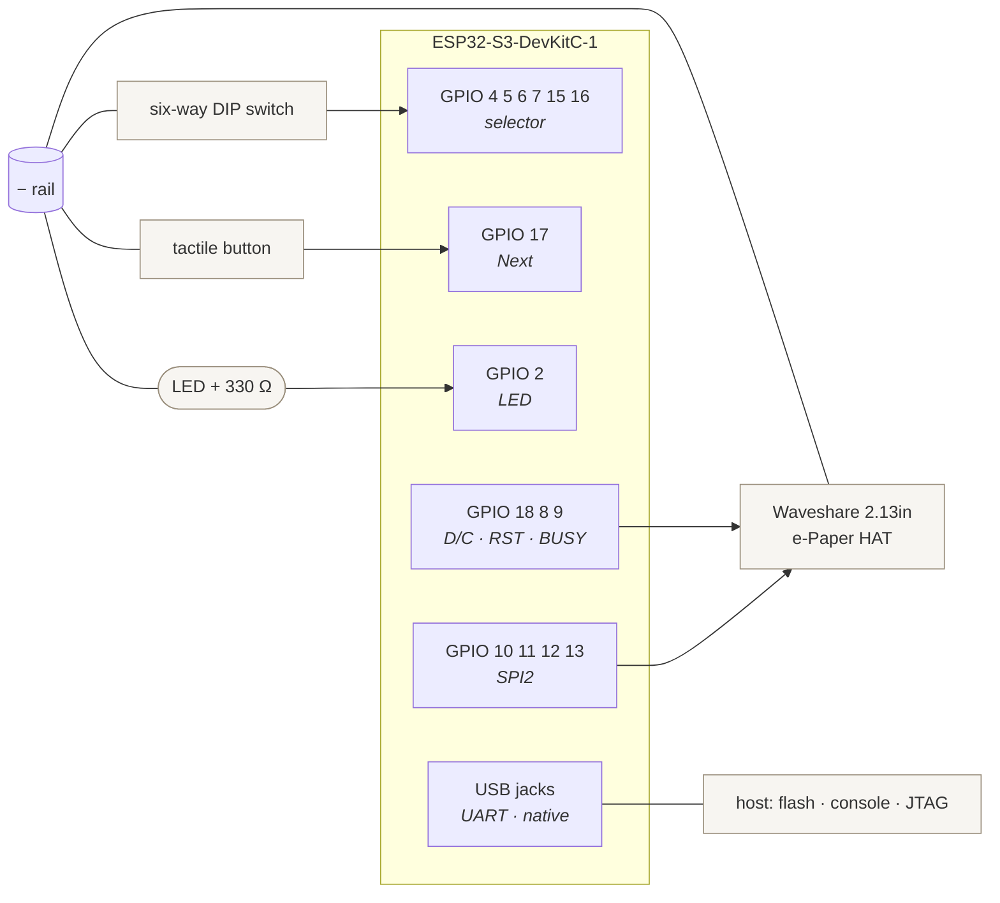
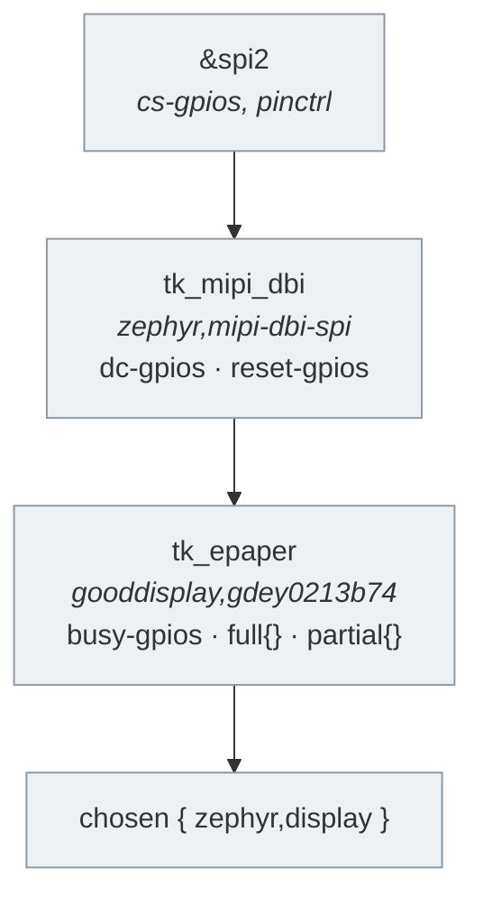

# Hardware and wiring

The breadboard rig: what is connected to what, and why each pin is the pin it
is. The shopping list is [prototype bom](prototype_bom.md), the object this
becomes is [device prototype](device_prototype.md), and the firmware that
drives it is [firmware architecture](firmware_architecture.md).

**Status:** the whole rig is wired and drawing questions. The selector, Next
and the bring-up LED behave as the suites describe, and the panel has been on
the bench long enough to find a real bug in the refresh sequence — the
blanking sandwich described below was diagnosed on the glass, not in a test.

What has *not* happened is measurement. Nothing on this page has been timed, no
ghosting has been counted, and the Kconfig values that depend on both are still
the numbers someone picked before there was a panel to look at. "Bench
measurements" at the end of this page is the procedure for fixing that.

This is the current compatibility rig, not the target enclosure. The default
[device prototype](device_prototype.md) uses Category and Next buttons, but the
firmware still needs the six-way DIP switch until a second button is available
and the input path is changed in code.

## Parts

| Part | Role |
|---|---|
| ESP32-S3-DevKitC-1-N8R8 | The firmware target. 8 MB flash, 8 MB PSRAM, native USB and a CP2102 UART bridge |
| Waveshare 2.13-inch e-Paper HAT | 250 × 122 display, SSD1680 controller, 3.3 V logic |
| Six-way DIP switch | Supplies the six one-hot category inputs expected by the current firmware |
| Tactile push-button | Stands in for the KSC321G |
| LED + 330 Ω resistor | Bring-up confirm; not on the final device |
| Breadboard and jumpers | — |

Everything runs at 3.3 V, so no level shifting anywhere.

## The whole rig



## Pin assignment

Every pin below is chosen, not arbitrary. Two constraints drive the whole map:

1. **Every wake input must be RTC-capable.** On the ESP32-S3 that is GPIO0–21.
   Outside that range, EXT1 deep-sleep wake is impossible, and the device's
   entire power budget depends on it.
2. **GPIO19 and GPIO20 are the native USB pair.** They carry the debug console
   and the JTAG interface OpenOCD uses. Anything else on them breaks both.

| GPIO | Function | Direction | Notes |
|---:|---|---|---|
| 4 | selector 0 — new_people | in, pull-up | active low |
| 5 | selector 1 — close | in, pull-up | active low |
| 6 | selector 2 — family | in, pull-up | active low |
| 7 | selector 3 — work | in, pull-up | active low |
| 15 | selector 4 — here | in, pull-up | active low |
| 16 | selector 5 — wild | in, pull-up | active low |
| 17 | Next | in, pull-up | active low |
| 2 | bring-up LED | out | active high |
| 10 | e-paper CS | out | fixed by the board's `spim2_default` |
| 11 | e-paper MOSI (DIN) | out | as above |
| 12 | e-paper SCK (CLK) | out | as above |
| 13 | SPI MISO | in | unused by the panel; claimed by the bus |
| 18 | e-paper D/C | out | active high |
| 8 | e-paper RST | out | active low; **not 19** |
| 9 | e-paper BUSY | in | active high; **not 20** |
| 21 | VBUS detect | in | reserved, not wired yet — see below |
| 1 | battery sense | in, ADC1_CH0 | reserved, not wired yet — see below |

Deliberately avoided: GPIO0 and GPIO3 are strapping pins, GPIO26–32 are the SPI
flash, GPIO33–37 are the octal PSRAM on the N8R8, GPIO43/44 are the UART0
console, and GPIO48 is the onboard WS2812.

That left **GPIO1, 14 and 21** free and RTC-capable, and the two power inputs
now claim two of them. Neither is wired on the rig or present in the
devicetree; they are reserved so the deep-sleep work does not find the range
full. GPIO14 is what remains.

### Why those two, and not the other way round

The ESP32-S3 has two ADCs and only one of them is usable here: **ADC2 shares
its hardware with Wi-Fi**, so a reading taken while the radio is up can fail.
Battery voltage has to be sampled during a sync, which is precisely when the
radio is up, so it needs ADC1 — GPIO1 to GPIO10.

Of those ten, seven are already the selector and the panel, GPIO2 is the
bring-up LED, and GPIO3 is a strapping pin. **GPIO1 is the only ADC1 channel
left**, which is why battery sense takes it rather than the roomier-looking
GPIO21.

VBUS detect is a digital input with no such constraint, so it takes GPIO21 and
leaves the last ADC1 channel to the measurement that cannot go anywhere else.

### Wiring VBUS when the time comes

VBUS is 5 V and the pin is 3.3 V tolerant only, so it needs a divider. Not
100k/100k: 2.5 V sits under the ESP32-S3's V_IH of 0.75 × VDD ≈ 2.48 V by too
little to trust across tolerance and supply droop. **100k/150k** puts it at
3.0 V with margin at both ends.

The index order of the selector is the deck order in
`questions/schema.json` → `x-tischkarte.decks`, and it is duplicated in the
devicetree `label` properties and in `tk_deck_name()`. All three have to agree.

## Wiring the inputs

All inputs are active low with internal pull-ups enabled in the devicetree, so
every switch simply shorts its pin to ground. **No external pull-up or
pull-down resistors** — adding them does nothing useful.

Run one jumper from a board **GND** pin to the breadboard's **−** rail, and
return everything to that rail.

**Six-way DIP switch.** Straddle the centre channel. Each switch has two legs
directly opposite each other, so there is no ambiguity: one side to its GPIO,
the other side to the − rail.

**Next button.** A 6 mm tactile switch has four legs in two internally shorted
pairs — the two legs in each row are permanently connected to each other. Use
two **diagonally opposite** legs, one to GPIO17 and one to the − rail, and
leave the other two unconnected.

If both chosen legs come from the same pair, GPIO17 sits at ground forever. The
symptom is silence rather than a stuck reading: the driver samples each pin once
at init and reports only edges, so a permanently shorted pin produces no `next`
line at all. Check with a multimeter on continuity — open when unpressed, closed
when held.

**LED.** GPIO2 → 330 Ω resistor → LED anode (long leg); cathode (flat side,
short leg) → − rail. It is active high, so reversed gives no light and no error
message.

## Wiring the panel

The HAT is a Raspberry Pi form factor, so the connections come off its 40-pin
header.

| HAT signal | RPi header pin | BCM | ESP32-S3 |
|---|---:|---|---|
| VCC | 1 | 3V3 | 3V3 |
| GND | 6 | — | − rail |
| DIN | 19 | BCM10 | GPIO11 |
| CLK | 23 | BCM11 | GPIO12 |
| CS | 24 | BCM8 | GPIO10 |
| DC | 22 | BCM25 | GPIO18 |
| RST | 11 | BCM17 | GPIO8 |
| BUSY | 18 | BCM24 | GPIO9 |

### Which revision

Waveshare has shipped three electrically different 2.13-inch panels under the
same name, and they need different controller profiles. Check the marking on
the board and set the devicetree compatible to match:

| Revision | Compatible | Controller | Size |
|---|---|---|---|
| V3 / V4 | `gooddisplay,gdey0213b74` | SSD1680 | 250 × 122 |
| V2 | `gooddisplay,gdeh0213b72` | SSD1675A | 250 × 120 |
| V1 | `gooddisplay,gdeh0213b1` | SSD1673 | 250 × 120 |

`firmware/app/boards/esp32s3_devkitc_esp32s3_procpu.overlay` currently targets
V3/V4, which is what is sold now. The older two are 120 rows rather than 122,
so the `height` property changes with the compatible.

### How the driver is bound

In Zephyr 4.4 the SSD16xx driver sits behind MIPI-DBI rather than on SPI
directly. The display node is a child of a `zephyr,mipi-dbi-spi` node that owns
the bus and the D/C and reset pins; putting those properties on the display node
itself is the older binding and does not bind at all.



The `full` and `partial` child nodes are not decoration. The driver offers
partial refresh only when a partial profile exists, and chooses between the two
by the blanking state — which is why `panel.cpp` toggles blanking rather than
looking for a driver flag it does not have.

Blanking is not a flag you set and forget, though. The two calls bracket the
write:

| Call | What ssd16xx does |
|---|---|
| `display_blanking_on()` | selects the `full` profile, suppresses updates |
| `display_write()` | loads the controller's RAM; updates the panel **only while blanking is off** |
| `display_blanking_off()` | performs the update that was suppressed |

So a full refresh is a sandwich — blanking on, write, blanking off — and a
partial refresh is a plain write with blanking already off. Doing only the
first half loads the image and never shows it: the refresh returns in about
20 ms with nothing changed on the glass, and the update is deferred onto
whichever later call turns blanking off, which then runs long and shows the
previous image. That was a real bug, found on the bench and not by any test —
the dummy display accepts blanking calls in any order.

## Cables

Keep both USB cables connected while developing.

| Jack | Shows up as | Carries |
|---|---|---|
| UART | `/dev/cu.usbserial-*` | Flashing, and the normal console |
| USB | `/dev/cu.usbmodem*` | JTAG for OpenOCD, and the debug build's console |

The UART jack's CP2102 drives EN and IO0 through the auto-reset circuit, so
anything opening that port resets the chip — which is why the debug build moves
its console to the native USB side, where no such circuit exists.

## Checking it

```sh
just fw-flash
just fw-monitor
```

- All six DIP positions produce their deck, one at a time.
- Two switches on, or none, logs `selector invalid` and the deck does not move.
- One press produces exactly one `next` line and one LED toggle.
- Sweeping the switch across several positions in one motion produces one deck
  change, not three.
- With the panel wired, each of the above draws a question on the display.

## Bench measurements

Three Kconfig values were guesses waiting on this rig. They were guesses on
purpose — each one is a property of the physical panel, and picking a number in
advance would have meant pretending otherwise.

What the first soak run found, on a Waveshare 2.13-inch V4:

| Measurement | Result | Where it went |
|---|---|---|
| Partial refreshes before ghosting | 193, minor artefacts, still readable | `TK_FULL_REFRESH_INTERVAL` = 64 |
| Partial refresh duration | 622 ms, ±2 ms across 193 of them | clears the 1 s target in [device prototype](device_prototype.md) |
| Full refresh duration | 2315 ms at boot | `TK_REFRESH_TIMEOUT_MS` stays at 15 s, now with a known margin |
| Peak thread stack | logging 89%, everything else 18–38% | `LOG_PROCESS_THREAD_STACK_SIZE` = 2048 |

The interval sits three times under what the panel actually tolerated. That
margin is for the conditions the run did not cover — a cold room, a different
panel batch — rather than for the one it did.

The stack figure was the surprise. Every application thread had two thirds of
its stack spare while Zephyr's own logging thread had 112 bytes, which is not
enough to add a log line to this firmware safely.

The procedures below are how to repeat any of it. Each wants both USB cables in
and `just fw-monitor` open.

### 1. Ghosting, for `CONFIG_TK_FULL_REFRESH_INTERVAL`

E-paper leaves a faint trace of what it was showing, and a partial refresh does
not clear it. The question is how many partials the panel tolerates before that
residue is visible from across a table, because that count is how often a full
refresh has to interrupt.

```sh
just fw-soak
just fw-monitor
```

The soak image presses its own Next button every five seconds with full
refreshes suppressed, so the chain builds up while nobody is at the board. Each
refresh logs where it sits:

```
[tk_soak] full refresh of seq 1; the chain starts here
[tk_soak] partial #1 of seq 2
[tk_soak] partial #2 of seq 3
```

Set the DIP switch to one deck before flashing, then leave it. Look at the
panel every so often and write down the number on the console at the point the
glass stops looking clean — from a normal seat at the table, not from six
inches away. That number, less a margin, is what goes in
`firmware/Kconfig.policy`.

`just fw-flash` returns the board to the real firmware.

### 2. Refresh duration, for `CONFIG_TK_REFRESH_TIMEOUT_MS`

The same console gives this away for free, from the line `display.c` logs after
every render:

```
[tk_display] partial refresh of question seq 2 took 412 ms (0)
```

The timeout exists only so a dead panel cannot wedge the device, so it wants to
sit well clear of the slowest honest refresh — which is a *full* one, and the
soak run only produces one of those at boot. Note the full figure from the
first line of the run, take the partials from the rest, and set the timeout
several times the larger.

The same output carries stack high-water marks once a minute, which is what the
board conf's promise to tighten stacks before the power bench is waiting on.

### 3. Accents, with `just fw-charset`

Not a number, but the same trip to the bench. The charset image draws every
diacritic the renderer composes; photograph the pages and judge whether the
marks sit where they should. Details in `firmware/README.md`.
