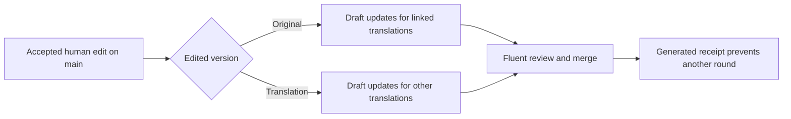

# Languages

## The model: independent corpora with reviewed translations

**There is no canonical language and no translation-completeness goal.** Every
language remains its own editorial corpus. A human-written original in any
supported language may seed machine-translation candidates for other languages,
but those candidates are optional and do not merge without fluent review.

- Translation must not create an N×M backlog. Automation targets only shipped
  languages whose active maintainer has opted in, and a missing translation is
  not a defect.
- Accepted human edits refresh the linked translations through review pull
  requests. Editing a translation never rewrites its human-written original.
- Conversation questions are register-sensitive (du/Sie, tu/vous) and
  culturally loaded. A fluent maintainer may edit or reject a translation that
  does not sound natural or changes the original question's meaning.

The optional `origin` field on a question declares "this is an adaptation of
that question in another language." Machine translations set it to the
human-written source question and also keep `translated_by: google`. These fields
provide lineage without making coverage mandatory. A removed origin currently
produces a validator warning for a human adaptation. The validator rejects a
machine translation whose origin is absent or missing, an origin in the same
language, more than one machine descendant of the same original in a language,
or an `origin` chain for a machine translation. The separate `translation_sync`
receipt records the version used for a synchronization update; it may reference
another translation with the same human-written origin.

**The scaling constraint is moderation, not storage.** For reference: 2,000 questions are about 160 KB of YAML, 50 KB gzipped, so twenty languages fit in a few MB. What does not scale for free is fluent human review of every submission, which is why everything below revolves around named maintainers.

## Incubator rule

New languages start in `questions/incubator/{lang}/` with the same file structure as a shipped language. Incubator languages are validated by CI but **excluded from site payloads and device bundles**.

A language **graduates** (its directory moves to `questions/{lang}/` in a reviewed PR) when it has:

1. **≥ 150 unique questions, with a varied default pool.**
2. **A named maintainer** listed below: a fluent speaker who commits to reviewing submissions in that language.
3. Its own **`STYLE.md`** (tone and register decisions; German uses informal "du", for example) and **`denylist.txt`**.

A shipped language whose maintainer steps down gets a `maintainer-wanted` notice here, never removal.

## Machine translation: reviewed synchronization

The source question is Human Reserved: a person conceives, writes, and submits
it, and a maintainer accepts it before translation begins. The
`google-translate.yml` workflow runs after a new original or a human edit reaches
`main`. It compares the before and after commits, selects new human originals
and changes to existing text, depth or tags in any language, and sends changed text to the
[Google Cloud Translation Basic v2 API](https://cloud.google.com/translate/docs/basic/translating-text).
Question submissions and pull requests from forks never receive the Google API key.

Each draft must:

- start from the accepted original or an accepted human edit to one of its
  linked translations;
- preserve the original meaning, assumptions, tone, and range of plausible
  answers;
- keep `origin` pointing to the human-written original, keep `translated_by: google`, and be
  submitted in a pull request tagged `needs-native-review`;
- pass the target language's validator, denylist, and style guide; and
- receive approval from a fluent maintainer before merge.

The workflow copies the reviewed depth and tags from the source as a
starting point. The target maintainer owns the final wording and classification
and may edit or reject the draft. It groups pending work into one bot branch and
one pull request per target language, rather than opening a pull request per
question. A source wording change requests a fresh translation; a metadata-only
edit updates the linked classification without spending translation quota or
replacing reviewed target wording.

An edit to an original refreshes its translations in all participating target
languages. An edit to a translation refreshes the other linked translations;
it never changes the original's wording, depth, tags or attribution. Existing
human translations participate when they have an `origin` link. Their IDs,
dates and author credits remain stable; machine wording updates add
`translated_by: google`. Metadata-only updates preserve the wording and its
existing provenance.

Each updated entry records `translation_sync.source`, the ID whose accepted
wording or classification was used, and SHA-256 revisions of that source and
the generated text, depth and tags. `origin` remains the original's ID even when
the source is a translated version. Reviewers keep the receipt: an unchanged
generated update does not trigger CI again, while a human wording or
classification change does. Author, date, provenance and tag-order changes do
not request translation.

When a push changes multiple versions of one question, CI fails with their IDs
instead of choosing a source. Use **Run workflow** on `main`, set `before_ref`
to the commit before those edits, and set `source_id` to the accepted version
to propagate. This selects only that question family; rerun with another source
ID for each additional changed family. The same manual trigger can retry a
failed translation run. Multiple linked variants in a single target language
must be resolved to one before synchronization.

Opt-in lives in `questions/schema.json`. A shipped language participates only
when its `x-cicala.languages.<code>.google` block declares Google source and
target codes. Remove that block when the fluent maintainer steps down. Enabling
a language affects future merges and edits; it does not backfill the corpus or
create a translation-completeness queue. The workflow expects a repository
Actions secret named `GOOGLE_TRANSLATE_API_KEY`.

English, German and Italian declare Google source and target codes. The plan is
a diff between two commits, so enabling a language translates nothing that
merged while its block was absent. To catch up on a gap, enable it first and run
`tools/translate_question.py apply --before-ref <commit> --after-ref main
--target <lang>`, which reads the language config from the working tree and both
corpora from the two refs. It sends the key in Google's
documented `X-Goog-Api-Key` header rather than placing it in the request URL.
Restrict the key to the Cloud Translation API, lower the project's daily
character quota, and add a billing alert before enabling the workflow. Google
Cloud Translation has no formality control, so target-language style and
register are part of fluent review.

After a reviewed translation merges, `build_site_data.py` carries its provenance
to the website. Browse and the play surface label it as an automatically
translated, human-reviewed question and link back to the original. The label
does not name the translation vendor: a reader needs to know the text was
machine-translated and checked, not which service produced it. The vendor stays
recorded in `translated_by`.

## Per-language moderation

Submissions (GitHub issue → `promote-question.yml` → PR) are routed to the language's maintainer via `CODEOWNERS` entries on `questions/{lang}/`. The per-language `denylist.txt` is a CI tripwire for obvious slurs and explicit content; a hit means a human looks, nothing more clever than that.

## Shipped languages

| Language | Code | Maintainer                                           | Status                      |
| -------- | ---- | ---------------------------------------------------- | --------------------------- |
| English  | `en` | [@giacomomellone](https://github.com/giacomomellone) | shipped, corpus being built |
| Deutsch  | `de` | [@giacomomellone](https://github.com/giacomomellone) | shipped, corpus being built |
| Italiano | `it` | [@giacomomellone](https://github.com/giacomomellone) | shipped, corpus being built |

All three corpora are currently empty. The seed questions were removed to build
the database from scratch, so the site and the bundles carry no questions until
the first entries land. Italian was opened directly as a shipped corpus rather
than through the incubator, on the repo owner's decision as its maintainer.

## Incubator

_None yet. To start one, open an issue titled `lang: <code>` and you'll get the same structure scaffolded, plus a `lang:{code}` label for submissions._
