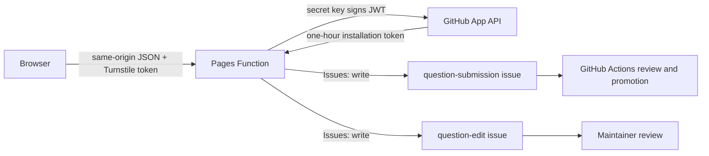

# Native question submission setup

The `/suggest` and `/edit` pages submit without a user account. A Cloudflare
Pages Function verifies the request, authenticates as a repository-scoped
GitHub App and opens an issue: `question-submission` for a new question, which
the review workflow promotes, or `question-edit` for a change to an existing
one, which a maintainer handles by hand.

This setup creates credentials in GitHub and Cloudflare. Never put their
values in this repository, an issue, a shell command, or documentation.

## Runtime boundary



The private key exists only as an encrypted Cloudflare runtime secret. The
browser receives the public Turnstile site key from `GET /api/suggestions` or
`GET /api/edits` and never receives a GitHub credential. The function does not use a personal
access token, OAuth client secret, user token or webhook secret.

The App needs `Issues: write` on one repository. It does not need Contents,
Pull requests, Actions, Administration, organization or account permissions.
The workflow's own `GITHUB_TOKEN` continues to create the branch and pull
request after a maintainer approves an issue.

## 1. Create the GitHub App

Open the GitHub account or organization that owns the repository, then go to
**Settings → Developer settings → GitHub Apps → New GitHub App**.

Use these settings:

| Setting                              | Value                                              |
| ------------------------------------ | -------------------------------------------------- |
| Name                                 | `cicala-bot`, or the closest available unique name |
| Homepage URL                         | `https://cicala.dev`                               |
| User authorization callback          | disabled / empty                                   |
| Webhook                              | inactive                                           |
| Repository permissions → Issues      | Read and write                                     |
| Other repository permissions         | No access, except GitHub's implicit Metadata read  |
| Organization and account permissions | No access                                          |
| Where it can be installed            | Only this account                                  |

Create the App, then record its numeric **App ID**. The App ID is configuration,
not a secret. Do not substitute the client ID.

Install the App and choose **Only select repositories**, then select
`giacomomellone/cicala`. Record the numeric installation ID. It is the number
in the installation settings URL and is not a secret.

GitHub App permissions start empty and should stay at the minimum required for
the issue endpoint. See GitHub's
[permission guidance](https://docs.github.com/en/apps/creating-github-apps/registering-a-github-app/choosing-permissions-for-a-github-app)
and the
[create-issue requirement](https://docs.github.com/en/rest/issues/issues#create-an-issue).

## 2. Generate the App private key

On the App settings page, open **Private keys** and select **Generate a private
key**. GitHub downloads a PEM file and retains only its public half.

The Pages Function accepts GitHub's downloaded PKCS#1 PEM and PKCS#8 PEM. Keep
the complete `BEGIN … PRIVATE KEY` block intact, including line breaks. Paste
it into the Cloudflare encrypted secret in step 5. Do not paste it into a
repository secret: GitHub Actions does not need this key.

GitHub App installation tokens expire after one hour. The function creates a
short-lived token for each accepted request and does not store it. The private
key itself does not expire. Replace it after suspected exposure, when project
policy requires it, or when retiring its owner; there is no calendar rotation
schedule in this project. GitHub documents
[installation tokens](https://docs.github.com/en/apps/creating-github-apps/authenticating-with-a-github-app/generating-an-installation-access-token-for-a-github-app)
and
[private-key rotation](https://docs.github.com/en/apps/creating-github-apps/authenticating-with-a-github-app/managing-private-keys-for-github-apps).

## 3. Create the editorial labels

The direct GitHub issue form stores classification in its body. Native issues
store it in labels so the website does not ask contributors to make editorial
decisions.

Create these labels in the repository if they do not exist:

```text
question-submission
question-edit
approved
needs-changes

deck:new_people
deck:close
deck:family
deck:work
deck:here
deck:wild

depth:1
depth:2
depth:3

tag:icebreaker
tag:reflective
tag:spicy
tag:dark
tag:hypothetical
tag:memory
tag:wouldyourather
```

`lang:<code>` labels are created on demand by `promote-question.yml` when an
issue opens.

For a native issue, a language maintainer adds at least one `deck:*` label,
exactly one `depth:*` label, any applicable `tag:*` labels, and then
`approved`. Approval before classification fails closed and removes
`approved`.

## 4. Create the Turnstile widget

In Cloudflare, open **Turnstile → Add widget**.

Use:

| Setting     | Value                         |
| ----------- | ----------------------------- |
| Name        | `cicala question suggestions` |
| Hostname    | `cicala.dev`                  |
| Widget mode | Managed                       |

Record the site key and secret key. The site key is public. The secret key is
used only by the Pages Function to call Siteverify.

One widget serves both forms. The suggestion page sends action
`suggest-question` and the edit page sends `suggest-edit`; each function
requires its own action and the exact `SUBMISSION_HOSTNAME`, so a token minted
on one form is refused by the other endpoint. Actions are asserted by the
client and checked by the server, not registered in the dashboard, so adding
the second form needs no Turnstile change. Turnstile tokens are short-lived
and single-use. Client rendering alone is not a
security check; the server-side Siteverify call is mandatory. See Cloudflare's
[server-side validation guide](https://developers.cloudflare.com/turnstile/get-started/server-side-validation/).

## 5. Add Pages runtime variables and secrets

Open **Cloudflare → Workers & Pages → cicala → Settings → Variables and
Secrets**. Add these to the production environment:

| Name                     | Kind             | Value                     |
| ------------------------ | ---------------- | ------------------------- |
| `GITHUB_APP_ID`          | plain text       | Numeric App ID            |
| `GITHUB_INSTALLATION_ID` | plain text       | Numeric installation ID   |
| `GITHUB_OWNER`           | plain text       | `giacomomellone`          |
| `GITHUB_REPO`            | plain text       | `cicala`                  |
| `SUBMISSION_HOSTNAME`    | plain text       | `cicala.dev`              |
| `TURNSTILE_SITE_KEY`     | plain text       | Turnstile public site key |
| `GITHUB_APP_PRIVATE_KEY` | encrypted secret | Complete private PEM      |
| `TURNSTILE_SECRET`       | encrypted secret | Turnstile secret key      |

Do not add quotes around values in the dashboard. Preserve PEM line breaks.
Cloudflare makes encrypted secrets available through `context.env` but does
not expose their values after saving. See
[Pages bindings and secrets](https://developers.cloudflare.com/pages/functions/bindings/#secrets).

The existing `CLOUDFLARE_API_TOKEN` and `CLOUDFLARE_ACCOUNT_ID` GitHub
repository secrets are deployment credentials. They remain in GitHub Actions
and are separate from these function-runtime settings.

Do not configure the GitHub App credentials in preview unless preview
deployments are intentionally allowed to create real public issues.

## Credential lifecycle

These secrets follow the repository-wide policy in
[hosting](hosting.md#credential-lifecycle); the translation key and deployment
credentials are not exceptions.

- To replace `GITHUB_APP_PRIVATE_KEY`, generate an additional App key, update
  the encrypted Cloudflare value, redeploy and verify one readiness request,
  then delete the old App key. GitHub permits overlapping keys so this can avoid
  downtime.
- To replace `TURNSTILE_SECRET`, use **Rotate Secret Key** for the widget, update
  the encrypted Cloudflare value and redeploy during Cloudflare's two-hour
  overlap, then verify a submission challenge.
- To replace `CLOUDFLARE_API_TOKEN`, create or roll a token with the same narrow
  Pages permission, update the GitHub repository secret and verify a deployment
  before revoking any still-valid predecessor.

Rotate immediately after suspected exposure. Otherwise rotate only when an
owner or permission boundary changes, a provider expires a credential, or
project policy sets a schedule. The corresponding provider procedures are
[GitHub App private keys](https://docs.github.com/en/apps/creating-github-apps/authenticating-with-a-github-app/managing-private-keys-for-github-apps),
[Turnstile secret rotation](https://developers.cloudflare.com/turnstile/troubleshooting/rotate-secret-key/),
and [Cloudflare token rolling](https://developers.cloudflare.com/fundamentals/api/how-to/roll-token/).

## 6. Deploy the Function

The function source is `website/functions/api/suggestions.ts`. The existing
Wrangler deployment discovers the `functions/` directory when it uploads
`website/dist`.

`website/public/_routes.json` includes only `/api/*`, so normal page and asset
requests stay on the static path. Cloudflare documents
[Pages Functions deployment](https://developers.cloudflare.com/pages/functions/get-started/)
and
[invocation routes](https://developers.cloudflare.com/pages/functions/routing/).

Redeploy after adding or changing runtime variables. A push to `main` runs the
normal `site` workflow; the Cloudflare deployment step must not be skipped.

## 7. Verify without opening an issue

Check configuration readiness:

```sh
curl -sS https://cicala.dev/api/suggestions
curl -sS https://cicala.dev/api/edits
```

Expected shape, with `turnstileAction` reading `suggest-question` and
`suggest-edit` respectively:

```json
{
  "available": true,
  "turnstileRequired": true,
  "turnstileSiteKey": "0x…",
  "turnstileAction": "suggest-question"
}
```

The site key is deliberately public. A private key or Turnstile secret in this
response is a security incident.

Open `https://cicala.dev/suggest` and verify:

1. the page does not say submissions are unavailable;
2. invalid and duplicate questions remain disabled;
3. Turnstile completes without an unnecessary visible challenge;
4. a deliberate test submission creates one issue authored by the App bot;
5. the issue has `question-submission` and later `lang:<code>`;
6. the check workflow comments with the native text-check result;
7. adding deck and depth labels followed by `approved` opens a valid pull request.

Then open a question permalink, select **suggest an edit**, and verify:

8. the current wording appears and an unknown `?q=` value is refused;
9. the consent boxes appear only once wording is proposed;
10. a deliberate test edit creates one `question-edit` issue authored by the
    App bot, whose body carries the same headings as the GitHub issue form.

Close the test issues or pull request without merging their fixture content.

Events created with a GitHub App installation token can trigger the repository
workflow. GitHub suppresses recursive events created with a workflow's own
`GITHUB_TOKEN`, which is a different token and does not apply to the Pages
Function. See [triggering workflows](https://docs.github.com/en/actions/how-tos/write-workflows/choose-when-workflows-run/trigger-a-workflow).

## Local and automated checks

Unit and browser tests mock Turnstile and GitHub; they do not need credentials
and never open an issue:

```sh
just test-tools
just test-website
just test-e2e e2e/suggest.spec.ts
```

For a deliberate local Pages Function test, build the site and use Wrangler:

```sh
just website-build
cd website
npx wrangler pages dev dist
```

Put local runtime values in `website/.dev.vars`, which is ignored by Git. Use
Cloudflare's published Turnstile test keys until the request reaches the final
GitHub call. Do not put the production GitHub App key in a routine development
environment.

## Failure behavior

`GET /api/suggestions` reports `available: false` when any required runtime
setting is absent. The page keeps the draft visible and disables submission.
The POST endpoint also fails closed.

The endpoint rejects an incorrect origin, non-JSON and oversized bodies,
invalid question data, stale consent versions, unsupported languages and
failed Turnstile checks before asking GitHub for a token. GitHub errors return
a generic `502` to the browser and do not expose an API response or credential.

The submitted issue is public because the accepted question database is
public. The contributor's account is not exposed; only an optional chosen
credit is written. The endpoint does not collect an email address or create a
user profile.
